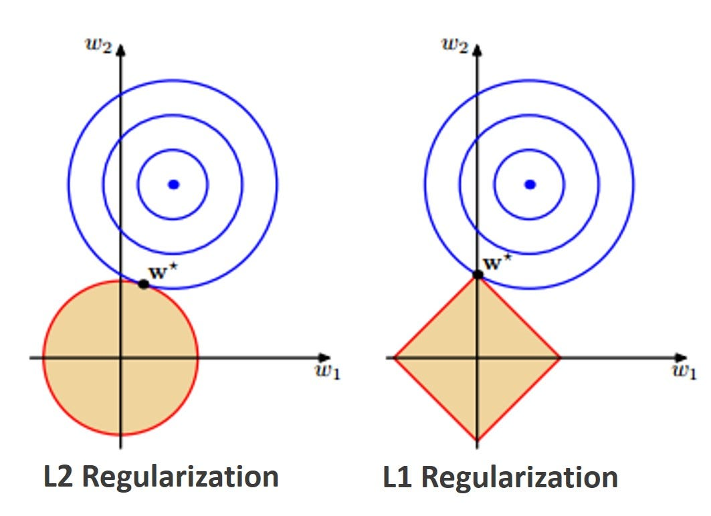

## 引出
1. 防止模型过拟合，在模型的损失函数中添加一个惩罚项。限制模型参数的大小，从而降低模型的复杂度。
2. 理论上可以为每个权重设置不同的正则化系数，但神经网络中单独设置系数过于麻烦

## L1 正则化 (Lasso)
在损失函数中加入所有模型权重（w）绝对值的和作为惩罚项
1. 使得一些不重要的特征所对应的权重被压缩到零
2. 对于 L1 的菱形约束，切点更有可能出现在坐标轴上，即某个权重为零，这正是产生稀疏解的原因
3. 适用于特征数量多且部分特征不重要时
### 优点 
1. 能够自动筛选出最重要的特征，生成一个更稀疏的模型。这对于处理高维数据（特征数量远大于样本数量）特别有用。
2. 由于不重要的特征被剔除，模型变得更简单，更容易理解
### 缺点
1. 当多个特征高度相关时，L1 正则化会随机选择其中一个特征，并将其余相关特征的权重置为零。这可能导致结果不稳定。
## L2 正则化 (Ridge)
在损失函数中加入所有模型权重平方和的一半作为惩罚项
1. 对于L2的圆形约束，切点通常不会出现在坐标轴上，所以权重只会趋近于零，而不会正好为零。
2. 适用于特征之间存在共线性或所有特征都重要时
### 优点
1. 平滑模型：防止模型权重过大，使得模型对训练数据的微小变化不那么敏感，增强了模型的泛化能力。
2. 处理共线性：当多个特征高度相关时，L2 正则化会平等地缩小所有相关特征的权重，而不是只选择其中一个，这使得模型更稳定。
### 缺点
1. 不进行特征选择：L2 正则化不会将任何权重完全变为零，所以它无法自动剔除不重要的特征