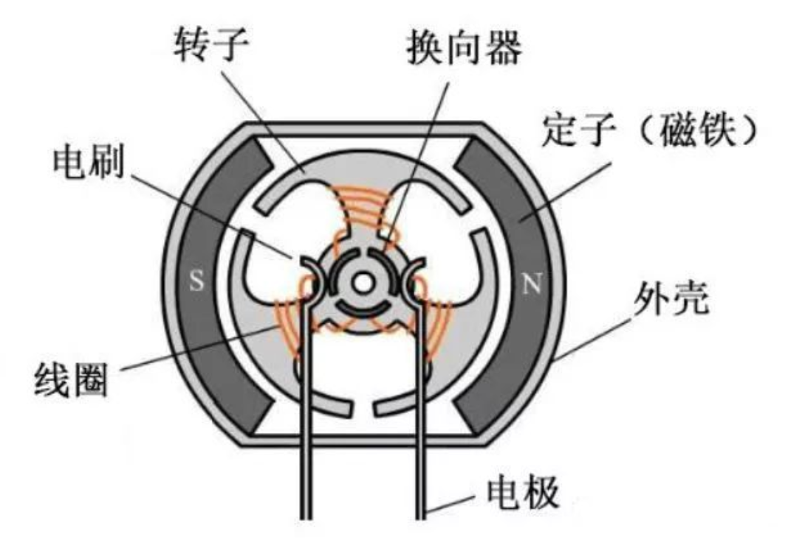
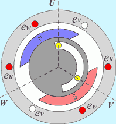

## 概述
1. 所有电机（除少数特例）的基本工作原理都基于电磁感应和洛伦兹力
2. 根据输入电源的类型可以分为直流和交流电机
# 直流电机
## 有刷直流电机

### 工作原理
1. 定子(Stator)：通常是永磁体或励磁绕组，用于产生一个固定的磁场。
2. 转子(Rotor)：也叫电枢 (Armature)，是缠绕了线圈的铁芯。
3. 换向器(Commutator)&电刷(Brushes)：有刷电机的核心。当转子转动时，电刷（通常是碳刷）与环形的换向器（分段的铜片）接触。
4. 换向器会机械地自动切换转子线圈中的电流方向，确保转子无论转到哪个位置，受到的电磁力矩（扭矩）方向始终一致，从而保持持续转动。
### 永磁直流电机
1. 定子是永磁体，结构简单、体积小、效率高。
2. 常用于玩具、小型家电、汽车附件（如雨刷、车窗）
### 电励磁直流电机
1. 定子是电磁铁（励磁绕组）。
2. 他励(Separately Excited)：励磁绕组和转子（电枢）绕组由两个独立的电源供电。调速范围广，控制灵活。
3. 并励 (Shunt-wound)： 励磁绕组与电枢绕组并联。特点是转速相对恒定，负载变化时转速变化不大。
4. 串励 (Series-wound)： 励磁绕组与电枢绕组串联。特点是启动扭矩极大（启动电流也大），但负载减小时转速会急剧升高（空载时易“飞车”）。常用于电车、起重机、电动工具（如电钻）。
5. 复励 (Compound-wound)： 兼有并励和串励的绕组，特性介于两者之间。
### 优点
1. 控制简单（通过调节电压即可调速）
2. 启动扭矩大
3. 技术成熟，成本低
### 缺点
1. 电刷磨损：电刷和换向器是机械接触，会磨损，需要定期维护更换
2. 火花：接触点会产生电火花，带来电磁干扰和安全隐患
3. 噪音：机械摩擦产生噪音
## 无刷直流电机

### 工作原理
1. 用电子换向取代了机械换向，通常是永磁体在转子上，线圈绕组在定子上
2. 电子换向：外部配有驱动器，根据位置传感器感知转子磁极的位置，按顺序给不同的定子线圈通电，产生旋转磁场，拉动转子上的永磁体跟着旋转。
### 优点
1. 无电刷： 没有磨损，寿命极长，免维护
2. 高效率、低噪音、无火花
3. 高转速： 摆脱了机械换向的限制
### 缺点
必须配备控制器，成本较高，控制系统复杂
# 交流电机
## 异步电机
### 工作原理
1. 旋转磁场：当三相（或单相）交流电通入定子绕组时，会在定子内部产生一个以恒定速度旋转的磁场，同步转速。
2. 感应电流： 转子（通常是“鼠笼”结构）的导体切割这个旋转磁场，根据电磁感应原理，转子导体中产生感应电流。
3. 产生扭矩： 带有感应电流的转子导体反过来在定子磁场中受到洛伦兹力，形成电磁扭矩，驱动转子旋转。
4. 异步的含义： 转子的转速必须低于定子磁场的转速。如果转速相等，转子导体和磁场相对静止，无法切割磁感线，就不会产生感应电流和扭矩。这个速度差称为转差率
### 鼠笼式异步电机
1. 转子结构像一个鼠笼（由导电条和两端短路环构成）
2. 结构极其简单、坚固、成本低、免维护，是应用最广泛的电机（占 90% 以上）。
### 绕线式异步电机
1. 转子也是线圈绕组，通过滑环引出。可以在转子电路中串入电阻，以改善启动性能（提高启动扭矩、降低启动电流）
2. 结构复杂，成本高
### 优点
1. 结构坚固，可靠耐用，维护成本极低
2. 成本低廉，制造简单
### 缺点
1. 转速“基本”恒定（随负载略有变化），调速困难（需要配合变频器 (VFD) 才能实现高效调速）
2. 功率因数相对较低
### 应用
1. 几乎所有不需要精确调速的场合
2. 风机、水泵、压缩机、传送带、家用电器（冰箱、洗衣机、空调室外机）
## 同步电机
### 工作原理
1. 定子同样产生一个旋转磁场，转子不是靠感应，而是本身就是一个磁体（永磁体或通直流电的电磁铁）
2. 定子的旋转磁场像一块“磁铁”一样，直接“锁住”转子的磁极，拖着转子以严格相同的速度旋转
3. 同步的含义：无论负载如何变化（在额定范围内），转子的转速永远严格等于定子磁场的同步转速
### 主要类型
1. 永磁同步电机 (PMSM)：转子是永磁体。效率高、功率密度大。
2. 电励磁同步电机：转子是电磁铁，需要一个外部直流电源通过滑环给转子励磁。
### 优点
1. 转速恒定：转速严格保持同步，不随负载变化，适用于精密传动。
2. 高效率：尤其是永磁同步电机。
3. 高功率因数：可以调节功率因数（用于补偿电网）
### 缺点
1. 成本高，结构比异步电机复杂
2. 启动困难（不能像异步电机那样“自启动”），通常需要变频器启动或辅助启动装置。
### 应用
1. 电动汽车： 现代高性能电动汽车（如特斯拉 Model 3/Y 后期型）多采用永磁同步电机（PMSM）
2. 精密控制： 要求速度恒定的场合
3. 发电机： 几乎所有的发电厂（水力、火力、核能）都使用同步电机作为发电机（原理可逆）