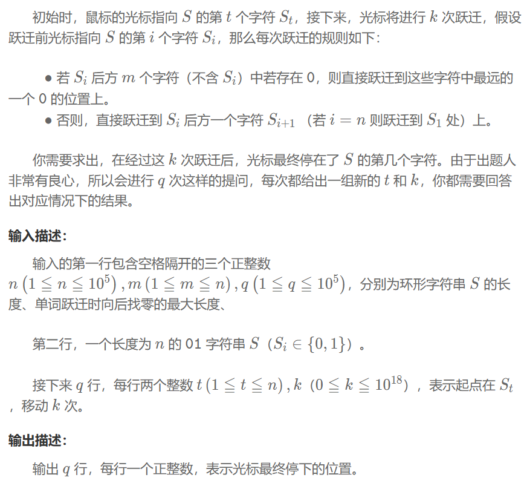

## 倍增
一种典型的用空间换时间的技巧，将任意大的信息拆分成若干个 2 的幂次项之和，从而实现快速查询。将一个 O(N) 的线性操作，通过预处理优化为 O(log N) 的操作
## ST ( Sparse Table ) 表
专门用于解决 RMQ (Range Minimum/Maximum Query) 区域最值查询问题。
1. 定义 $st[i][j]$：表示从数组下标 i 开始，长度为 $2 ^j$ 的区间内的最值。
2. 查询\
（1）根据 $2^k \le len < 2^{k+1}$，求得 k\
（2）区间 [L, R] 可以被 $[L,L+2^k-1]$ 和 $[R-2^k+1,R]$ 完全覆盖\
（3）$query(L, R) = min(st[L][k], st[R - (1 << k) + 1][k])$
### 程序
```
void build_st() {
    // Base Case: j = 0, 区间长度为 1
    for (int i = 0; i < n; ++i) {
        st[i][0] = arr[i];
    }
    // 递推
    for (int j = 1; (1 << j) <= n; ++j) {
        for (int i = 0; i + (1 << j) <= n; ++i) {
            st[i][j] = std::min(st[i][j - 1], st[i + (1 << (j - 1))][j - 1]);
        }
    }
}
int query(int l, int r) {
    int k = log2(r - l + 1);
    return std::min(st[l][k], st[r - (1 << k) + 1][k]);
}
```
## LCA (最近公共祖先)
在一棵树中，对于任意两个节点 u 和 v，找到它们深度最深的共同祖先
1. 定义 $up[u][j]$：表示节点 u 的第 $2 ^j$ 个祖先
2. 预处理：遍历得到节点的深度和父节点，递推 $up[u][j]=up[up[u][j-1]][j-1]$
3. 查询\
（1）保证节点在同意深度，利用倍增加速跳跃\
（2）同步跳跃 u 和 v,从 j = logN 开始向下循环。如果 $up[u][j]$ 不等于 $up[v][j]$，说明跳了 $2 ^j$ 步后 LCA 还在更上方。可以安全地跳这一步：$u=up[u][j]，v=up[v][j]$\
（3）如果等于，说明已经跳到了 LCA 或其祖先，所以这一步不能跳。\
（4）循环结束后，u 和 v 就在 LCA 的正下方，返回 up[u][0]即可。
### 程序
```
void dfs(int u, int p, int d) {
    depth[u] = d;
    up[u][0] = p;
    for (int v : adj[u]) {
        if (v != p) dfs(v, u, d + 1);
    }
}
void build_lca() {
    // 假设根节点是 1，没有父节点，深度为 0
    dfs(1, 0, 0); 
    // 根节点的父节点设为0或自己，避免越界
    up[1][0] = 1;
    if (n>0 && up[0][0] == 0) up[0][0] = 0; // 虚拟节点0的父节点是自己
    for (int j = 1; j < LOGN; ++j) {
        for (int i=1; i<=n;++i) up[i][j] = up[up[i][j-1]][j-1];
    }
}
int lca(int u, int v) {
    // 1. 拉平深度，让 v 成为更深的节点
    if (depth[u] > depth[v]) std::swap(u, v);
    // 将 v 跳到和 u 同样的高度
    for (int j = LOGN - 1; j >= 0; --j) {
        if (depth[v] - (1 << j) >= depth[u]) v = up[v][j];
    }
    // 2. 如果此时 u == v, 说明 u 是 v 的祖先
    if (u == v) return u;
    // 3. 同步向上跳，直到成为 LCA 的子节点
    for (int j = LOGN - 1; j >= 0; --j) {
        if (up[u][j] != up[v][j]) {
            u = up[u][j];
            v = up[v][j];
        }
    }
    return up[u][0];
}
```
## 环形字符串跃迁
### 问题


### 解题思路
1. 先预处理得到每个位置最近的 0 位置（包括自身）
2. $next[i][j]$ 表示位置 i 走 $2 ^j$ 步后的落点
3. 将 k 进行二进制分解，即可得到最终落点
### 程序
```
vector<int> p(n);
vector<vector<int>> next(n, vector<int>(log_k));
if(count(s.begin(),s.end(),'0')==0){
    while (q--) {
        int t;
        ll k;
        cin >> t >> k;
        cout<<(t-1+k)%n+1<<endl;
    }
    return 0;
}
int cur_0;
for (int i = n - 1; i >= 0; --i) {
    if (s[i] == '0') {
        cur_0 = i;
        break;
    }
}
for (int i = 0; i < n; ++i) {
    if (s[i] == '0') {
        cur_0 = i;
    }
    p[i] = cur_0;
}
for (int i = 0; i < n; ++i) {
    int dist = (p[(i + m) % n]-i+n)%n;
    if (dist > 0 && dist <= m) {
        next[i][0] = p[(i + m) % n];
    } else {
        next[i][0] = (i + 1) % n;
    }
}
for (int j = 1; j < log_k; ++j) {
    for (int i = 0; i < n; ++i) {
        next[i][j] = next[next[i][j - 1]][j - 1];
    }
} 
while (q--) {
    int t;
    ll k;
    cin >> t >> k;
    --t;
    vector<bool> binary;
    while(k>0){
        binary.push_back((k&1)?true:false);
        k >>= 1;
    }
    for(short i=binary.size()-1;i>=0;i--){
        if(binary[i]){
            t=next[t][i];
        }
    }
    cout<<t+1<<endl;
}
```