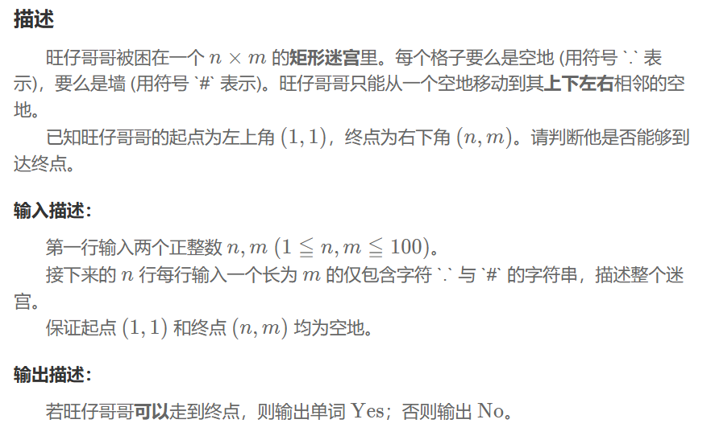
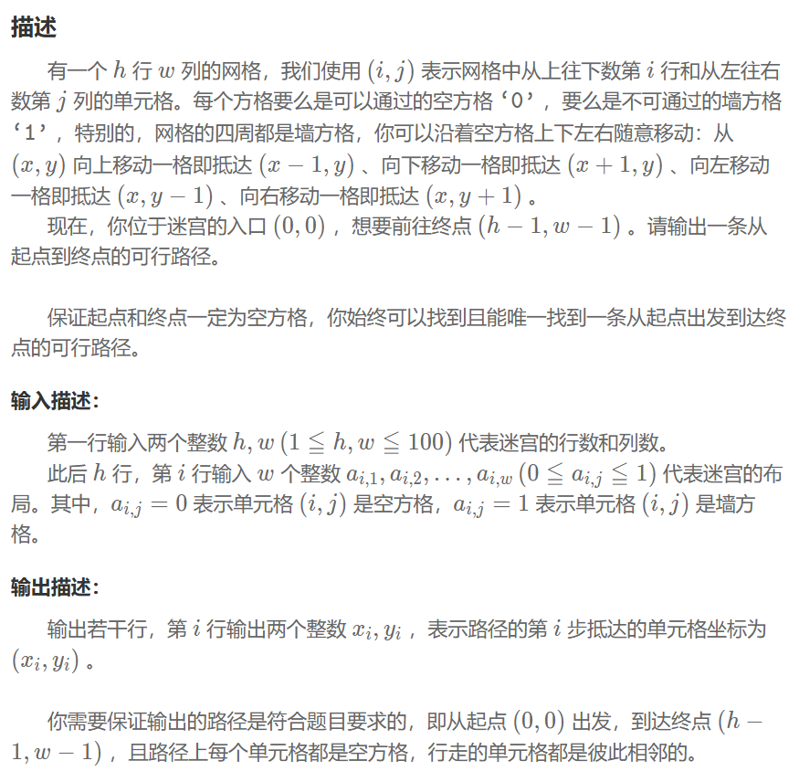

## 深度优先
一种用于遍历或搜索树或图的算法，其基本思路是从起始节点开始，沿着一条路径一直走到底，直到无法再走下去才回溯到上一个节点，重复上述过程直到遍历完所有节点。可以采用递归或者栈实现。
用栈存储节点
## 迷宫寻路
### 问题


### 程序
```
vector<vector<int>> visited(n, vector<int>(m, 0));
    queue<pair<int,int>> q;
    q.push(make_pair(0, 0));
    visited[0][0] = 1;
    const int dx[4] = {1, -1, 0, 0};
    const int dy[4] = {0, 0, 1, -1};
while (!q.empty()) {
    pair<int,int> cur = q.front();
    q.pop();
    int x = cur.first, y = cur.second;
    if (x == n - 1 && y == m - 1) {
        cout << "Yes\n";
        return 0;
    }
    for (int dir = 0; dir < 4; ++dir) {
        int nx = x + dx[dir];
        int ny = y + dy[dir];
        if (nx < 0 || nx >= n || ny < 0 || ny >= m) continue;
        if (grid[nx][ny] == '#') continue;
        if (visited[nx][ny]) continue;
        visited[nx][ny] = 1;
        q.push(make_pair(nx, ny));
    }
}
cout<<"No"<<endl;
```
## 广度优先
用队列存储节点
## 迷宫寻路
### 问题


### 程序
```
const short dx[4]={-1,1,0,0};
const short dy[4]={0,0,-1,1};
struct point{
    short x;
    short y;
    short prev_index;
};
queue<short> path;
vector<vector<bool>> map(h,vector<bool>(w,true));
path.push(0);
map[0][0]=false;
point_all.push_back({0,0,-1});
short index=0;
while(!path.empty()){
    short cur=path.front();
    path.pop();
    for(unsigned short i=0;i<4;++i){
        short x_next=point_all[cur].x+dx[i];
        short y_next=point_all[cur].y+dy[i];
        if(x_next<0||x_next>=h||y_next<0||y_next>=w) continue;
        if(!map[x_next][y_next]) continue;
        ++index;//cout<<"index="<<index<<endl;
        map[x_next][y_next]=false;
        point_all.push_back({x_next,y_next,cur});
        path.push(index);
        if(x_next==h-1&&y_next==w-1){
            queue<short> empty;
            swap(empty, path);
            break;
        }
    }
}
```
