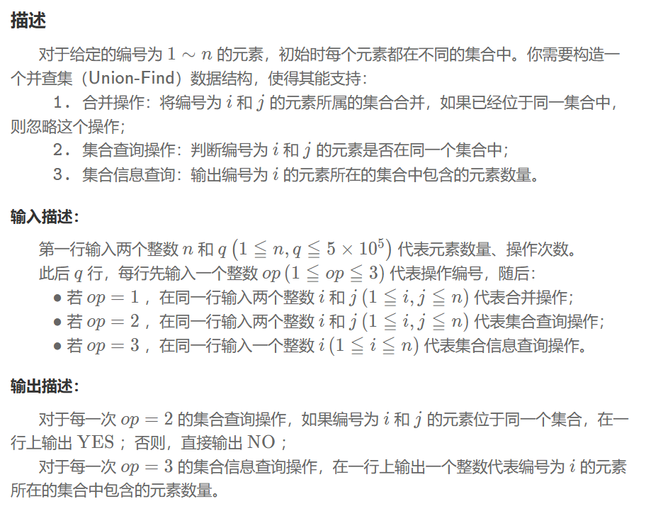

## 并查集
### 问题


### 解题思路
1. 核心结构\
（1）parent[i] 存储元素 i 的父节点。根节点的父节点是自身，即 parent[root] = root\
（2）size[i] 仅在 i 是所在集合根节点时有意义，表示集合中元素总数
### 程序
```
class DSU {
private:
    vector<unsigned int> parent; 
    vector<unsigned int> sz; 
public:
    DSU(unsigned int n) {
        parent.resize(n + 1);
        iota(parent.begin(), parent.end(), 0);
        sz.assign(n + 1, 1);
    }
    unsigned int find(unsigned int i) {
        if (parent[i] == i) return i; 
        return parent[i] = find(parent[i]);
    }
    void unite(unsigned int i, unsigned int j) {
        unsigned int root_i = find(i); 
        unsigned int root_j = find(j); 
        if (root_i != root_j) { 
            if (sz[root_i] < sz[root_j]) {
                parent[root_i] = root_j;
                sz[root_j] += sz[root_i];
            } else {
                parent[root_j] = root_i;
                sz[root_i] += sz[root_j];
            }
        }
    }
    unsigned int size(unsigned int i) {
        unsigned int root_i = find(i);
        return sz[root_i];
    }
};
```