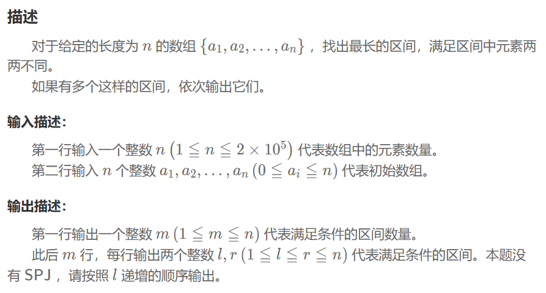

## 最长区间
### 问题


### 解题思路
1. 定义两个变量 $l,r=0$，维护一个动态窗口，还需要一个 set 记录区间出现的元素
2. 扩张窗口：右指针 r 从 0 到 n-1 遍历整个数组
3. 收缩窗口：如果新元素重复，则将左指针 l 向右移动，直至没有重复元素
4. 计算当前窗口长度并比较更新最大值
### 程序
```
struct range{
    int l;
    int r;
};
int length=1,left=0;
vector<int> a(n);
vector<range> b;
set<int> c;
for(int right=0;right<n;++right){
    while(c.count(a[right])){
        c.erase(a[left]);
        ++left;
    }
    c.insert(a[right]);
    int cur_len=right-left+1;
    if (cur_len>length) {
        length=cur_len;
        b.clear();
        b.push_back({left+1,right+1});
    }else if (cur_len==length) {
        b.push_back({left+1,right+1});
    }
}
cout<<b.size()<<endl;
for(auto i:b){
    cout<<i.l<<' '<<i.r<<endl;
}   
```