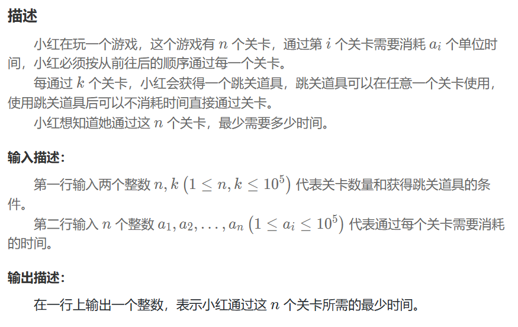
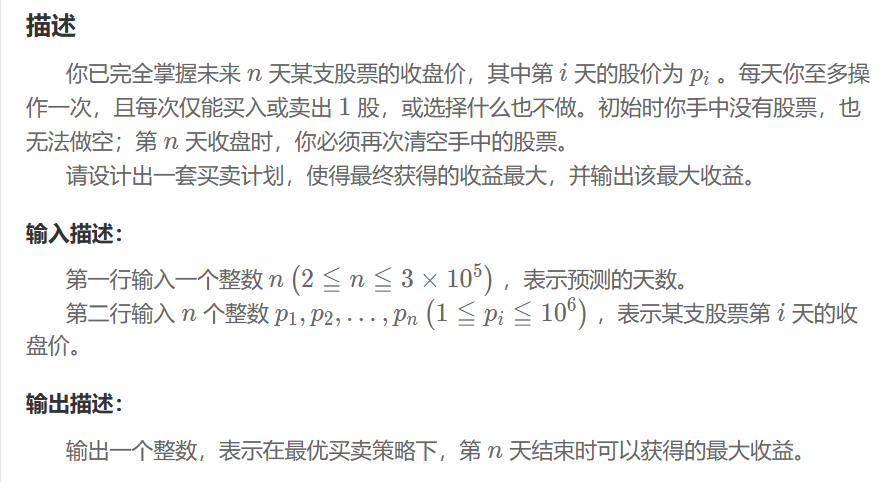

## 定义
保证每次操作都是当前最优，不能保证最后解是全局最佳
## 小红闯关
### 问题


### 解题思路
1. 从后往前遍历时，维护一个“待选池”，里面存放了从 i+1 到 n-1 所有关卡的耗时，使用优先队列得到最大值。
2. 处理到第 i 关时，如果 (i+1) % k == 0，意味着小红在这一关结束后会获得一个道具。她应该用这个道具跳过未来会遇到的最耗时的那关。
### 程序
```
unsigned long long total_t=0,skip_t=0;
vector<size_t> a(n);
priority_queue<size_t> time;
for(size_t i=0;i<n;++i){
    cin>>a[i];
    total_t+=a[i];
}
for(int i=n-1;i>=0;--i){
    if((i+1)%k==0&&!time.empty()){
        skip_t+=time.top();
        time.pop();
    }
    time.push(a[i]);
}
cout<<total_t-skip_t<<endl;
```
## 低买高卖
### 问题


### 解题思路
1. 反悔贪心，每遇到一个新价格，都先假设可以是一个买入点，放入优先队列
2. 若新价格比队列中最便宜的高，则卖出。为了不影响未来的决策，把低买高卖的操作，转换为以当前价格“换购”了一股，为未来更高的价格做准备。
### 程序
```
ll sum=0;
priority_queue<ll,vector<ll>, greater<ll>> q;
for(int i=0;i<n;++i){
    ll cur;
    cin>>cur;
    q.push(cur);
    if(cur>q.top()){
        sum+=(cur-q.top());
        q.pop();   
        q.push(cur);               
    }
}
```