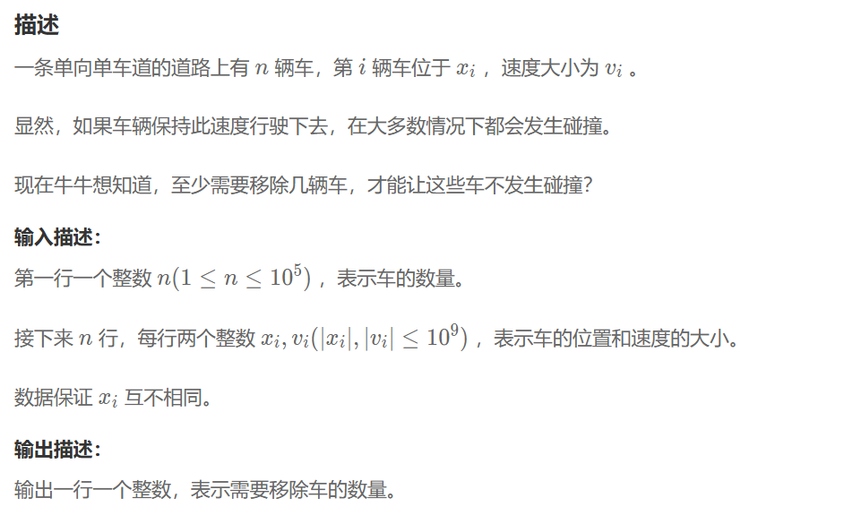

## 最长不下降子序列
### 问题


### 解题思路
1. 首先将所有的车辆按照其初始位置从小到大进行排序。
2. 要使这些车辆不发生碰撞，保留下来的车辆的速度必须构成一个不下降的序列。
3. 就转化成了：对按位置排序后的速度序列，求解其“最长不下降子序列”（LNDS）
```
sort(c.begin(),c.end(),[](const car&a,const car&b){return a.x<b.x;});
vector<int> v;
v.push_back(c[0].v);
for(int i=1;i<n;i++){
    if(c[i].v>=v.back()){
        v.push_back(c[i].v);
    }else{
        auto it=upper_bound(v.begin(),v.end(),c[i].v);
        *it=c[i].v;
    }
}
cout<<n-v.size()<<endl;
```