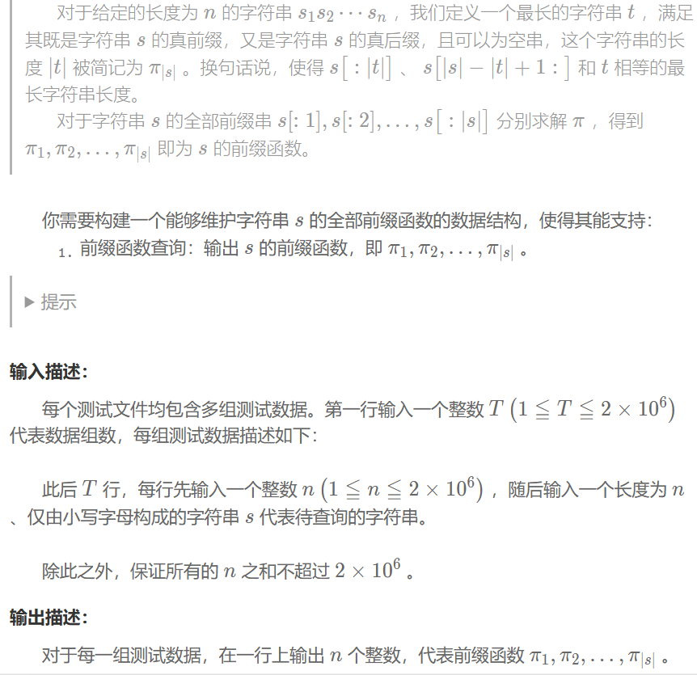

## Kmp
### 问题


### 解题思路
1. 真前缀指不包含本身的前缀
2. 我们只需比较 $j=p[i-1],s[i]和s[j]$ 是否相同即可，相同则 $p[i]=j+1$
3. 若不同则回退，比较 $j=p[j-1],s[i]和s[j]$，直到 $j=0$ 或找到一个匹配
### 程序
```
while(T--){
    int n;
    string s;
    cin>>n;
    cin>>s;
    vector<int> p(n,0);
    cout<<0;
    for(int i=1;i<n;++i){
        int j=p[i-1];
        while(j>0&&s[i]!=s[j]){
            j=p[j-1];
        }
        if(s[i]==s[j]) ++j;
        p[i]=j;
        cout<<' '<<p[i];
    }
    cout<<'\n';
}
```