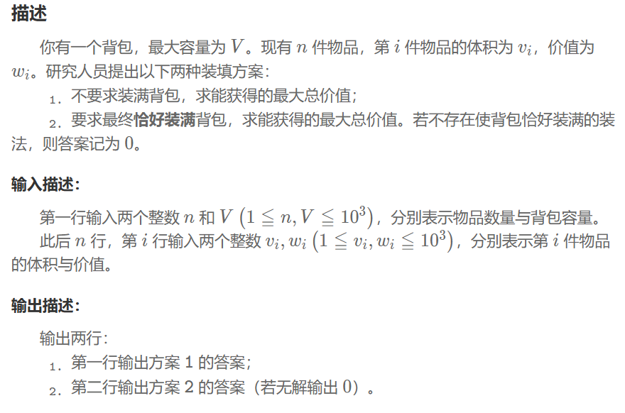
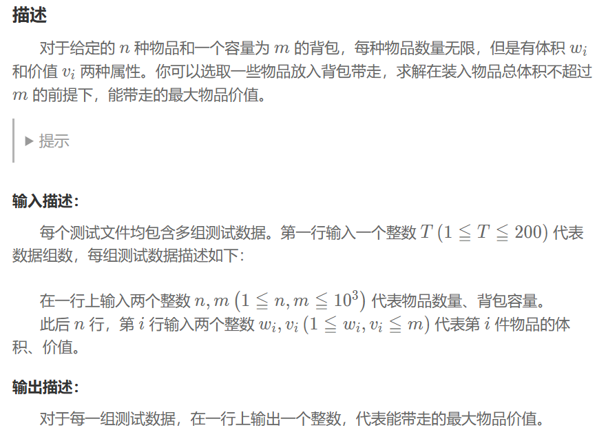
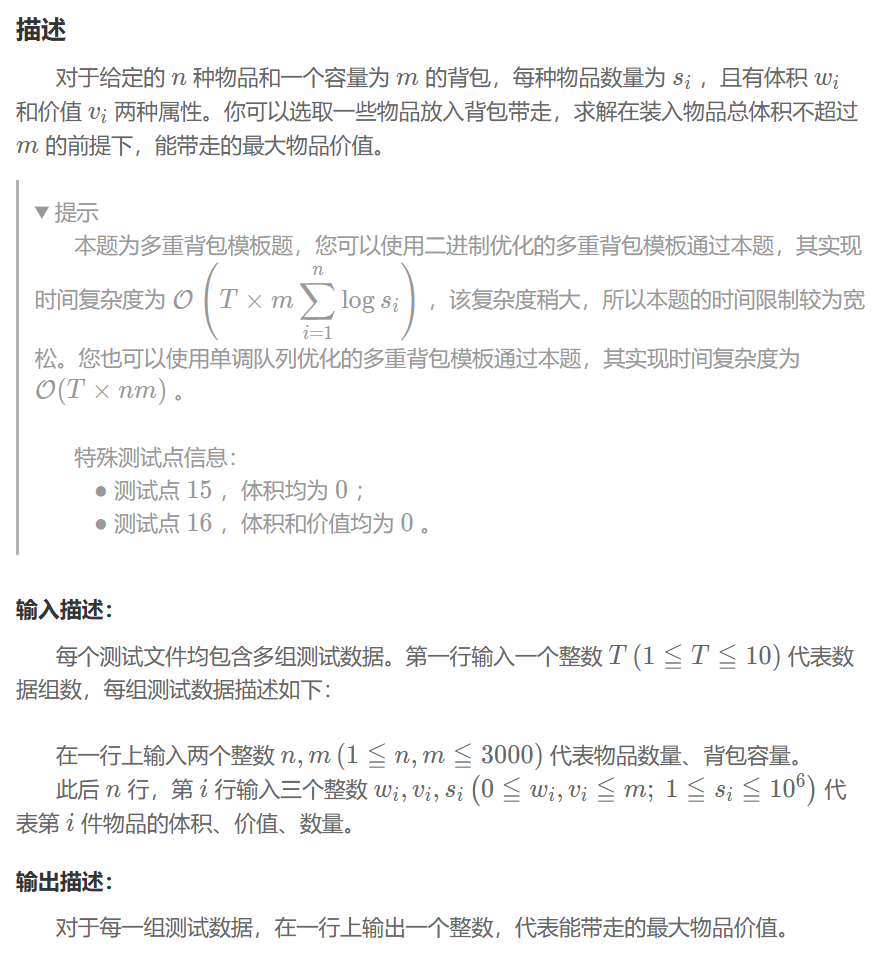
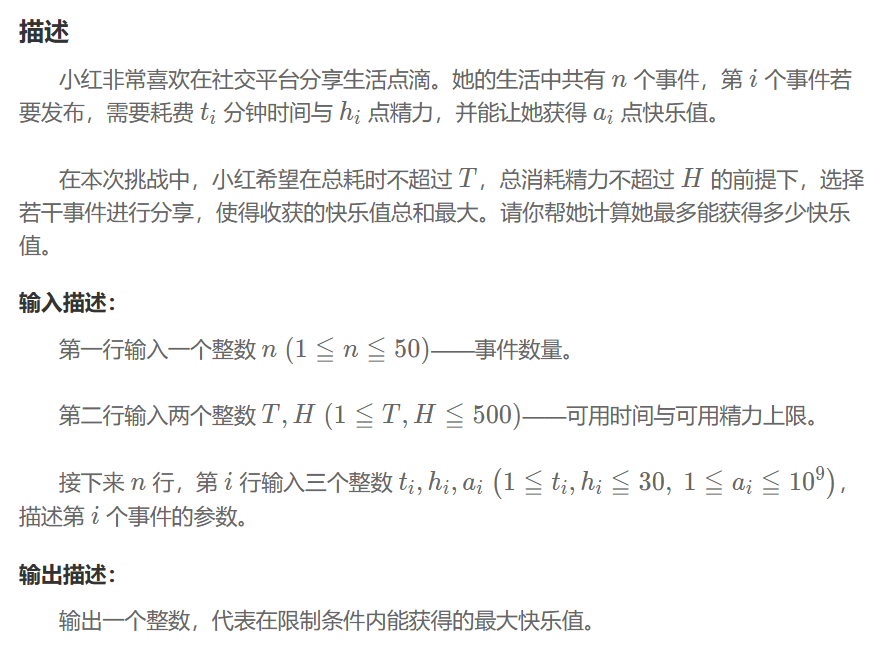
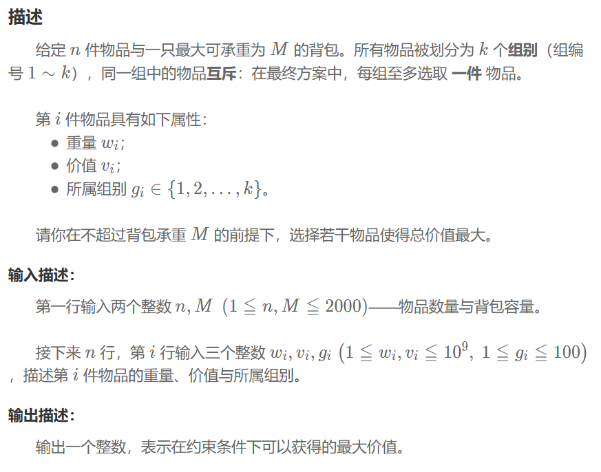

## 01背包
### 问题


### 问题 1 解题思路
1. $dp1[i]$ 表示不考虑背包是否装满，在容量为i的情况下，最多装多大价值的物品。
2. 通过 $dp1[j]=max(dp1[j],dp1[j-g[i].v]+g[i].w)$ 更新状态
### 问题 2 解题思路
1. $dp2[i]$ 表示背包恰好装满，在容量为i的情况下，最多装多大价值的物品。
2. 设置 $dp2[0]=0$，其它情况设置为最小的Integer型整数，表示不可达状态。
3. 通过 $if(dp2[j-g[i].v]!=INT_MIN) dp2[j]=max(dp2[j],dp2[j-g[i].v]+g[i].w)$ 更新状态
### 程序
```
struct good{
    short w;
    short v;
};
vector<good> g(n);
vector<int> dp1(v+1,0);
vector<int> dp2(v+1,INT_MIN);
dp2[0]=0;
for(int i=0;i<n;++i){
    for(int j=v;j>=g[i].v;--j){//如果从小到大遍历，一个物品会被重复选择
        dp1[j]=max(dp1[j],dp1[j-g[i].v]+g[i].w);
    }
}
for(int i=0;i<n;++i){
    for(int j=v;j>=g[i].v;--j){
        if(dp2[j-g[i].v]!=INT_MIN) dp2[j]=max(dp2[j],dp2[j-g[i].v]+g[i].w);
    }
}
```
## 完全背包
### 问题


### 解题思路
与 01 背包的唯一区别是内层循环顺序
### 程序
```
for(int j=0;j<n;++j){
    for(int k=g[j].v;k<=m;++k){
        dp[k]=max(dp[k],dp[k-g[j].v]+g[j].w);
    }
}
```
## 多重背包
### 问题


### 解题思路
1. 可以等价为 01背包，把多个数量的同种物品也看成是多个不同种类的物品，但必然超时
2. 二进制优化：假设某种物品的数量为1000件，拆分成10个种类，每个种类分别包含1、2、4、8、16、32、64、128、256、489件，组合起来可以表示 0-1000 所有数字
### 程序
```
vector<good> items;
vector<long long> dp(m+1,0);
for(short j=0;j<n;++j){
    short w,v;
    int s;
    cin>>w>>v>>s;
    for(int k=1; k<=s; k*=2) {
        items.push_back({k*w, k*v});
        s-=k;
    }
    if(s>0) {
        items.push_back({s*w, s*v});
    }
}
for(int j=0;j<items.size();++j){
    for(int k=m;k>=items[j].w;--k){
        dp[k]=max(dp[k],dp[k-items[j].w]+items[j].v);
    }
}
cout<<dp[m]<<endl;
```
## 二维费用背包
### 问题


### 解题思路
1. $dp[i][k]$ 在可用时间不超过 $j$、可用精力不超过 $k$ 的前提下，能获得的最大快乐值总和。 
### 程序
```
struct thing{
    short t;
    short h;
    int a;
};
vector<thing> t(n);
vector<vector<long long>> dp(T+1,vector<long long>(H+1,0));
for(short i=0;i<n;++i){
    for(short j=T;j>=t[i].t;--j){
        for(short k=H;k>=t[i].h;--k){
            dp[j][k]=max(dp[j][k],dp[j-t[i].t][k-t[i].h]+t[i].a);
        }
    }
}
```
## 分组背包
### 问题


### 解题思路
1. 决策改为对于每一组，可以不选任何物品，或者选择组中某一物品
2. 三重循环\
（1）外层：遍历每一个组\
（2）中层：逆序遍历背包容量\
（3）内层：遍历组内的每一个物品
### 程序
```
struct item{
    long long w;
    long long v;
    short g;
};
vector<vector<item>> it;
vector<long long> dp(M+1,0);
for(short i=0;i<n;++i){
    int w, v;
    short g;
    cin>>w>>v>>g;
    if(it.size()<g) it.resize(g);
    it[g-1].push_back({w,v});
}
for(short i=0;i<it.size();++i){
    for(short j=M;j>=0;--j){
        for(short k=0;k<it[i].size();++k){
            if (j >= it[i][k].w) dp[j]=max(dp[j],dp[j-it[i][k].w]+it[i][k].v);
        }
    }
}
```