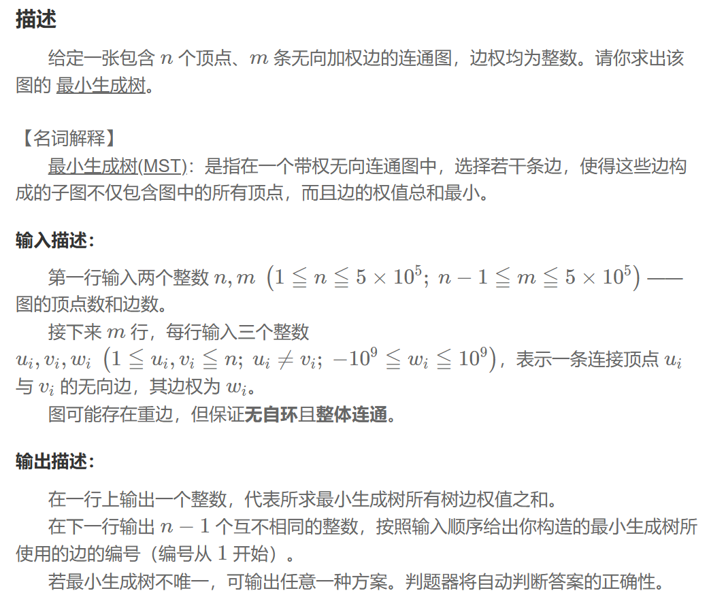

## 最小生成树
### 问题


### Kruskal 算法
1. 一种贪心算法，不断选择图中权重最小的边来构建最小生成树，同时避免形成环
2. 将所有边按权重从小到大进行排序，并初始化空的生成树
3. 遍历，对于每一条边 (u, v)，检查是否已在同一个连通分量中，可用并查集\
（1）如不在，说明这条边连接了两个不同的部分，将其加入生成树中，并将 u 和 v 所在的集合合并。\
（2）如在，则说明加入这条边会形成一个环，因此跳过这条边。
4. 终止条件：当已选择的边数达到 n-1
5. 时间复杂度：O(mlogm)，主要消耗在边的排序上。更适合稀疏图（边数 m 远小于顶点数 n 的平方）
### Kruskal 程序
```
struct edge{
    int u,v,w,id;
};
vector<edge> edges(m);
sort(edges.begin(),edges.end(),[](const edge& a,const edge& b){return a.w<b.w;});
DSU dsu(n);
ll w_sum = 0;
vector<int> mst_edges;
int edges_cnt=0;
for (auto& e:edges){
    if(dsu.find(e.u)!=dsu.find(e.v)){
        dsu.unite(e.u, e.v);
        w_sum+=e.w;
        mst_edges.push_back(e.id);
        ++edges_cnt;
        if (edges_cnt == n - 1) {
            break;
        }
    }
}
```
### Prim 算法
1. 一种贪心算法，从单一的顶点开始，每次都添加一条与已构建的树相连的最短边。
2. 随机选择一个起始顶点，将其放入最小生成树中。创建优先队列，存储与已选顶点相连的所有边，并按权重排序。
3. 取出权重最小的边 (u, v)，最小生成树中没有 v，将 v 加入最小生成树，同时将这条边加入到结果集。
4. 遍历所有与 v 相连的边，将那些连接到未访问顶点的边加入优先队列。
5. 终止条件：当已选的顶点数达到 n 
6. 时间复杂度 O(mlogn)，更适合稠密图
### Prim 程序
```

```