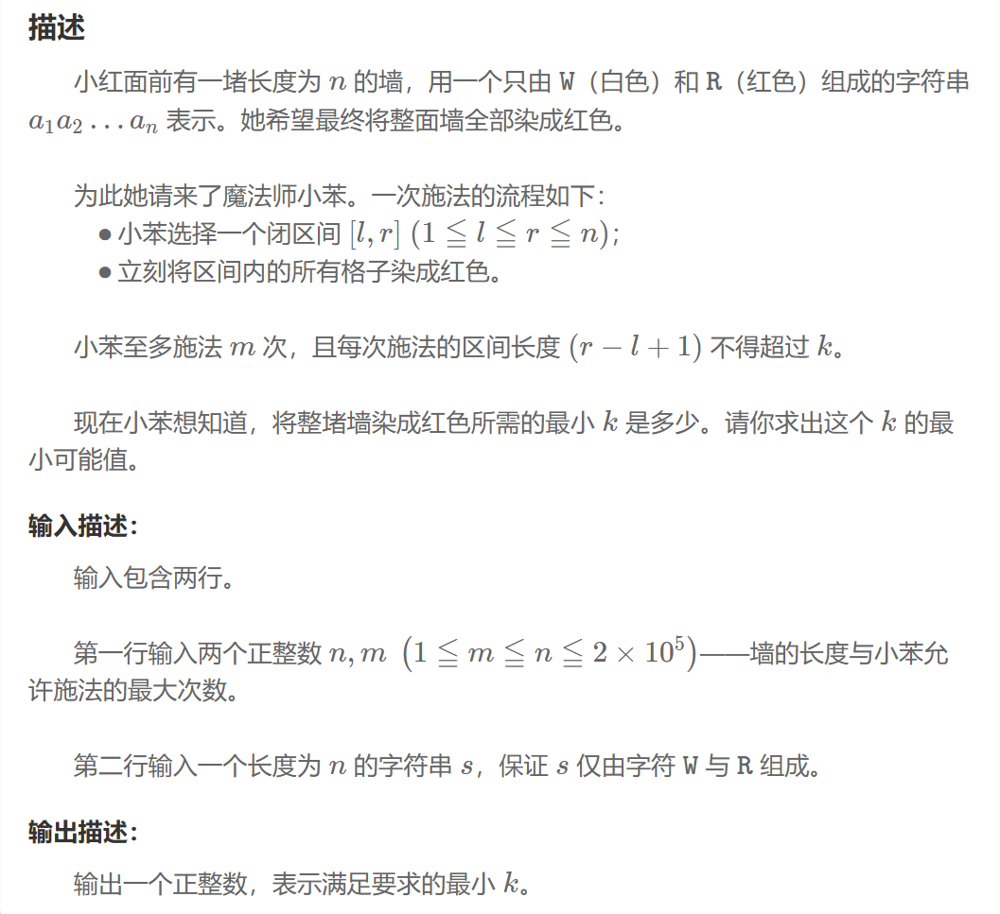

## 小苯的魔法染色
### 问题


### 解题思路
1. 使用二分查找来寻找最小的区间长度 
2. 对于每个猜测的长度 ，我们需要验证是否能在最多  次操作内将墙完全染红
3. 验证过程中，我们采用贪心策略\
（1）从左到右扫描墙面\
（2）遇到白色格子时，尽可能覆盖最多的未染色区域
### 程序
```
bool check(int k){
    int count=0;
    int i=0;
    while(i<n){
        if(s[i]=='R'){
            ++i;
            continue;
        }else{
            i+=k;
            ++count;
        }
        if(count>m){ 
            return false;
            break;
        }
    }
    return true;
}
int l=ceil(count(s.begin(),s.end(),'W')/m);
int r=n/m+1;
int k=r;
while(l<r){
    int mid=(l+r)/2; //cout<<"mid="<<mid<<endl;
    if(check(mid)){
        r=mid;
        k=mid;//cout<<"k=r="<<k<<endl;
    }else{
        l=mid+1;//cout<<"l="<<l<<endl;
    }
}    
```