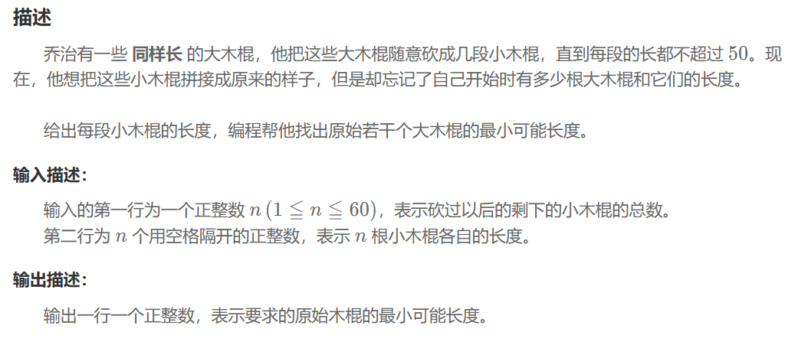

## 拼接木棍
### 问题


### 解题思路

### 程序
```
short n;
vector<int> ln;
vector<bool> used;
bool dfs(int groups_left,int target_l,int cur_sum,int start_id){
    if(groups_left==0) return true;
    if(cur_sum==target_l) return dfs(groups_left-1,target_l,0,0);
    for(int i=start_id;i<n;++i){
        if(used[i]) continue;
        if(cur_sum+ln[i]>target_l) continue;
        if(i>0&&!used[i-1]&&ln[i]==ln[i-1]) continue;
        used[i]=true;
        if(dfs(groups_left,target_l,cur_sum + ln[i], i + 1)){
            return true;
        }
        used[i]=false;
        if(cur_sum==0) return false;
        if(cur_sum+ln[i]==target_l) return false;
    }
    return false;
}
int main(){
    cin>>n;
    ln.assign(n,0);
    used.assign(n,false);
    int sum=0;
    for(short i=0;i<n;i++){
        cin>>ln[i];
        sum+=ln[i];
    }
    sort(ln.begin(),ln.end(),greater<>());
    int l=ln[0];
    for(int i=l;i<=sum;++i){
        if(sum%i!=0) continue;
        int group=sum/i;
        if(dfs(group,i,0,0)){
            cout<<i<<'\n';
            break;
        }
    }
}
```