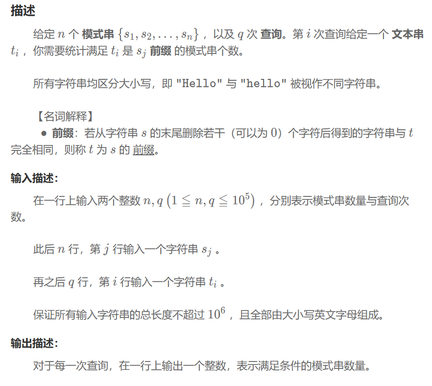

## Trie 字典树
### 问题


### 程序
```
struct trienode{
    vector<trienode*> child;
    int count=0;
    trienode():child(52,nullptr){}
};

int s_to_id(char&a){
    if(a>='a'&&a<='z') return a-'a';
    else return a-'A'+26;
};

void insert(string&s,trienode* root){
    trienode* cur=root;
    for(int i=0;i<s.size();++i){
        int index=s_to_id(s[i]);
        if(cur->child[index]==nullptr) cur->child[index]=new trienode();
        ++cur->child[index]->count;
        cur=cur->child[index];
    }
};

int search(string&s,trienode* root){
    trienode* cur=root;
    for(int i=0;i<s.size();++i){
        int index=s_to_id(s[i]);
        if(cur->child[index]==nullptr){
            return 0;
        }
        cur=cur->child[index];
    }
    return cur->count;
};

int main() {
    int n,q;
    cin>>n>>q;
    trienode* root=new trienode();
    for(int i=0;i<n;++i){
        string s;
        cin>>s;
        insert(s,root);
    }
    for(int i=0;i<q;++i){
        string s;
        cin>>s;
        cout<<search(s,root)<<endl;
    }
    return 0;
}
```

