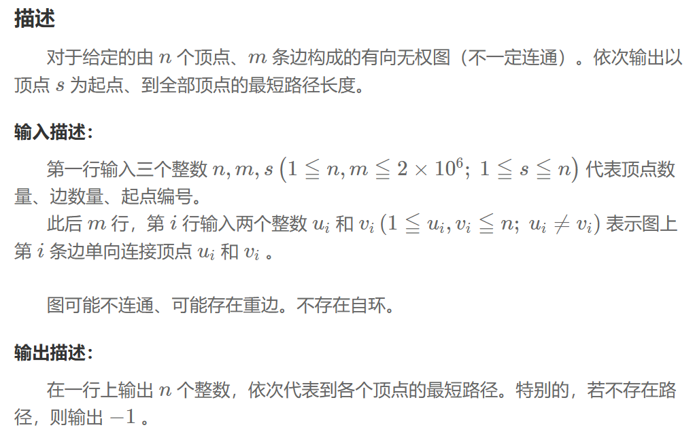

## 单源最短路 ‖ 无权图
### 问题


### 解题思路
BFS
### 程序
```
int n,m,s;
cin>>n>>m>>s;
vector<vector<int>> adj(n+1);
for(int i=0;i<m;++i){
    int u,v;
    cin>>u>>v;
    adj[u].push_back(v);
}
queue<int> q;
vector<bool> is_visited(n+1,false);
vector<int> dis(n+1,-1);
dis[s]=0;
q.push(s);
is_visited[s]=true;
while(!q.empty()){
    int cur=q.front();
    q.pop();
    for(auto a:adj[cur]){
        if(is_visited[a]) continue;
        dis[a]=dis[cur]+1;
        is_visited[a]=true;
        q.push(a);
    }
}
```
## Dijkstra 
### 原理 
主要用于解决带非负权重边的有向图或无向图中，单源最短路径的问题。核心思想是贪心
### 假设
图 G = (V, E)，其中 V 是节点集合，E 是边集合，w(u, v) 是连接节点 u 和 v 的边的权重。指定一个源点 s。
### 初始化
1. 距离数组 dist，dist[v] 表示从源点 s 到节点 v 的当前最短距离。将 dist[s] 初始化为 0，其他所有节点的 dist 初始化为无穷大。
2. 已访问节点集合 S，初始为空。
3. 优先队列（通常用最小堆实现），并将所有节点放入队列中。节点的优先级由其在 dist 数组中的值决定。
### 迭代
当优先队列不为空时，执行以下操作：
1. 取出距离源点最近的节点 u（即 dist[u] 最小的节点）。
2. 将节点 u 加入到已访问集合 S 中。
3. 对于节点 u 的每一个邻接节点 v\
松弛操作：如果通过 u 到达 v 的路径比当前已知的路径更短（即 dist[u] + w(u, v) < dist[v]），则更新 dist[v]。
## 单源最短路 ‖ 非负权图
### 问题


### 解题思路
Dijkstra 
### 程序
```
struct edge {
    int to;
    int w;
};
struct dist{
    int node;
    ll dis;
    bool operator<(const dist& other) const{
        return dis>other.dis;
    }
};
vector<vector<edge>> adj(n+1);
for(int i=0;i<m;++i){
    int u,v,w;
    cin>>u>>v>>w;
    adj[u].push_back({v,w});
}
priority_queue<dist> pq;
vector<ll> dis(n+1,LLONG_MAX);
dis[s]=0;
pq.push({s,dis[s]});
while(!pq.empty()){
    dist cur=pq.top();
    pq.pop();
    if(cur.dis>dis[cur.node]) continue;
    for(auto a:adj[cur.node]){
        if (dis[cur.node] + a.w < dis[a.to]) {
            dis[a.to] = dis[cur.node] + a.w;
            pq.push({a.to,dis[a.to] });
        }
    }
}
```