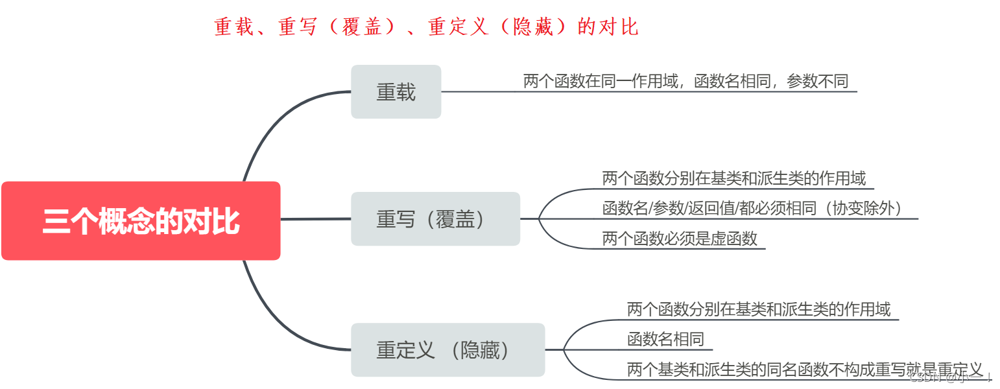

## 封装
1. 通过类，将一个对象的数据和函数结合在一起，隐藏对象的属性和实现细节，仅对外公开接口来和对象进行交互。
2. 目的在于将对象的使用者和设计者分开，可以隐藏实现细节包括包含私有成员，使得代码模块增加安全指数，同时提高软件的可维护性和可修改性。
## 继承
从已有类产生新类的过程。原有的类成为基类或父类，产生的新类称为派生类或子类，子类继承基类后，可以创建子类对象来调用基类的函数，变量等。
### 单一继承
继承一个父类，这种继承称为单一继承，这也是使做多的继承方式。
### 多重继承
1. 继承多个基类，类与类之间要用逗号隔开，类名之前要有继承权限
2. 假使两个或两个基类都有某变量或函数，在子类中调用时需要加类名限定符如 obj.classA::i = 1；
### 菱形继承
多重继承掺杂隔代继承1-n-1模式，此时需要用到虚继承，例如 B，C 虚拟继承于A，D 再多重继承 B，C，否则会出错。


## 多态
用的是同一个接口，但是效果各不相同，多态有两种形式的多态，一种是静态多态，一种是动态多态。
### 静态多态（编译时多态）
1. 在编译时就能够确定函数或方法的调用对象，即函数或方法的重载。
2. 函数或方法的重载是通过参数类型、参数数量或参数顺序来区分的。
```
int add(int a, int b){
    return a + b;
}
double add(double a, double b){
    return a + b;
}
```
### 动态多态（运行时多态）
1. 在程序运行时才能确定函数或方法的调用对象，即虚函数或抽象类。
2. 函数或方法的重载是通过继承和虚函数来实现的。


## 面向对象
把构成问题事务分解成各个对象，建立对象的目的不是为了完成一个步骤，而是为了描叙某个事物在整个解决问题的步骤中的行为。