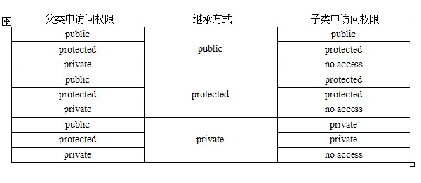

## 概念
1. 依据另一个类来定义一个类，达到了重用代码功能和提高代码可维护性的效果，已有的类称为基类，新建的类称为派生类（Derived Class）。
2. 派生类中，默认的成员函数会自动生成，并且派生类会调用基类的相应成员函数来初始化基类部分。
```
class Person {
public:
    void identity(){
        cout << "void identity()" << _name << endl;
    }
protected:
    string _name;
    string _tel; 
    int _age;
};

class Student : public Person {
public:
    void study(){...}
protected:
    int _stuid; 
};

class Teacher : public Person {
public:
    void teaching(){...}
protected:
    string title; 
};
```
## 访问权限
 

在实际使用中，public 继承是最常见和默认的方式，因为保持了基类成员的可访问性。而 protected 和 private 较少使用。

## 名字隐藏
### 规则
1. 如果派生类中声明了一个成员，而该成员与基类中的某个成员同名，那么派生类中的这个成员将会隐藏基类中所有同名的成员
2. 这种隐藏是不考虑参数列表和返回类型的。只要名字相同，基类的所有同名版本（包括所有重载版本）都会被隐藏
### 解决
1. 使用 using 声明
```
class Base {
public:
    void func() {
        std::cout << "Base::func()" << std::endl;
    }
    void func(int i) {
        std::cout << "Base::func(int)" << std::endl;
    }
};
class Derived : public Base {
public:
    // 将 Base 类中所有名为 func 的成员引入到 Derived 的作用域
    using Base::func; 
    // 现在 Derived 的作用域中同时有 3 个，且构成了重载关系
    // 1. 从 Base 引入的 func()
    // 2. 从 Base 引入的 func(int)
    // 3. 自己定义的 func(double)
    void func(double d) {
        cout << "Derived::func(double)" << endl;
    }
};

int main() {
    Derived d;
    d.func(3.14); // 调用 Derived::func(double)
    d.func(10);   // OK: 调用 Base::func(int)
    d.func();     // OK: 调用 Base::func()
}
```
2. 使用作用域解析运算符：可以显式地指定调用基类的版本，但比较繁琐
```
int main() {
    Derived d;
    d.func(3.14);      // 调用 Derived::func(double)
    d.Base::func(10);  // OK: 显式调用 Base::func(int)
    d.Base::func();    // OK: 显式调用 Base::func()
}
```
## 默认成员函数
1. 派生类的默认（由编译器生成的）特殊成员函数会自动调用其基类的对应成员函数，而不是继承。
2. 如创建一个派生类对象时，会先调用基类的构造函数来初始化对象中的“基类部分”，然后再执行派生类自己的构造函数来初始化“派生类部分”。

## 多继承
```
class Person {
public:
    string _name;
};
class Student : public Person {
protected:
    int _num;
};
class Teacher : public Person {
protected:
    int _id; 
};
class Assistant : public Student, public Teacher {
protected:
    string _majorCourse;
};
```

## 菱形继承
1. 多个基类中有相同的成员，导致派生类中有两份相同的成员拷贝。
2. 在上述代码中，Assistant 类同时继承自 Student 和 Teacher，存在两份 _name 成员，这就产生了数据冗余和访问二义性的问题。
3. 虚继承：派生类只会保留一份基类的成员
```
class Person {
public:
    string _name;
};
class Student : virtual public Person {
protected:
    int _num;
};
class Teacher : virtual public Person {
protected:
    int _id;
};
class Assistant : public Student, public Teacher {
protected:
    string _majorCourse;
};

int main() {
    Assistant a;
    a._name = "peter"; // 没有二义性
    return 0;
}
```
## 继承与组合
1. 在面向对象设计中，继承表示一种 is-a 的关系，而组合表示一种 has-a 的关系
2. 优先使用组合而不是继承可以降低类之间的耦合度，提高代码的灵活性和可维护性。
3. 下面代码中，Car 类通过组合方式包含了四个轮胎对象 Tire，这种设计更符合逻辑上的 has-a 关系
```
class Tire {
protected:
    string _brand = "Michelin"; 
    size_t _size = 17;
};

class Car {
protected:
    string _colour = "白色"; 
    Tire _t1, _t2, _t3, _t4;
};

class BMW : public Car {
public:
    void Drive() { cout << "驾驶宝马车" << endl; }
};
```