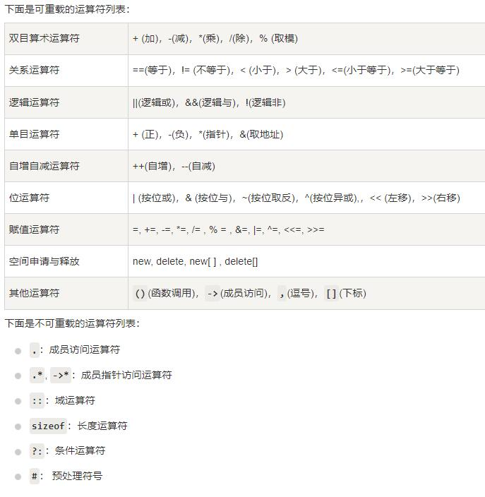

## 定义
允许为在同一作用域中的函数和运算符指定多个定义，分别称为函数重载和运算符重载；编译器通过对比使用的参数类型与定义中的参数类型，决定选用最合适的定义，过程称为重载决策
## 函数重载
在同一个作用域内，可以声明几个功能类似的同名函数，但是这些同名函数的形式参数（指参数的个数、类型或者顺序）必须不同，不能仅通过返回类型的不同来重载函数
````
class printData
{
   public:
      void print(int i) {
        cout << "整数为: " << i << endl;
      }
      void print(double  f) {
        cout << "浮点数为: " << f << endl;
      }
      void print(char c[]) {
        cout << "字符串为: " << c << endl;
      }
};
````
## 运算符重载
可以重定义或重载大部分C++内置运算符，不可以改变语法结构、操作数个数、优先级、结合性\
重载运算符是有特殊名称的函数，函数名由关键字operator和其后的运算符构成的\
与其他函数一样，重载运算符有一个返回类型和一个参数列表\


````

````