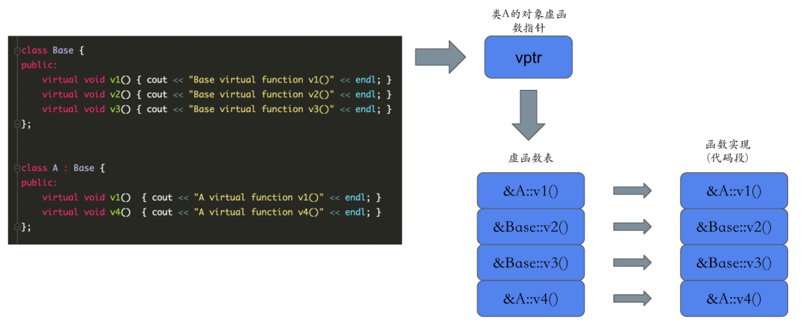
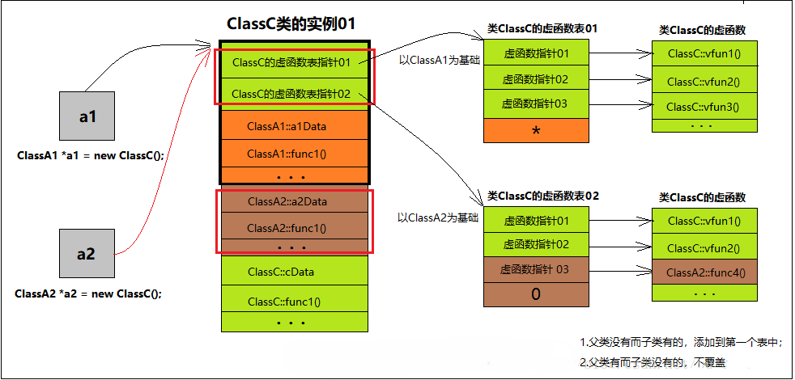

## 概述
1. 虚函数是在父类中定义的一种特殊类型的函数，允许子类重写该函数以适应其自身需求。
2. 避免静态绑定，在使用父类指针或引用调用子类对象的成员函数时，如果没有使用虚函数，则会进行静态绑定。
3. 静态绑定即只能调用父类的成员函数，无法调用子类特有的成员函数。

## 实现
### 虚函数表
1. 每个包含虚函数的类都会生成一个虚函数表，其中存储着该类中所有虚函数的地址。（不论子类是否实现）
2. 是一个由指针构成的数组，每个指针指向一个虚函数的实现代码。
3. C++ 中的虚函数调用比起其他语言（如 Java）成本要高，因为需要额外的内存空间存储虚函数表及其指针。


### 虚函数指针
1. 在对象的内存布局中，编译器会添加一个额外的指针，称为虚函数指针或虚表指针。
2. 指向该对象对应的虚函数表，从而让程序能够动态地调用正确的虚函数。
### 调用过程
1. 编译期间，编译器会根据函数调用的类型和对象的类型确定要调用的函数。
2. 运行期间，程序会根据对象的实际类型来决定调用哪个函数。这个过程叫做动态绑定。
3. 每个含有虚函数的类都有自己的虚函数表，存储了指向实际函数地址的指针。
4. 对象被创建时，它的指针会指向所属类的虚函数表。
5. 调用虚函数时，在对象中存储的指针会被解引用，获取到虚函数表的地址。然后根据函数调用的类型，从虚函数表中获取相应的函数地址。
6. 最后，程序跳转到函数地址处执行实际的代码。

## 使用
### 声明
```
class Base {
public:
    virtual void foo();
};
```
### 重写
1. 派生类重写基类的虚函数，称为函数的覆盖；不重写则默认继承基类的实现，称为虚函数的重载。
2. 名称和参数列表需相同。
3. 在子类中重写虚函数时，其访问权限不能更严格，否则编译器会报错。
4. override 关键字虽然可以不加，加上后编译器会检查参数列表。
```
class Derived : public Base {
public:
    void foo() override {
        std::cout << "Derived::foo()" << std::endl;
    }
};
```

## 多继承
```
class ClassA1
{
public:
	ClassA1() { cout << "ClassA1::ClassA1()" << endl; }
	virtual ~ClassA1() { cout << "ClassA1::~ClassA1()" << endl; }
	void func1() { cout << "ClassA1::func1()" << endl; }
	virtual void vfunc1() { cout << "ClassA1::vfunc1()" << endl; }
	virtual void vfunc2() { cout << "ClassA1::vfunc2()" << endl; }
private:
	int a1Data;
};

class ClassA2
{
public:
	ClassA2() { cout << "ClassA2::ClassA2()" << endl; }
	virtual ~ClassA2() { cout << "ClassA2::~ClassA2()" << endl; }
	void func1() { cout << "ClassA2::func1()" << endl; }
	virtual void vfunc1() { cout << "ClassA2::vfunc1()" << endl; }
	virtual void vfunc2() { cout << "ClassA2::vfunc2()" << endl; }
	virtual void vfunc4() { cout << "ClassA2::vfunc4()" << endl; }
private:
	int a2Data;
};

class ClassC : public ClassA1, public ClassA2
{
public:
	ClassC() { cout << "ClassC::ClassC()" << endl; }
	virtual ~ClassC() { cout << "ClassC::~ClassC()" << endl; }
	void func1() { cout << "ClassC::func1()" << endl; }
	virtual void vfunc1() { cout << "ClassC::vfunc1()" << endl; }
	virtual void vfunc2() { cout << "ClassC::vfunc2()" << endl; }
	virtual void vfunc3() { cout << "ClassC::vfunc3()" << endl; }
};
```


1. 有多少个有虚函数的基类就有多少个虚函数表指针。
2. 当有多个虚函数表时，虚函数表的结尾是 0 代表没有下一个虚函数表。"*"号位置在不同操作系统中实现不同，代表有下一个虚函数表。
3. 子类虚函数会覆盖每一个父类的每一个同名虚函数。
4. 父类中没有的虚函数而子类有，填入第一个虚函数表中，且用父类指针是不能调用。
5. 父类中有的虚函数而子类没有，则不覆盖。仅子类和该父类指针能调用。

## 纯虚函数
1. 在基类中定义的没有实现的虚函数，让子类必须实现该函数，并且不能直接创建该类对象（抽象类）。
2. 抽象类是包含纯虚函数的类，不能被实例化，只能被继承。
3. 如果一个类继承了抽象类，则必须实现所有的纯虚函数，否则该类也会成为抽象类。
```
class Shape{
public:
    virtual double getArea() = 0; // 纯虚函数
};

class Rectangle: public Shape {
public:
    double width;
    double height;
    double getArea() {return width * height;}
};
```
## 绑定
### 静态绑定
在编译时就确定要调用哪个方法，通常出现在使用类或接口定义对象时。
### 动态绑定
在程序运行时才能确定要调用哪个方法，通常出现在使用子类对象调用父类方法时。
```
Animal* Ptr; // 定义父类指针
Ptr = &Cat;  // 指向 Cat 对象
Ptr->makeSound(); // 运行时动态绑定到 Cat::makeSound()
```
