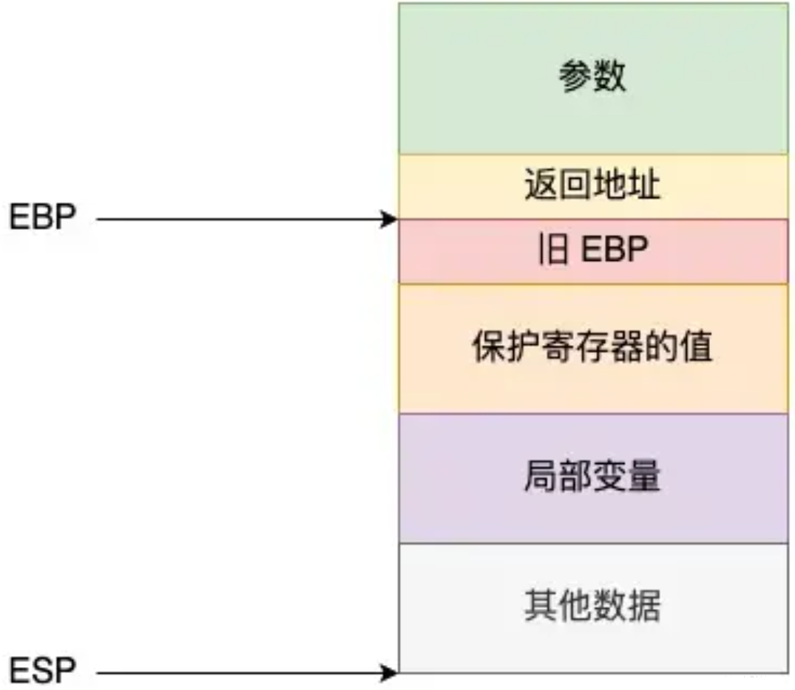

## 函数调用栈
1. 将每个函数所用的信息，称之为活动记录或者栈帧，按照调用的顺序依次压入栈中.
2. 等最上层的函数执行完了，就弹出相应的栈帧，栈帧主要包括以下几个内容：


3. 寄存器 EBP: 基址寄存器，也叫栈底寄存器。在整个函数执行期间，EBP 的值是稳定不变的。
4. 寄存器 ESP: 栈顶寄存器。ESP 的值是动态变化的。每当有数据入栈（push），ESP 的地址会减小。
5. 旧 EBP：调用者函数的 EBP 值，实现栈回溯的关键，即例子中的 main 函数。
6. 返回地址：下一条指令的地址，即例子中的 “return 0;”。
7. 保护寄存器：如果当前函数需要使用某些特定的寄存器（如 EBX, ESI, EDI），先将这些寄存器的值保存在栈上，在函数返回前再恢复它们。
8. 其他数据：可能包括编译器使用的临时变量、动态内存分配（alloca）等。
## 调用流程
### 举例
程序：
```
int add(int x, int y) {
    int sum = x + y;
    return sum;
}

int main() {
    int a = 5;
    int b = 10;
    int result = add(a, b); // 这里暂停
    return 0;
}
```
### 调用前的准备
1. 在执行 add(a, b) 这行代码之前，main 函数需要进行参数压栈
2. main 函数将传递给 add 的参数 a 和 b 按调用约定的顺序压入栈顶。常见的约定是从右到左，即先压 b，再压 a。
### 发起调用
CPU 执行 call 汇编指令
1. 压入返回地址：CPU 会将 call 指令之后指令的内存地址（也就是书签）压入栈顶。这样 add 函数执行完毕后，就知道该跳回到哪里继续执行。
2. 跳转：CPU 将程序计数器 (PC/EIP) 指向 add 函数的第一条指令的地址，开始执行 add 函数。
### 被调函数的“前奏”
add 函数被调用后，首先要创建自己的栈帧。
1. 保存旧的帧指针：将 main 函数的栈帧基址指针 (BP/EBP) 压栈，以便退出时能恢复 main 的栈帧。
2. 设置新的帧指针：将当前的栈顶指针 (SP/ESP) 的值赋给帧指针 (BP/EBP)，确立 add 函数自己的栈帧基址。
3. 分配局部变量空间：将栈顶指针向下移动，为 add 函数的局部变量（如 sum）分配空间。
### 执行函数体
函数通过帧指针 (BP) 加上一个固定的偏移量来访问它的参数（x, y）和局部变量（sum）。
### 被调函数的“尾声”
函数执行完毕，准备返回。
1. 放置返回值：return sum; 这句代码会将 sum 的值放入一个特定的 CPU 寄存器中（通常是 EAX 或 RAX）。对于简单的返回值，使用寄存器传递比使用栈更高效。
2. 销毁栈帧：恢复栈顶指针 (SP)，释放局部变量空间；从栈中弹出旧的 BP 值，恢复 main 函数的帧指针。
### 返回
CPU 执行 ret 汇编指令，从栈顶弹出之前存入的返回地址，并跳转到该地址。
### 调用后的清理
main 函数恢复执行。
1. 获取返回值：main 函数从 EAX/RAX 寄存器中读取返回值，并赋值给变量 result。
2. 清理参数：main 函数将栈顶指针上移，清理掉之前为 add 函数压入的参数 a 和 b。