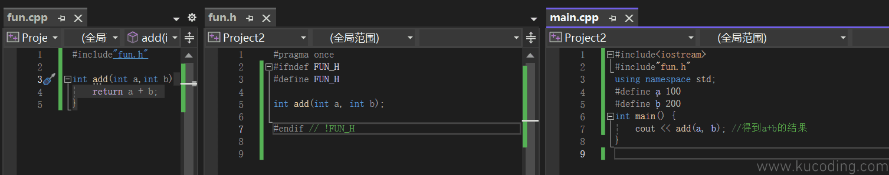
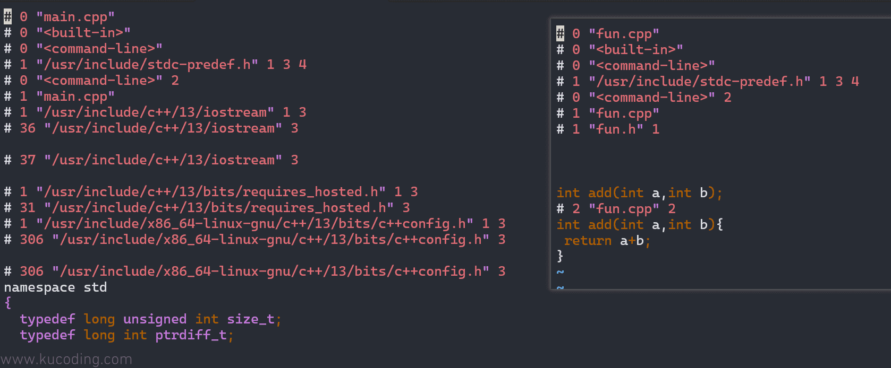
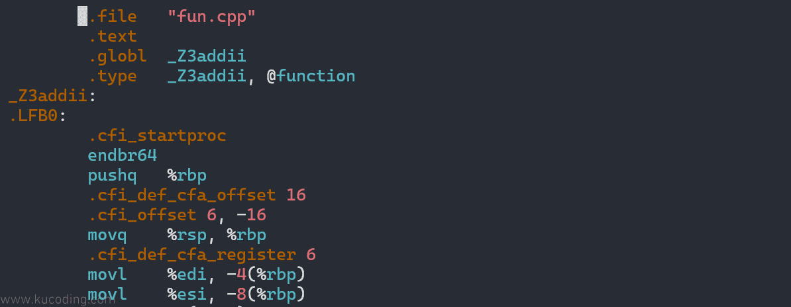

## 流程
主要分为4步：预处理、编译、汇编、链接，以下面三个文件为例\


## 预处理
主要处理源代码中以 # 开头的“预处理指令”
### 流程
1. 头文件展开：将 #include xxx 替换为 xxx 文件的全部内容。这是一个递归的过程。
2. 宏定义替换：#define 替换
3. 条件编译：处理 #ifdef, #ifndef, #if, #else, #endif 等指令，根据条件保留或舍弃部分代码。
4. 注释删除
### 输出
1. 指令： `g++ -E hello.cpp -o hello.i`
2. 生成的文件一般以 .i 作为后缀名
3. 左边的是main.i，右边的是fun.i\


## 编译
将预处理后的 C++ 代码翻译成与特定 CPU 架构相关的汇编代码
### 流程
1. 词法分析：将代码分解成一系列的“记号”(Tokens)，比如关键字 int、标识符 main、括号()等。
2. 语法分析：根据 C++ 语法规则，将记号组织成一棵“抽象语法树” (AST)，检查是否存在语法错误（比如分号缺失、括号不匹配等）。
3. 语义分析：检查代码的语义是否正确，比如类型是否匹配、变量是否在使用前声明等。
4. 代码优化：对生成的中间代码进行优化，比如删除无用代码、优化循环、内联函数等，以提高程序性能。
5. 生成汇编代码：将优化后的代码转换成目标平台的汇编语言。
### 输出
1. 指令： 
```
g++ -S hello.i -o hello.s
# 或者直接从cpp开始
# g++ -S hello.cpp -o hello.s
```
2. 生成包含汇编指令的文本文件，通常扩展名为 .s
3. fun.s 内容


## 汇编
将汇编代码转换成机器能够直接识别和执行的二进制指令，即机器码。由汇编器 as 执行
### 流程
1. 将每一条汇编指令翻译成对应的机器码。
2. 将这些机器码打包成一种称为“可重定位目标文件”的格式。
### 输出
1. 指令：`g++ -c main.s -o main.o`
2. 一个或多个目标文件，通常扩展名为 .o (Linux/macOS) 或 .obj (Windows)。
3. 目标文件是二进制文件，包含了代码段、数据段和符号表等信息，但还不能独立运行。

## 链接
将多个独立编译的目标文件以及它们所需要的库文件“链接”在一起，整合成一个单一的、完整的可执行文件。
### 流程
1. 符号解析\
（1）如 hello.o 文件中调用了 std::cout 和 std::endl，但具体实现在 C++ 标准库中。\
（2）链接器会查找所有目标文件和库文件，确保每一个符号引用（如函数调用）都能找到其唯一的定义。\
（3）如果找不到或找到多个定义，就会报链接错误 (e.g., undefined reference to '...')。
2. 地址重定位\
（1）将所有目标文件的代码段、数据段合并，并修正代码中对变量和函数的地址引用。\
（2）因为在编译单个文件时，编译器不知道函数和变量的最终内存地址，只是用一个占位符代替。链接器会计算出最终的内存地址，并用真实地址替换这些占位符。
3. 库文件链接：根据编译选项，链接器会执行静态链接或动态链接。
4. 静态链接：将库中被调用函数的机器码复制到最终的可执行文件中。\
（1）优点：程序独立性好，不依赖外部环境\
（2）缺点：文件体积大，库更新时需要重新编译。
5. 动态链接（默认）：不复制库代码，只在可执行文件中记录一个对外部库（如.so或.dll文件）的引用。程序运行时，由操作系统负责加载这个库。\
（1）优点：文件体积小，多个程序可共享一个库，更新方便\
（2）缺点：依赖外部环境。
### 输出
1. 指令
```
g++ hello.o -o hello
# 或者，最常用的一步到位命令
# g++ hello.cpp -o hello
```
2. 一个可执行文件 (在Linux/macOS上通常没有扩展名，如 hello；在Windows上是 .exe，如 hello.exe)
### 静态链接库
1. 全局静态链接：尝试将所有库（包括系统库如 libc）都进行静态链接
```
g++ main.cpp -L./lib -lmath -static -o app_static
-l：告诉链接器去链接一个库（library）。
math：库的规范名。链接器会自动加上 lib 前缀和 .a 或 .so后缀，也就是寻找 libmath.a 或 libmath.so 文件。
```
2. 局部静态链接：在命令行中给出静态库文件的完整路径或相对路径
```
g++ main.cpp ./lib/libmath.a -o app_static
```