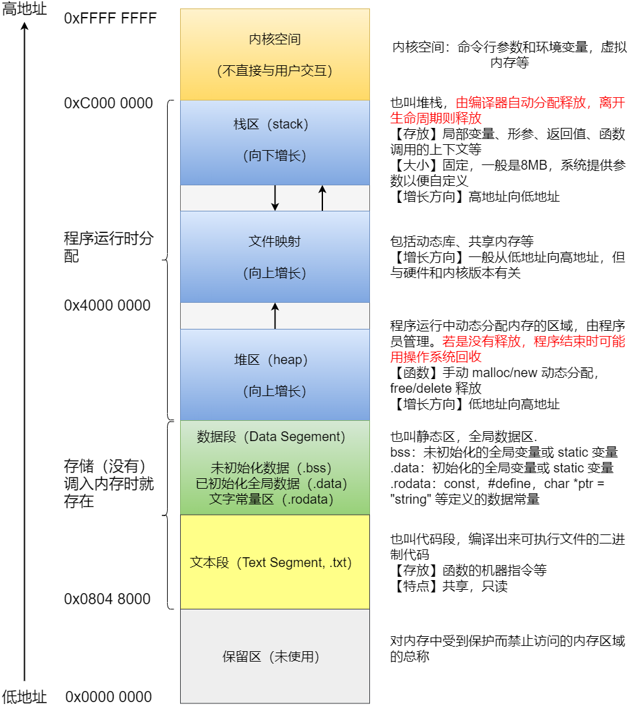

## 虚拟内存
虚拟内存为每个运行中的进程提供了一个独立的、虚拟的地址空间。这个空间通常被设计为连续的，与物理内存的实际布局无关。
1. 简化内存管理：操作系统仅需维护从虚拟地址到物理地址的映射关系，这大大简化了内存的分配和回收机制，提高了内存管理的效率。
2. 提升系统安全性：每个进程拥有独立的虚拟内存空间，这降低了进程间相互干扰的风险，增强了系统的安全性和稳定性。
3. 灵活的内存使用：允许操作系统采用更灵活的内存管理策略。例如，可以利用磁盘空间作为虚拟内存，从而支持大型应用程序的运行，即使物理内存有限。
4. 内存复用：物理内存可以被多个进程共享，但每个进程在自己的虚拟地址空间中看到的是独立的内存区域，从而实现了内存的有效复用。

### 栈（stack）
1. 从高到低增长，由编译器自动分配释放，总空间一般 8 MB。
2. 保存函数的局部变量、参数、返回值，以及函数调用上下文。
3. 离开生命周期后则释放。
### 堆（heap）
1. 一般由程序员分配释放，若程序员不释放，程序结束时由 OS 回收。
2. 从低到高增长，手动 malloc/new 动态分配 ， free/delete 释放
### 全局数据区（静态区）
1. .bss：未初始化的全局变量或 static 变量
2. .data：初始化的全局变量或 static 变量
3. .rodata：const，#define，char *ptr = "string" 等定义的数据常量
### 程序代码区
1. 存放程序执行代码，通常程序运行前就已确定，内容不可被修改
2. 可共享，对于频繁被执行的程序，只需要在内存中有一份代码
### 内核空间
1. 操作系统内核专用的内存区域，用于存储内核代码和数据结构。应用程序通常无法直接访问内核空间。
2. 当应用程序进行系统调用时，会从用户态切换到内核态，此时可以访问内核区域。
3. 主要用于操作系统与硬件之间的交互，如文件系统操作、I/O 通信、网络通信等。这些操作通常涉及到系统资源的管理和硬件设备的控制。

## 内存分配
1. 开辟空间时, 分配是从高位到低位
2. 存储数据时, 分配是从低位往高位