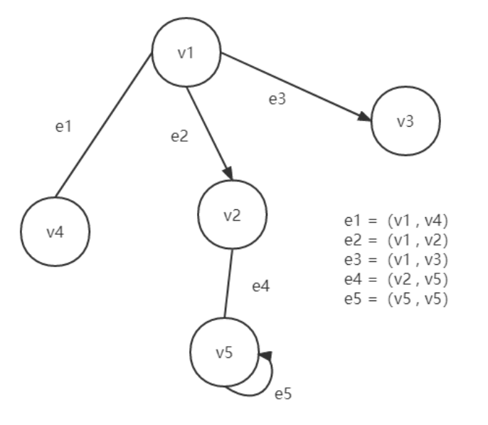
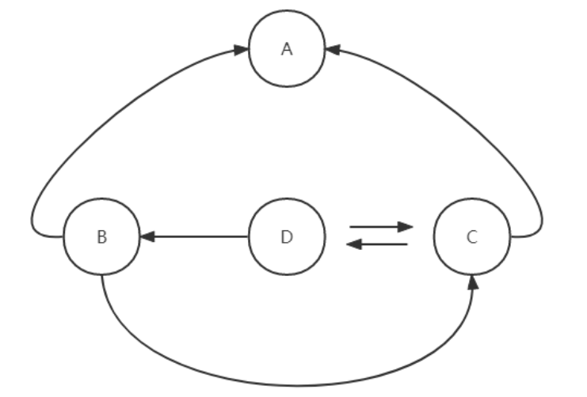
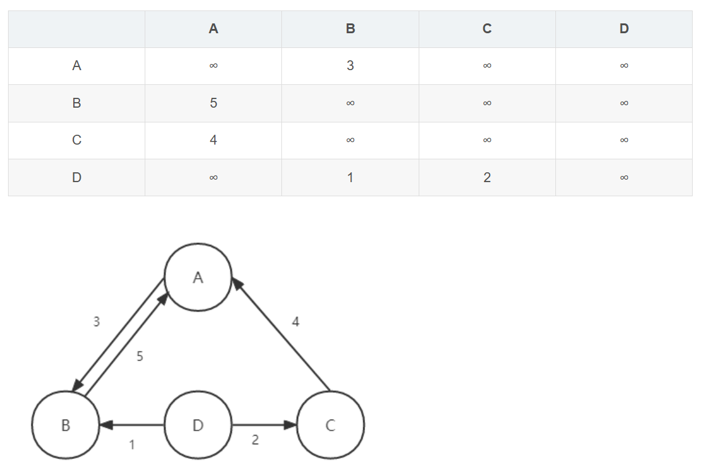
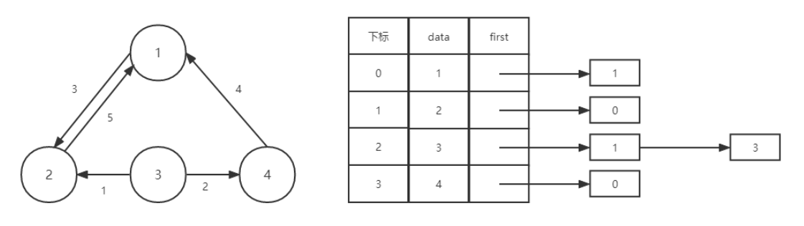
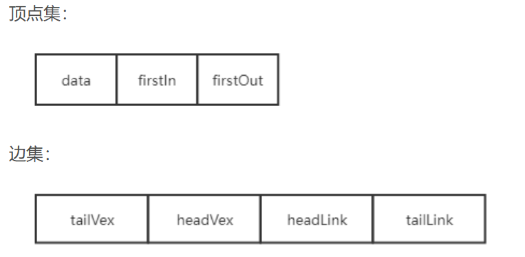
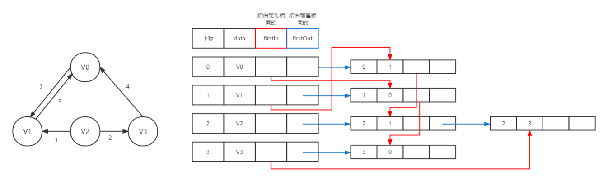
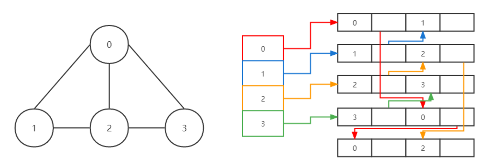

## 定义
G 是由两个集合 V 和 E 组成，记为 G = （V，E），其中 V 代表顶点，E 代表边，如下图。\


## 概念
### 简单图
不存在顶点到其自身的边，且同⼀条边没有重复出现
### 无向/有向图
代表边的顶点偶对是无序/有序的
### 完全图
图中的每两个顶点之间，都存在一条边
### 端点和邻接点
1. 若存在一条边（i，j），则称顶点 i 和顶点 j 为该边的两个端点，并称它们互为邻接点。
2. 在有向图中顶点 i 为起点。顶点 j 为终点。
### 顶点的度
顶点所具有的边的数目。在有向图中，顶点 v 的度就分为入度和出度。
### 回路/环
一条路径上的开始点与结束点为同一个顶点，则称此路为回路或环。
1. 欧拉环路：经过图中各边一次且恰好一次的环路。如{C，A，B，A，D，C，D，B，C} 
2. 哈密尔顿环路：经过图中的各顶点一次且恰好一次的环路。如{C，A，B，D，C}\


### 无向图连通
1. 若从顶点 i 到顶点 j 有路径，则称这两个顶点是连通的。
2. 如果图 G 中任意两个顶点都连通，则称 G 为连通图，否则称为非连通图。
3. G 中的极大连通子图称为 G 的连通分量。
### 有向图连通
1. 若从顶点 i 到顶点 j 有路径，则称从顶点 i 到顶点 j 是连通的。
2. 若图中的任意两个顶点都连通，即从顶点 i 到顶点 j 和从顶点 j 到顶点 i 都存在路径，则称其为强连通图。
3. G 中的极大强连通子图称为 G 的强连通分量。
### 稠密/稀疏
1. 当一个图接近完全图的时候，称之为稠密图；相反，当一个图含有较少的边数，则称之为稀疏图。
2. 通常认为边小于 nlogn（n 是顶点的个数）为稀疏图。
### 权
1. 边可以对应一个数，称为权。
2. 边上带有权的图称为带权图，也称之为网。
### 弧
1. 有向图中，有向边是由两个顶点组成的有序对，通常用尖括号表示，有向边又称为弧。
2. 弧的始点称为弧尾（起始点），弧的终点称为弧头（终端点）。

## 存储
### 邻接矩阵
两个数组来表示，一维数组存储图中的顶点信息，二维数组（将这个数组称之为邻接矩阵）存储图中的边的信息。\


### 邻接表
1. 空间浪费问题。尤其是边数相对比较少的稀疏图。可把数组与链表结合在一起来存储，即邻接表。
2. 数组来存储所有结点信息，然后每个结点有指向其他结点的指针。
3. 邻接表是用来存储出度的指针，而逆邻接表就是用来存储入度的指针。\


### 邻接数组
```
for(unsigned short i=0;i<m;++i){
	unsigned short u,v;
	cin>>u>>v;
	adj[u].push_back(v);
	adj[v].push_back(u);
}
```
### 十字链表
1. 将邻接表和逆邻接表结合，直接用一个数组表示。\


2. tailVex 表示该弧的弧尾顶点在顶点数组中的位置，headVex 表示该弧的弧头顶点在顶点数组中的位置。
3. hLink 则表示指向弧头相同的下一条弧，tLink 则表示指向弧尾相同的下一条弧。这里定义的是没有箭头的是弧尾，有箭头的是弧头。\


4. headLink 把所有弧头相同的边连了起来，比如指向结点 V0 的边有两条，分别是 V1 -> V0 和 V3 -> V0，所以从 V0 的 firstIn 连出去，先指向第一条边 1 -> 0 ，再将 1 -> 0 的 headLink 指向下一条也是指向 V0 的边。同样，V1 和 V3 的 firstIn 也是一样，V2 没有连是因为没有指向 V2 的边。
### 邻接多重表
1. 十字链表对于边的改动十分麻烦，就有了邻接多重表。在十字链表的边集定义上做了一些改动，同时在顶点数组中只用保留一个指针。\


2. 其中 iVex 和 jVex 是与某条边依附的两个顶点在顶点表中的下标。iLink 指向依附顶点 iVex 的下一条边，jLink 指向依附顶点 jVex 的下一条边。\


3. 这每条边中每个结点后面的指针其实就是指向下一个包含该结点的边。