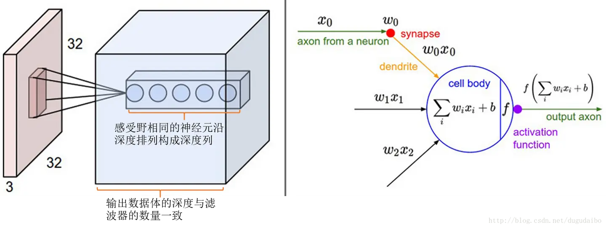
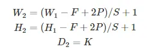
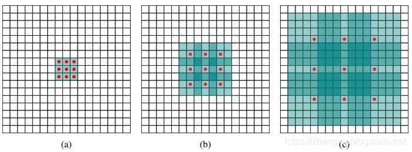
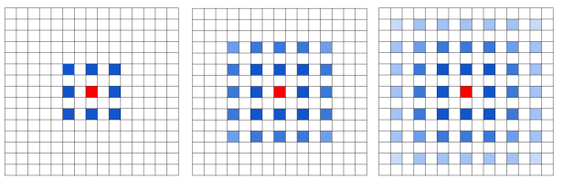

## 名词
1. 卷积核：二维矩阵，比输入图像的二维矩阵要小或相等。
2. 卷积：卷积核在输入图像的二维矩阵上移动，每一次移动都进行一次乘积的求和，作为此位置的值。\

3. 特征图：卷积后得到的新的二维矩阵
4. Padding：输入图像二维矩阵的边缘只计算了一次，可以在输入图像二维矩阵周围再拓展一圈或者几圈，以保留边缘特征。
## 作用
1. 滤波器：卷积层的参数是有一些可学习的滤波器集合构成的。每个滤波器在空间上（宽度和高度）都比较小，但是深度和输入数据一致。看到某些类型的视觉特征时就激活。
2.  降低参数数量：由于卷积具有“权值共享”这样的特性，可以降低参数数量，达到降低计算开销，防止由于参数过多而造成过拟合。
3.  可被看作是神经元的一个输出。神经元只观察输入数据中的一小部分，并且和空间上左右两边的所有神经元共享参数（因为这些数字都是使用同一个滤波器得到的结果）
## 感受野（receptive field）
1. 图像这样的高维度输入，进行全连接是不现实的。让每个神经元只与输入数据的一个局部区域连接，该连接的空间大小叫做神经元的感受野，它的尺寸是一个超参数（其实就是滤波器的空间尺寸）。
2. 连接在空间（宽高）上是局部的，但是在深度上总是和输入数据的深度一致。\

## 神经元的空间排列 
1. 输出数据体的深度：超参数，和滤波器数量一致，而每个滤波器在输入数据中寻找某些特征。沿着深度方向排列、感受野相同的神经元集合称为深度列（depth column），也可称纤维（fibre）。
2. 步长:滤波器每次移动的像素个数，步长也可以是 3 或者更大的数字，但在实际中很少使用，会让输出数据体在空间上变小。
3. 零填充（zero-padding）：将输入数据体用 0 在边缘处进行填充，其尺寸是超参数。零填充可以控制输出数据体的空间尺寸，常用来保持输入和输出的宽高相等。
4. 输出数据体在空间上的尺寸 $W_2×H_2×D_2$ 可以通过输入数据体尺寸 $W_1×H_1×D_1$，卷积层中神经元的感受野尺寸（F），步长（S），滤波器数量（K）和零填充的数量（P）计算输出出来。

一般说来，当步长 S=1 时，零填充的值是 P=(F-1)/2，这样输入和输出有相同的空间尺寸。
## 权值共享
1. 假如在一个卷积核中，每一个感受野采用的都是不同的权重值（卷积核的值不同），那么这样的网络中参数数量将是十分巨大的。
2. 权值共享是基于卷积核在图像矩阵不同位置提取特征是等效的，以减少参数量
3. 有时候权值共享没有意义，特别是输入图像是一些明确的中心结构，此时期望在图片的不同位置学习不同的特征。如输入为人脸，通常就放松权值共享的限制，称为局部连接层（Locally-Connected Layer）。
## 超参数及选择
1. 常见的设置是 F=3，S=1，P=1
2. 几个小卷积层的组合比一个大卷积层好，相同感受野的情况下，参数更少，且多个卷积层与非线性激活层交替的结构，比单一卷积层的结构更能提取出深层特征。缺点是反向传播时，中间的卷积层可能会导致占用更多的内存。
## 扩张卷积（Dilated Convolution）
也称为空洞卷积或者膨胀卷积，是在标准的卷积核中注入空洞，以此来增加模型的感受野。相比原来的卷积操作，多了一个参数：dilation rate，指的是卷积核的点的间隔数量，比如常规的卷积操作 dilation rate 为 1。
### 引出
1. 经典 CNN 结构对目标检测和图像分割来说存在一些问题，比如目标检测一般要在最后一层特征图上做预测，那么特征图上的一个点能映射到原图的多少像素，决定了网络能检测到的尺寸上限，而保证感受野就要靠下采样，下采样的结果就是小目标不容易被检测到。
2. 针对以上问题，多层特征图拉取分支能改善这个问题，因为小目标在越靠前的特征图上越容易体现，但是前面的特征图语义信息不够，比如在 SSD 中就存在这个问题。
3. 不做下采样，只增加卷积层的数量，首先会增大网络的计算量，其次不做 Pooling 的聚合最后的特征提取效果也会受到影响，而且感受野不会变化。
4. 扩张卷积可以不牺牲特征图尺寸的情况下增加感受野。
### 原理

扩张卷积就是在（a）基础卷积核加入间隔，（b）的 dilation rate = 2，即间隔为 1，卷积核尺寸变为了 7X7，但是只有 9 个点有参数，其余位置均为0
### 问题
卷积核是有间隔的，意味着不是所有的输入都参与计算，整体特征图上体现出一种卷积中心点的不连续，尤其是当叠加的卷积层都是用相同的 dilation rate。

上图中是三个 dilation rate=2 扩张卷积层连续卷积后的结果，蓝色的标识是参与计算的卷积中心，而颜色的深度表征次数。可以看到，由于3次的dilation rate是一致的额，所以卷积的计算中心会呈现出一种网格状向外扩展，有一些点不会成为计算的中心点。
### 解决
最直接的方法是不使用连续的 dilation rate 相同的扩展卷积，但是这还不够，因为如果 dilation rate 是成倍数的，那么问题还是存在。最好的方式是将连续排布的扩张卷积的 dilation rate 设置为“锯齿状”，比如分别是 [1，2，3]，那么卷积中心的分布就会变成下面这样，不在有遗漏的情况。
