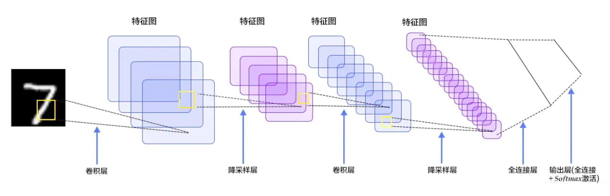

## 全连接网络缺陷
1. 将图像展开为向量会丢失空间信息；
2. 其次参数过多效率低下，训练困难；
3. 大量的参数也很快会导致网络过拟合。
## 结构

1. 输入层：输入图像等信息，对输入样本数据做一定的预处理
2. 卷积层：用来提取图像的底层特征，在实际应用中往往将卷积层与 ReLU 层共同称之为卷积层
3. 池化层：防止过拟合，将数据维度减小
4. 全连接层：汇总卷积层和池化层得到的图像的底层特征和信息
5. 输出层：根据全连接层的信息得到概率最大的结果
## 尺寸设置
1. 输入层：能被2整除很多次。常用数字包括32（如CIFAR-10），64，96（如STL-10）或224（如ImageNet），384和512。
2. 卷积层：小尺寸滤波器（比如3x3或最多5x5），步长S=1，且零填充。
3. 池化层：2x2 感受野，步长为 2，这一操作将会把输入数据中75%的激活数据丢弃
## 下采样和上采样
### 下采样
1. 缩小图像，主要目的有两个\
（1）使图像符合显示区域的大小\
（2）生成对应图像的缩略图
1. 实现方式\
（1）用步长为 2 的卷积层实现：下采样是信息损失的过程，而池化层是不可学习的，用步长为 2 的可学习卷积层来代替 pooling 可以得到更好的效果，同时也增加了一定的计算量。\
（2）用步长为 2 的池化层实现：池化下采样是为了降低特征的维度。如 Max-pooling 和 Average-pooling，目前通常使用 Max-pooling，因为计算简单且能更好保留纹理特征。
### 上采样
1. 放大图像，从而可以显示在更高分辨率的显示设备上
2. 实现方式\
（1）插值，一般使用双线性插值，效果最好，计算上比其他插值方式复杂，但是相对于卷积计算可以忽略，其他插值方式还有最近邻插值、三线性插值等\
（2）转置卷积又或是说反卷积(Transpose Conv)，通过对输入图像间隔填充 0，再进行标准的卷积计算，可以使得输出图像的尺寸比输入更大；相比上池化，使用反卷积进行图像的“上采样”是可以被学习的（会用到卷积操作，其参数是可学习的）。