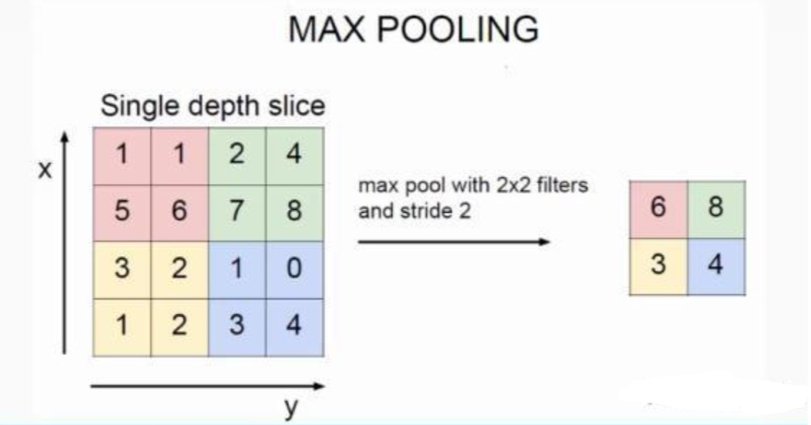

## 概述
通常也叫做子采样（subsampling）或降采样（Downsampling），没有参数，往往是用在卷积层之后，主要作用如下
1. 抑制噪声，降低信息冗余
2. 提升模型的尺度不变性，旋转不变性，平移不变性
3. 降低参数和计算量，防止过拟合
## 最大池化

如上图所示，表示的就是对一个 4X4 feature map，用一个 2X2 的 filter，步长为 2 选择最大值输出到下一层。最大池化常选择 2X2 filter，步长为2。
## 平均池化
取 filter 内的平均值输出到下一层
## 总结
是特征选择，信息过滤的过程。也就是损失了一部分信息，这是一个和计算性能的一个妥协，随着运算速度的不断提高，现在有些网络都开始少用或者不用 pooling 层了。