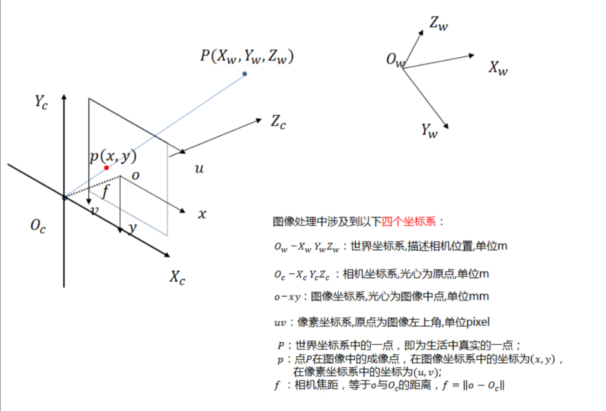

# 坐标系
内参、外参和畸变，正是控制以下坐标系之间转换的参数。

## 世界坐标系 (World Coordinate System)
自己定义的、描述真实世界中物体位置的参考系。例如，可以将一个棋盘格的角点定义为原点 $(0, 0, 0)$。
## 相机坐标系 (Camera Coordinate System)
以相机的光心为原点，光轴为 Z 轴的坐标系。相机看到的一切物体，都需要先转换到这个坐标系下。
## 图像物理坐标系 (Image Plane Coordinate System)
以相机光轴与成像平面的交点为原点的二维坐标系，单位通常是毫米。
## 像素坐标系 (Pixel Coordinate System)
以图像的左上角为原点的二维坐标系，单位是像素。这是我们最熟悉的图片坐标。

# 外参
相机在世界坐标系中的“位置”和“姿态”。决定了如何将世界坐标系转换到相机坐标系。当移动或旋转相机时，外参就会改变。
## 旋转矩阵 R
一个 $3 \times 3$ 的矩阵，描述了相机坐标系的三个轴相对于世界坐标系的旋转关系。
## 平移向量 t
一个 $3 \times 1$ 的向量，描述了相机坐标系的原点（光心）相对于世界坐标系原点的位置。它定义了相机的位置。
## 变换
$$P_{camera} = R \cdot P_{world} + t \quad \text{或写成齐次矩阵形式} \quad \begin{bmatrix} P_{camera} \\ 1 \end{bmatrix} = \begin{bmatrix} R & t \\ 0 & 1 \end{bmatrix} \begin{bmatrix} P_{world} \\ 1 \end{bmatrix}$$

# 内参
相机自身的属性，是相机坐标系到像素坐标系的转换关系。相机出厂时就固有的，一旦镜头和相机固定，内参一般不会改变。
## 内参矩阵
$$K = \begin{bmatrix} f_x & s & c_x \\ 0 & f_y & c_y \\ 0 & 0 & 1 \end{bmatrix}$$
1. $f_x$ 和 $f_y$：分别是在 x 和 y 方向上缩放的焦距，单位是像素。它们是物理焦距（单位：毫米）和像素在传感器上物理大小的结合。
2. $f_x = f \cdot k_x$，其中 $f$ 是物理焦距，$k_x$ 是 x 方向每单位长度的像素数。
3. $(c_x, c_y)$：主点的坐标，即相机光轴与成像平面的交点。理论上应该在图像的正中心，但由于制造工艺的偏差，会存在少量偏移。
4. $s$：扭曲系数 (Skew Coefficient)，表示 x 和 y 成像轴之间的倾斜程度。在现代相机中，这个值几乎总是 0，因此可以被忽略。
## 变换
从相机坐标系 $(X_c, Y_c, Z_c)$ 到像素坐标系 $(u, v)$ 
$$Z_c \begin{bmatrix} u \\ v \\ 1 \end{bmatrix} = \begin{bmatrix} f_x & s & c_x \\ 0 & f_y & c_y \\ 0 & 0 & 1 \end{bmatrix} \begin{bmatrix} X_c \\ Y_c \\ Z_c \end{bmatrix} = K \cdot P_{camera}$$

# 畸变
1. 理想的针孔相机模型是线性的，即一条直线在成像后仍然是一条直线。
2. 但相机镜头是复杂的凸透镜和凹透镜组合，光线在通过时会发生折射，导致实际成像并非完美的线性投影。这种偏差就是畸变。
## 径向畸变
最主要的一种畸变，由镜片形状引起，沿着镜头半径方向分布，越靠近图像边缘越明显。
### 桶形畸变 (Barrel Distortion)
图像向外凸出，像一个木桶。通常在广角镜头（短焦距）中出现。数学上，当畸变系数 $k_1 > 0$ 时表现为桶形畸变。
### 枕形畸变 (Pincushion Distortion)
图像向内凹陷，像一个枕头。通常在长焦镜头中出现。数学上，当畸变系数 $k_1 < 0$ 时表现为枕形畸变。
## 切向畸变
由于镜头镜片与成像平面不完全平行造成的，导致图像中的某些区域被拉伸。
## 衡量
1. 通常用几个畸变系数来量化这些畸变。最常用的模型是 Brown-Conrady 模型，包含：径向畸变系数：$k_1, k_2, k_3, \dots$；切向畸变系数：$p_1, p_2$
2. 畸变校正的过程，就是利用这些系数，将图像上畸变了的点坐标变换回在理想模型中应该在的位置。

# 标定
通过实验，精确地计算出相机的所有内部参数（内参矩阵K 和 畸变系数）
## 张正友标定法
目前最流行的方法，非常简单实用，只需要一台相机和一张打印出来的棋盘格图案。
### 准备步骤
1. 准备：打印一张黑白相间的棋盘格图案，并将其固定在一个平面上。
2. 拍摄：从不同角度、不同距离、不同姿态拍摄这张棋盘格图案\
（1）通常需要 15 到 20 张高质量的照片。\
（2）要让棋盘格出现在画面的不同位置，尤其是边缘区域，这样才能充分激发镜头的畸变，从而让算法更好地计算出畸变系数。
3. 角点检测：在所有拍摄的照片上，使用图像处理算法（如 OpenCV 中的 findChessboardCorners 函数）自动检测出所有棋盘格的角点在像素坐标系下的坐标 $(u, v)$。
### 求解
已知棋盘格上所有角点在世界坐标系下的三维坐标 $(X_w, Y_w, Z_w=0)$ (棋盘格是平面的，Z=0) 和在像素坐标系下的二维坐标 $(u, v)$。\
1. 代入投影模型公式中：
$$s \cdot p_{pixel} = K \cdot (\text{Distort}) \cdot [R|t] \cdot P_{world}$$
2. 通过非线性优化的方法（如列文伯格-马夸尔特算法），就可以反向求解出最优的内参矩阵K、畸变系数。
3. 同时，对于拍摄的每一张棋盘格照片，算法也能计算出当时相机相对于那张棋盘格的外参 $[R|t]$。

# 矫正
1. 标定后已知相机内参矩阵 K 和 畸变系数 D，畸变系数通常是一个包含5个或更多参数的向量。
2. 例如 $D = [k_1, k_2, p_1, p_2, k_3]$。$k_1, k_2, k_3$ 是径向畸变系数。$p_1, p_2$ 是切向畸变系数。
## 核心思想
1. 反向映射：对于无畸变图像中的任意一个像素点 $p_{undistorted} = (u_{u}, v_{u})$，它对应于原始畸变图像中的哪个点。
2. 正向映射可能会导致无畸变图像中某些像素没有颜色值（被拉伸的空洞），而反向映射可以确保新图像的每个像素都有值，保证了图像的完整性。
## 计算
### 像素坐标 $\rightarrow$ 归一化图像坐标
将无畸变图像的像素坐标 $(u_u, v_u)$，利用内参矩阵 K 的逆矩阵，转换到归一化的图像平面坐标 $(x_u, y_u)$
$$ \\ \begin{bmatrix} x\_u \\ y\_u \\ 1 \end{bmatrix} = K^{-1} \cdot \begin{bmatrix} u\_u \\ v\_u \\ 1 \end{bmatrix}
$$
### 应用畸变模型
对这个理想的归一化坐标 $(x_u, y_u)$ 应用畸变模型公式，计算出它在畸变情况下应该在的位置 $(x_d, y_d)$。令 $r^2 = x_u^2 + y_u^2$。
1. 径向畸变
$$x_{d\_radial} = x_u (1 + k_1 r^2 + k_2 r^4 + k_3 r^6)$$
$$y_{d\_radial} = y_u (1 + k_1 r^2 + k_2 r^4 + k_3 r^6)$$
2. 切向畸变：
$$x_{d\_tangential} = x_{d\_radial} + [2p_1 x_u y_u + p_2(r^2 + 2x_u^2)]$$
$$y_{d\_tangential} = y_{d\_radial} + [p_1(r^2 + 2y_u^2) + 2p_2 x_u y_u]$$
3. 最终得到畸变后的归一化坐标 $p_d' = (x_d, y_d)$。
### 归一化图像坐标 $\rightarrow$ 像素坐标（畸变）
将计算出的畸变归一化坐标 $(x_d, y_d)$，利用内参矩阵K，转换回原始畸变图像的像素坐标 $(u_d, v_d)$
$$ \\ \begin{bmatrix} u\_d \\ v\_d \\ 1 \end{bmatrix} = K \cdot \begin{bmatrix} x\_d \\ y\_d \\ 1 \end{bmatrix}
$$
由于计算出的 $(u_d, v_d)$ 大概率不是整数（比如(100.7, 205.2)），需要用双线性插值等方法来精确计算出这个亚像素点的颜色值。
## 实践
1. 在实际操作中，不可能对图像的每一个像素都实时进行上面那套复杂的计算，效率太低。
2. 更高效的做法是预先计算好一个“映射表”，存储了新图像中每个像素 $(u_u, v_u)$ 应该对应到老图像的哪个坐标 $(u_d, v_d)$