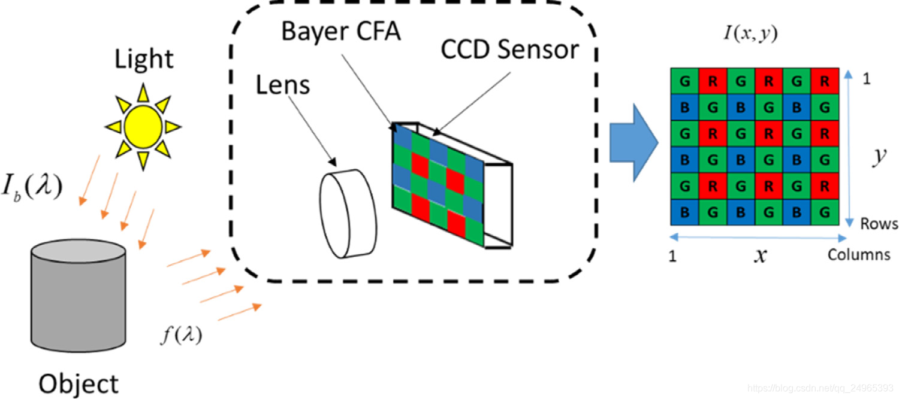

## 概述
1. 接收来自图像传感器的原始数据，并将其转换成人类视觉系统能够欣赏、并且可以在屏幕上正确显示的数字图像。
2. 图像传感器（如 CCD 或 CMOS）本质上是一个光电转换器件，它只能感知光的强度（亮度），而不能直接感知颜色。
3. 为了捕捉颜色信息，传感器前方覆盖了一层“拜耳滤镜”。这个滤镜由无数个微小的红、绿、蓝滤色片以特定的模式（通常是 RGGB）
4. 原始数据就像一张灰暗、带有马赛克图案的、未经加工的“数字底片”。

# 前端处理
## 黑电平校正 (Black Level Correction)
### 问题
即使在完全黑暗的环境下，传感器由于暗电流等原因也会产生微弱的电信号，导致图像最黑的部分不是纯黑，而是偏灰。
### 操作
从整个图像信号中减去这个“黑色”的基准值，确保黑色纯净。
## 镜头阴影校正 (Lens Shading Correction)
### 问题
由于镜头物理特性，图像中心区域的进光量通常比边缘和角落多，导致照片出现“暗角”。
### 操作
对图像边缘和角落的亮度进行补偿，使整个画面的亮度更加均匀。
## 坏点/噪声消除 (Denoise & Defect Pixel Correction)
### 问题
传感器在制造过程中可能会产生一些永远失效（全黑或全白）的“坏点”。同时，在弱光环境下提高 ISO 会产生大量随机的噪点（彩色或亮度噪点）。
### 操作
通过算法识别这些坏点和噪点，并用周围像素的信息进行智能填充和修复，使画面更纯净。这是衡量 ISP 性能的关键指标之一。

# 色彩与图像重建
## 去马赛克 (Demosaicing / Debayer)
### 问题
每个像素只包含 R、G、B 中的一种颜色信息。

### 操作
这是最核心、最复杂的步骤之一。ISP 需要根据每个像素周围其他颜色像素的信息，通过插值算法估算出该像素点缺失的另外两种颜色信息。
1. 双线性插值：缺失的颜色，取其周围相同颜色像素点的平均值\
（1）在 G 像素点上插值 R/B：取其上下（或左右）两个 R/B 像素的平均值。\
（2）在 R/B 像素点上插值 G：取其上下左右四个 G 像素的平均值。\
（3）在 R 像素点上插值 B：取其斜对角四个 B 像素的平均值。\
（4）优点：比最近邻好很多，计算依然简单快速。\
（5）算法没有考虑图像的结构，在物体边缘处会表现很差。它会粗暴地将边缘两侧的颜色平均化，导致边缘模糊，并产生两种典型的伪影\
（6）拉链效应 (Zippering)：在斜向的边缘上出现断断续续、类似拉链的痕迹。\
（7）色彩伪影/颜色混叠 (Color Aliasing)：在物体的边缘或高频纹理区域（如布料）出现不该有的杂色（彩虹色或奇怪的色块）。
2. 高品质线性插值：引入了一个更大的插值核，比如 $5\times 5$ 的范围。同时考虑颜色通道之间的相关性。\
（1）利用了色差恒定假设：即在一个很小的局部区域内，R-G 和 B-G 的值是基本保持不变的。\
（2）优点：效果比双线性好得多，能有效抑制一部分伪影。\
（3）代表算法：Malvar-He-Cutler (MHC)
3. 边缘导向/自适应插值：目前高性能 ISP 的关键技术。先检测插值点附近的边缘方向\
（1）如果要为一个 G 像素点插值 R，算法会先判断该点是否存在一条垂直边缘或水平边缘。\
（2）若判断存在一条垂直边缘，那么插值时就会优先使用垂直方向上的 R 像素信息，因为水平方向的 R 像素很可能属于边缘另一侧的不同物体，颜色差异巨大。\
（3）优点：极大地改善了边缘处的清晰度和伪影问题。
## 自动白平衡 (Auto White Balance - AWB)
### 问题
人眼有很强的色彩恒常性，无论在日光、灯光还是烛光下，我们都能正确感知一张白纸是白色的。但相机传感器不行，在不同色温的光源下，白色物体会偏蓝（高色温）或偏黄（低色温）。
### 操作
通过算法分析画面中的色温信息，自动调整红、绿、蓝通道的增益，还原物体在人眼视觉中的真实色彩。
## 色彩校正矩阵 (Color Correction Matrix - CCM)
### 问题
传感器对颜色的感知与人眼的色彩空间 (sRGB) 存在差异。
### 操作
通过一个校正矩阵，将传感器的色彩空间映射到标准的 sRGB 或其他色彩空间上，确保颜色准确。
## 伽马校正 (Gamma Correction)
### 问题
人眼对亮度的感知是非线性的（对暗部变化更敏感），而传感器的响应是线性的。直接输出的图像在屏幕上会显得暗淡、对比度不足。
### 操作
应用一条伽马曲线，调整图像的中间调，使其亮度和对比度更符合人眼观感。

# 后期增强与输出
## 色调映射 (Tone Mapping / HDR)
### 问题
真实世界的光照动态范围（最亮到最暗的差距）远超传感器能记录的范围，更超过屏幕能显示的范围。
### 操作
通过算法（如 HDR 技术）将高动态范围的场景信息“压缩”到显示屏能够容纳的范围内，同时保留高光和阴影部分的细节，使画面看起来更像人眼所见。
## 锐化 (Sharpening) 与 边缘增强 (Edge Enhancement)
### 问题
去马赛克和降噪过程可能会使图像损失一些细节，显得有些“软”。
### 操作
通过算法增强物体边缘的对比度，让图像看起来更清晰、更锐利。
## 色彩空间转换 (Color Space Conversion)
### 操作
将处理完成的 RGB 数据转换为 YUV（或 YCbCr）格式。YUV 格式将亮度和色度信息分开存储，更符合人眼视觉特性，也便于后续的压缩。
## 压缩与输出 (Compression & Output)
### 操作
将 YUV 数据通过 JPEG 或 HEIC 编码器进行压缩，形成我们最终得到的照片文件。