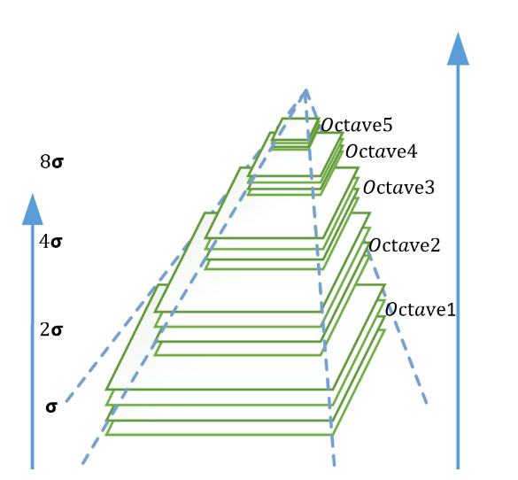
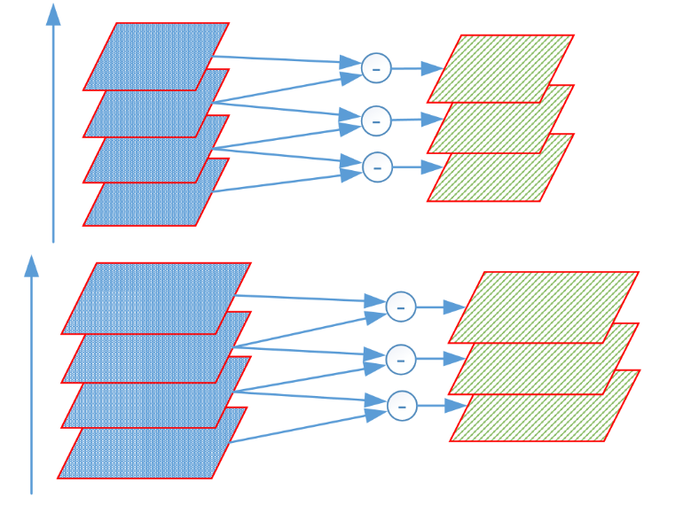
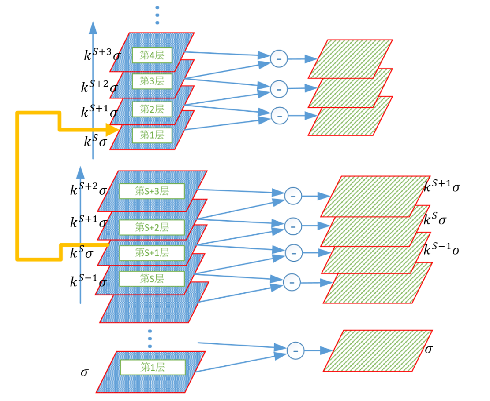
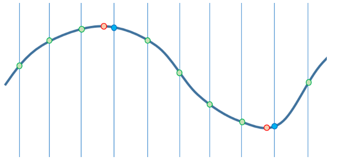
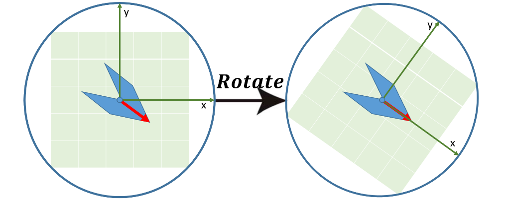
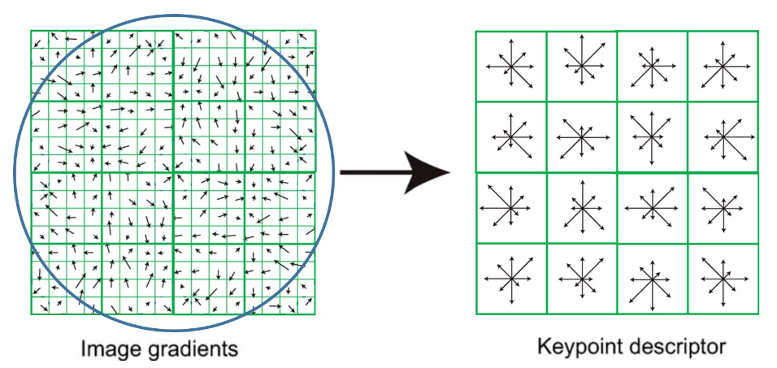

## 概述
1. 在图像中寻找那些独特的、易于识别和跟踪的点、线或区域。这些点被称为“特征点”或“关键点”。
2. 为每个检测到的特征点创建一个数学表示（一个向量或二进制字符串），被称为“描述子”。一个好的描述子应该对光照、旋转、尺度等变化具有鲁棒性。
3. 在两张或多张图像之间，通过比较它们的描述子来寻找相互对应的特征点即特征匹配。

# 角点检测
1. 特征检测的目标是找到关键点，最经典的就是角点。
2. 角点是指在各个方向上移动窗口，都会产生显著灰度变化的点。
3. 平坦区域和直线上的点由于缺乏独特性，很难被精确定位。
## 结构张量
所有基于梯度的角点检测器，其核心都是结构张量（也称 Harris 矩阵或二阶矩矩阵）。
### 计算图像梯度
通常使用 Sobel 算子来完成。
$$I_x = G_x * I \quad \text{和} \quad I_y = G_y * I$$
### 构建结构张量 M
对于每一个像素点，考虑其周围的一个窗口（例如 5x5），计算该窗口内的梯度信息的加权和
$$M = \sum_{window} w(x, y) \begin{bmatrix} I_x^2 & I_x I_y \\ I_x I_y & I_y^2 \end{bmatrix} = \begin{bmatrix} A & C \\ C & B \end{bmatrix}$$
其中，$w(x,y)$ 是一个窗口函数，通常是高斯窗口。
### 计算特征值 $λ_1$，$λ_2$：
1. 平坦区域：$λ_1$ 和 $λ_2$ 都很小。
2. 边缘区域：一个特征值远大于另一个（ $λ_1$ ≫ $λ_2$ 或 $λ_2$ ≫ $λ_1$ ）。
3. 角点区域：$λ_1$ 和 $λ_2$ 都很大。
## Harris 角点检测器
设计了一个巧妙的角点响应函数 R，避免了直接计算复杂的特征值。
### 原理
通过一个小的滑动窗口，分析窗口向任意方向移动时所引起的像素值变化。
1. 平坦区域：无论向哪个方向移动，内部像素变化都很小。
2. 边缘：沿边缘方向移动，变化很小；垂直于边缘方向移动，变化很大。
3. 角点：无论向哪个方向移动，变化都很大。
### 计算
1. 根据上述步骤为图像中的每个像素计算结构张量 M
2. 计算每个像素的角点响应值 R
$$R = \det(M) - k \cdot (\text{trace}(M))^2$$
（1）$\det(M) = AB - C^2 = \lambda_1 \lambda_2$\
（2）$\text{trace}(M) = A + B = \lambda_1 + \lambda_2$\
（3）k 是一个经验常数，通常取 0.04 到 0.06。

3. 设定阈值：只有当 R 大于阈值时，才将其视为候选角点。
4. 非极大值抑制：在一个局部邻域内，只保留响应值最大的那个角点，以确保每个角点只被检测一次。
### 缺点
不具备尺度不变性。
## Shi-Tomasi 角点检测器
Shi 和 Tomasi 发现，对于目标跟踪任务，一个更稳定的角点标准是其较小的那个特征值也要足够大。 
### 计算
1. 为每个像素计算结构张量 M。
2. 计算角点响应值 R：
$$R = \min(\lambda_1, \lambda_2)$$
3. 对 R 应用阈值并进行非极大值抑制。
### 区别
这个简单的改进通常能产生分布更均匀、更适合跟踪的特征点。
## FAST (Features from Accelerated Segment Test) 
核心思想是角点周围一圈的像素中，应该有连续的一段都比它亮，或者都比它暗。
### 计算
1. 选择中心像素 p：从图像中选取一个像素 p 作为候选点，其灰度值为 $I_p$
2. 定义邻域圆：在 p 的周围，定义一个半径为 3 像素的 Bresenham 圆，这个圆上正好有 16 个像素点。从 1 到 16 进行编号（通常 1 在正上方，顺时针排列）。
3. 定义灰度阈值 t：决定了“显著亮”或“显著暗”的标准。
4. 进行段测试：比较这 16 个邻域像素的灰度值和 $I_p$，分为三类：\
（1）更亮：像素灰度值 > $I_p$+t\
（2）更暗：像素灰度值 < $I_p$−t\
（3）相似：像素灰度值在 [$I_p−t$,$I_p+t$] 范围内
5. 判定角点：如果在圆周上存在连续的 n 个像素 都属于 更亮/更暗，那么 p 就判定为角点。
6. n 的值通常被设为 9、10、11 或 12。最常用的是 FAST-9。
### 优化
圆周上四个基准点（1, 5, 9, 13）中，至少要有 3 个点满足 更亮/更暗，才有可能存在一个长度为9的连续段。

# 特征检测与描述
核心是解决尺度不变性和旋转不变性。
## SIFT (Scale-Invariant Feature Transform)
### 尺度空间构建与极值检测
1. 高斯金字塔：对原图进行连续的高斯模糊和降采样，构建一系列不同分辨率的图像，形成金字塔。
2. 高斯金字塔对每层图像中的每张图像使用不同参数做高斯模糊，使得金字塔的每层含有多张高斯模糊后的图像，在这里将金字塔每层多张图像合称为一组（Octave），每组中的每张图像称为该组中的层（Interval），一般为3~5层。\

3. 高斯差分 (DoG) 金字塔：在每个金字塔层级内，将相邻两个高斯模糊后的图像相减，得到 DoG 图像。这可以高效地近似拉普拉斯算子，用于检测斑点状特征。\

$$D(x, y, \sigma) = (G(x, y, k\sigma) - G(x, y, \sigma)) * I(x, y)_o$$

4.  寻找极值点：在 DoG 金字塔中，将每个像素点与其邻域的 8 个点，以及上下两个尺度层的各 9 个点（共 26 个点）进行比较，寻找局部最大值或最小值。这些点是候选关键点。
### 关键点定位与筛选
 

1. 亚像素级定位：对候选点周围的 DoG 空间进行三维二次函数拟合（泰勒展开），解出极值点的精确位置（亚像素坐标）、尺度和响应强度。如下图，离散空间的极值点并不一定是真的极值点，所以需要三维二次函数拟合。\
 

2. 剔除低对比度点：如果拟合出的极值点响应强度绝对值小于某个阈值（如0.03），则认为它是由噪声引起的，予以剔除。
3. 剔除边缘点：计算关键点位置的 Hessian 矩阵，通过主曲率的比值来判断其是否位于边缘上。如果比值过大（如大于10），说明它是一个不稳定的边缘点，予以剔除。这个过程类似 Harris 角点检测。
### 方向分配
1. 在关键点所在的尺度上，计算其邻域（由尺度决定大小）内所有像素的梯度方向和幅值。
2. 创建一个包含 36 个 bin 的方向直方图（每 10 度一个 bin）。根据梯度方向将像素分配到对应的 bin，并根据梯度幅值和高斯权重进行加权累加。
3. 直方图的峰值所代表的方向就是该关键点的主方向。为了增强鲁棒性，任何超过主峰值80%的峰都会被保留，并为此创建一个具有该方向的、位置和尺度相同的关键点。
### 特征描述子生成
1. 在关键点周围选取一个 16x16 的邻域，将该邻域的坐标轴旋转到关键点的主方向，以确保旋转不变性。
 

2. 将旋转后的 16x16 邻域划分为一个 4x4 的网格，在每个子区域内计算一个8个方向的梯度直方图。
 

3. 将这 16 个子区域的 8 方向直方图串联起来，形成一个 128 维的向量。
4. 最后，对该向量进行归一化，以消除光照变化的影响。就是最终的 SIFT 描述子。
### 优点
1. 具备尺度、旋转、光照不变性，对视角变化和噪声也有很强的鲁棒性。
2. 描述子独特性极高，误匹配率低。
### 缺点
1. 计算量巨大，速度非常慢。
2. 由于专利保护（现已过期），在商业应用中曾受限制。
### 应用
图像拼接、物体识别等对精度要求高、不追求实时性的离线任务。
## SURF (Speeded Up Robust Features)
1. 通过积分图像和盒式滤波器对 SIFT 进行了大幅加速。
2. 积分图像：积分图像中的任意一点 (x,y) 的值是原图中左上角到该点所有像素之和。
3. 这使得计算任意矩形区域内像素之和的操作，从随面积变化的复杂度降低到了 O(1) 的常数时间，只需4次查表和3次加减法。
### 步骤
1. 尺度空间构建：不使用DoG金字塔，而是保持图像大小不变，通过逐步增大盒式滤波器的尺寸来近似不同尺度的高斯二阶导数响应。这一切都基于积分图像进行超高速计算。
2. 关键点定位：与 SIFT 类似，通过在尺度空间中搜索3D非极大值来定位关键点。
3. 方向分配：在关键点周围的一个圆形邻域内，计算 Haar 小波在 x 和 y 方向的响应，并将这些响应向量进行加权求和，得到最长的向量方向即为主方向。
4. 特征描述子生成：\
（1）在关键点周围选取一个 20s x 20s 的窗口（s 是关键点尺度）。\
（2）将其旋转到主方向，并划分为 4x4 的子区域。\
（3）在每个子区域内，计算 Haar 小波在 x 和 y 方向的响应 $∑dx,∑dy,∑∣dx∣,∑∣dy∣$\
（4）将这 16 个子区域的 4 个值串联起来，形成一个 64 维的描述子。
### 优点
1. 速度比 SIFT 快很多倍（通常3-7倍）。
2. 鲁棒性与 SIFT 相当。
### 缺点
1. 同样受专利保护（现已过期）。
2. 在某些场景下，精度略低于 SIFT。
### 应用
需要较高性能且对实时性有一定要求的任务。
## ORB (Oriented FAST and Rotated BRIEF)
### 步骤
1. 构建图像金字塔，在每一层上都运行 FAST 检测
2. 方向分配：使用强度质心法。在一个邻域内，计算像素的矩，通过一阶矩 $m_10$,$m_01$ 和零阶矩 $m_00$ 计算出质心位置。从角点指向质心的向量即为该特征点的方向。
3. BRIEF 描述子：其核心思想是在关键点邻域内，预先定义好 N 对像素点 $(p_i,q_i)$。通过比较这些点对的亮度大小来生成一个二进制字符串：
$$\tau(p_i, q_i) = \begin{cases} 1 & \text{if } I(p_i) < I(q_i) \\ 0 & \text{otherwise} \end{cases}$$
将 N 次比较的结果串联起来，就得到一个 N-bit 的二进制描述子。

4. 旋转不变性：原始 BRIEF 不具备旋转不变性。根据特征点方向，在生成描述子之前，将这 N 对像素点的坐标 $(p_i,q_i)$ 旋转到该方向
### 优点
1. 速度极快，接近 SURF，远快于 SIFT。
2. 完全免费，无专利限制。
3. 综合性能好，是实时应用中的首选。
### 缺点
对视角变化的鲁棒性不如 SIFT/SURF。
### 应用
实时 SLAM、移动设备上的特征匹配、物体识别等。

# 特征匹配距离度量
## 连续/实值描述子 
### 代表算法
SIFT, SURF, RootSIFT, AKAZE
### 匹配度量
1. L2 范数：最常用、最标准的度量方式
2. L1 范数：计算速度比 L2 快，但在某些情况下精度略低。
## 二进制/字符串描述子
### 代表算法
ORB, BRIEF, BRISK, FREAK
### 匹配度量
汉明距离： 二进制描述子距离计算的唯一标准。

# 特征匹配算法
## 暴力匹配
## 快速最近邻搜索 (Approximate Nearest Neighbors - ANN)
### 对于连续描述子
1. 通常使用 k-d 树 (k-dimensional tree)。k-d 树是一种空间划分数据结构，它将高维的点集通过一系列超平面进行划分。
2. 在搜索时，可以根据树的结构快速剪枝，排除掉那些不可能包含最近邻的大片空间，从而大大减少需要计算距离的点的数量。
### 对于二进制描述子
1. 通常使用 局部敏感哈希 (Locality-Sensitive Hashing - LSH)。
2. 基本思想是设计一组哈希函数，使得相似的（汉明距离近的）描述子有很高的概率被哈希到同一个“桶”里，而不相似的描述子则分散到不同的桶里。
3. 搜索时，只需要在查询描述子所在的桶内进行小范围的暴力匹配即可。

# 特征匹配筛选
无论是暴力匹配还是 FLANN，得到的初始匹配对中都不可避免地包含大量错误。因此，匹配后的筛选至关重要。
## Lowe's Ratio Test (比率测试)
1. 目前最常用、最有效的筛选方法。
2. 核心思想：一个好的、明确的匹配，其最佳匹配的距离应该远远小于次佳匹配的距离。
### 计算
1. 在使用匹配算法时，对每个描述子，找 k=2 个最近邻（match1 和 match2）。
2. 计算这两个匹配的距离 dist1、dist2，以及比率 ratio = dist1 / dist2。
3. 进行判断：如果 ratio < threshold（经验阈值，通常设为 0.7 或 0.75），则保留 match1。否则，认为这是一个模糊匹配，予以剔除。
## 交叉验证 (Cross Check)
核心思想：如果图A中的点 pA 匹配到了图B中的点 pB，那么反过来，图B中的点 pB 也应该匹配到图A中的点 pA
### 计算
1. 进行一次从A到B的匹配。
2. 进行第二次从B到A的匹配，只保留那些相互匹配的对。
## 几何校验 (Geometric Verification) - RANSAC
1. 核心思想：在两张同一个场景的图像之间，所有正确的匹配点都应该遵循一个统一的几何变换模型（如单应性矩阵 Homography 用于平面场景，基础矩阵 Fundamental Matrix 用于一般场景）。
2. RANSAC（Random Sample Consensus - 随机抽样一致性）：用来找到这个模型并分离出“内点”（符合模型的点）和“外点”（不符合模型的点）。
### 计算
1. 随机采样：从所有初始匹配对中，随机选出计算模型所需的最小样本（例如，计算单应性矩阵需要 4 对点）。
2. 计算模型：根据样本，计算出一个候选的变换矩阵 H。
3. 验证模型：将图 A 中所有的特征点通过 H 矩阵变换到图B中，然后检查有多少对匹配点是符合这个模型的（即变换后的点与实际匹配点的距离小于一个阈值）。符合的点被称为“内点”。
4. 迭代：重复以上过程成百上千次。
5. 最终决策：选择那个拥有最多内点的模型作为最佳模型。所有属于这个内点集的匹配对被视为最终的、经过几何校验的正确匹配。