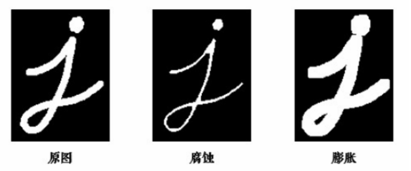
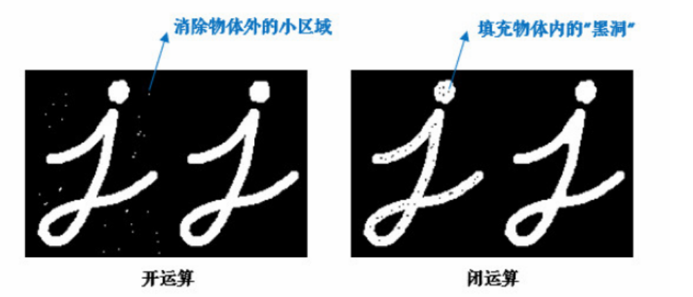

## 概述
1. 核心思想源于集合论，将图像中的形状（特别是二值图像中的前景物体）看作是一个集合。
2. 使用一个被称为结构元素的小型“探针”或“模板”来与图像集合进行交互，改变和分析图像的几何结构。
3. 这个技术在处理二值图像（黑白图像）时最为直观，同样可以扩展到灰度图像。

# 腐蚀与膨胀
以处理二值图像（前景为白色=1，背景为黑色=0）为例

## 腐蚀
### 原理
1. 将 结构元素（一般为 3X3 或 5x5 矩阵）的原点在图像上逐像素移动。
2. 当 SE 完全被包含在物体内部时，输出图像中对应原点位置的像素才被设为前景，否则设为背景。
### 作用
1. 使物体“变瘦”：前景物体的边界会被向内收缩。
2. 消除微小物体：如果一个物体比结构元素还小，会在腐蚀后完全消失。这使得腐蚀非常适合去除去除“盐”噪声（小的白色噪点）。
3. 分离物体：如果两个物体之间有细微的连接，腐蚀操作可能会将这个连接“腐蚀”掉。
### 数学表示
$$A \ominus B = \{ z | (B)_z \subseteq A \}$$
## 膨胀
1. 将 结构元素 的原点在图像上逐像素移动。
2. 只要 SE 的至少一个前景像素与图像中的前景像素有重叠，输出图像中对应原点位置的像素就被设为前景。
### 作用
1. 使物体“变胖”：前景物体的边界会向外扩张。
2. 填补内部孔洞：物体内部的小型孔洞会被“膨胀”的物体填满。这使得膨胀非常适合去除“胡椒”噪声（小的黑色噪点）。
3. 连接物体：如果两个物体距离很近，膨胀操作可能会使它们的边界扩张至接触。
### 数学表示
$$A \oplus B = \{ z | (\hat{B})_z \cap A \neq \emptyset \}$$

# 开运算与闭运算
单独使用腐蚀或膨胀会改变物体的大小。为了尽量保持物体原有的大小，使用由腐蚀和膨胀组合而成的复合操作。

## 开运算
对图像先进行腐蚀，再进行膨胀，使用同一个结构元素。
### 效果
1. 可以想象成用砂纸打磨一个物体的表面。
2. 腐蚀会“磨掉”物体表面微小的突起和细连接，随后的膨胀则会将物体大致恢复到原来的尺寸，但已经被磨掉的细节不会再回来。
## 闭运算
对图像先进行膨胀，再进行腐蚀，使用同一个结构元素。
### 效果
1. 可以想象成填补物体表面的小裂缝或孔洞。
2. 膨胀会“填充”这些缝隙，随后的腐蚀则会将物体收缩回大致原来的尺寸，但已经被填上的孔洞会保留下来。

# 高级形态学变换
## 形态学梯度
图像的膨胀结果减去腐蚀结果
### 效果
1. 能够突出物体的边缘和轮廓。
2. 膨胀图像比原图大一圈，腐蚀图像比原图小一圈，两者相减留下的就是物体的边界带。
## 顶帽变换 (Top-Hat Transform)
原图减去其开运算结果
### 效果
1. 开运算会移除小的亮点和细节，用原图减去开运算结果，剩下的就是那些被移除的小亮点和细节。
2. 这个变换对于在不均匀背景下提取明亮的小物体非常有效。
## 黑帽变换 (Black-Hat Transform)
图像的闭运算结果减去原图
### 效果
1. 闭运算会填充小的暗区和孔洞。用闭运算结果减去原图，剩下的就是那些被填充的小暗区和孔洞。
2. 这个变换对于提取图像中的暗色裂缝、小孔等非常有用。
## 灰度图像形态学
数学形态学可以扩展到灰度图像。此时，集合运算被替换为min和max运算。
### 灰度腐蚀
1. 在结构元素覆盖的邻域内，输出像素的值被设为该邻域内所有像素的最小值。
2. 效果是使图像中明亮的区域收缩，暗的区域扩张。
### 灰度膨胀
1. 在结构元素覆盖的邻域内，输出像素的值被设为该邻域内所有像素的最大值。
2. 效果是使图像中明亮的区域扩张，暗的区域收缩。
### 开闭运算
灰度开/闭运算和梯度等也相应地基于灰度腐蚀和膨胀来定义，它们在图像去噪、背景平滑、纹理分析等方面有广泛应用。