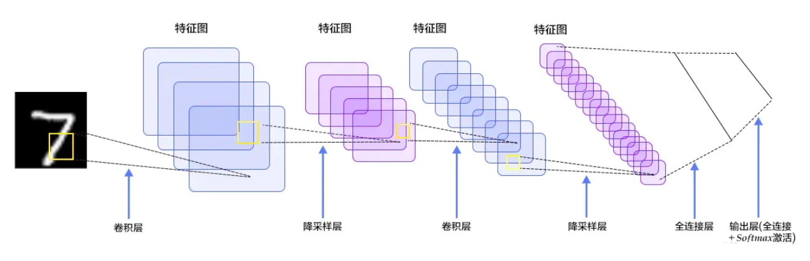

## 结构

1. 输入层：输入图像等信息
2. 卷积层：用来提取图像的底层特征，在实际应用中往往将卷积层与 ReLU 层共同称之为卷积层
3. 池化层：防止过拟合，将数据维度减小
4. 全连接层：汇总卷积层和池化层得到的图像的底层特征和信息
5. 输出层：根据全连接层的信息得到概率最大的结果
## 输入层
将图像转换为其对应的由像素值构成的二维矩阵
## 卷积层
### 名词
1. 卷积核：二维矩阵，比输入图像的二维矩阵要小或相等。
2. 卷积：卷积核在输入图像的二维矩阵上移动，每一次移动都进行一次乘积的求和，作为此位置的值。\

3. 特征图：卷积后得到的新的二维矩阵
4. Padding：输入图像二维矩阵的边缘只计算了一次，可以在输入图像二维矩阵周围再拓展一圈或者几圈，以保留边缘特征。
### 作用
1. 滤波器：卷积层的参数是有一些可学习的滤波器集合构成的。每个滤波器在空间上（宽度和高度）都比较小，但是深度和输入数据一致。看到某些类型的视觉特征时就激活。
2.  降低参数数量：由于卷积具有“权值共享”这样的特性，可以降低参数数量，达到降低计算开销，防止由于参数过多而造成过拟合。
3.  可被看作是神经元的一个输出。神经元只观察输入数据中的一小部分，并且和空间上左右两边的所有神经元共享参数（因为这些数字都是使用同一个滤波器得到的结果）
### 感受野
1. 
## 池化层

## 全连接层

## 输出层