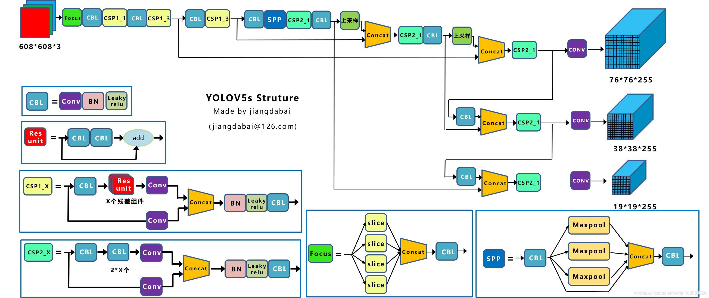

## 概述
1. 特点：合适于移动端部署，模型小，速度快
2. 有 YOLOv5s、YOLOv5m、YOLOv5l、YOLOv5x 四个版本。这几个模型的结构基本一样，不同的是 depth_multiple 模型深度和 width_multiple 模型宽度这两个参数。 YOLOv5s 网络是 YOLOv5 系列中深度最小，特征图的宽度最小的网络。其他的三种都是在此基础上不断加深加宽。\


3. 网络结构如下\


（1）输入端：Mosaic 数据增强、自适应锚框计算、自适应图片缩放\
（2）Backbone：Focus 结构，CSP 结构，对输入图像进行特征提取\
（3）Neck：FPN+PAN 结构，对特征图进行多尺度特征融合，并把这些特征传递给预测层\
（4）Head：CIOU_Loss，进行最终回归预测

4. 基本组件\
（1）Focus：基本上就是 YOLO v2 的 passthrough\
（2）CBL：由 Conv+Bn+Leaky_relu 三者组成\
（3）CSP1_X：借鉴 CSPNet 网络结构，由 3 个卷积层和 X 个 Res unint 模块组成\
（4）CSP2_X：不再用 Res unint 模块，而是改为 CBS\
（5）SPP：采用 1×1，5×5，9×9，13×13 的最大池化的方式，进行多尺度融合
# 输入端
## Mosaic数据增强
将多张图片按照一定比例组合成一张，使模型在更小的范围内识别目标。参考了 CutMix 数据增强算法。CutMix 使用两张图片进行拼接，而 Mosaic 一般使用四张进行拼接，两者的算法原理非常相似。
1. 步骤如下\
（1）随机选取图片拼接基准点坐标（xc，yc），另随机选取四张图片\
（2）四张图片根据基准点，经过尺寸调整和比例缩放后，放置在指定尺寸的大图的左上，右上，左下，右下位置\
（3）根据每张图片的尺寸变换方式，将映射关系对应到图片标签上\
（4）依据指定的横纵坐标，对大图进行拼接。处理超过边界的检测框坐标
2. 优点如下\
（1）丰富数据集： 随机使用 4 张图像，随机缩放后随机拼接，增加很多小目标，大大增加了数据多样性\
（2）增强模型鲁棒性： 混合 4 张具有不同语义信息的图片，可以让模型检测超出常规语境的目标\
（3）加强批归一化层的效果： 当模型设置 BN 操作后，训练时会尽可能增大批样本总量，因为其越大，那么 BN 计算的均值和方差就越接近于整个数据集的均值和方差，效果越好\
（4）利于提升小目标检测性能： 由四张原始图像拼接而成，每张图像会有更大概率包含小目标，从而提升模型的检测能力
## 自适应锚框计算
1. YOLOv3v4 对于不同的数据集，会计算先验框 anchor。训练时，网络会在 anchor 的基础上进行预测，再和标签框进行对比，最后进行梯度的反向传播。
2. YOLOv3v4 训练不同的数据集时，是使用单独的脚本进行初始锚框的计算，YOLOv5 将此功能嵌入到整个训练代码里中。每次训练开始之前，会根据不同的数据集来自适应计算 anchor。如果觉得计算的锚框效果并不好，也可以在代码中将此功能关闭。
3. 具体计算过程：\
（1）获取数据集中所有目标的宽和高。\
（2）将每张图片等比例缩放到指定大小，这里保证宽高中的最大值符合指定大小。\
（3）将 bboxes 从相对坐标改成绝对坐标，这里乘以的是缩放后的宽高。\
（4）筛选 bboxes，保留宽高都大于等于两个像素的 bboxes。\
（5）使用 k-means 聚类得到 n 个 anchors，与 YOLOv3v4 操作一样。\
（6）使用遗传算法随机对 anchors 的宽高进行变异。变异后的效果好，就将结果赋值给 anchors；效果变差就跳过，默认变异 1000 次。使用 anchor_fitness 方法计算得到的适应度 fitness 进行评估。
## 自适应图片缩放
1. 根据原始图片大小以及输入到网络的图片大小计算缩放比例\


原始缩放尺寸是416*416，除以原始图像的尺寸后得到 0.52，和 0.69 两个缩放系数，选择小的缩放系数。

2. 根据原始图片大小与缩放比例计算缩放后的图片大小\


3. 计算黑边填充数值，得到原本需要填充的高度 416-312=104。采用 np.mod(104,32) 得到 8，再除以 2 即图片高度两端需要填充的数值。\


4. YOLOv5 经过 5 次下采样，而 $2^5=32$。至少要去掉 32 的倍数再取余，以免产生尺度太小走不完 stride
5. Yolov5 中填充的是灰色，即（114,114,114）
6. 训练时没有采用缩减黑边的方式，还是采用传统填充的方式，即缩放到416*416大小。只是在测试，使用模型推理时，才采用缩减黑边的方式，提高目标检测，推理的速度。
# Backbone
## Focus 结构
1. 图片进入 Backbone 前进行切片，在一张图片中每隔一个像素拿到一个值，得到四张图片，W、H 信息集中到了通道空间，输入通道扩充了 4 倍，最后将新图片经过卷积操作，得到没有信息丢失情况下的二倍下采样特征图。\


2. 可以在信息不丢失的情况下提高计算力，但对某些设备不支持且不友好，开销很大，另外切片对不齐的话模型就崩了。
3. 在新版中，YOLOv5 将 Focus 模块替换成了一个 6x6 的卷积层。两者的计算量是等价的，但是对于一些 GPU 设备，使用 6x6 的卷积会更加高效。
## CSP结构
v4.0 版本之前的 BottleneckCSP，用 LeakyReLU 作为激活函数，之后的版本 C3 用的 SiLU 作为激活函数
### BottleneckCsp


1. CBL 模块就是 Conv2D + BN（正态分布） + LeakyReLU 的组合
2.  bottleneck 可以根据传入的参数决定是否带有 shortcut。如果是带有 shortcut 的话，就是正统的 residual 模块了，如果没有 shortcut，就是单纯的 2 个 CBL 串联。
### C3


1. C3 模块因为内部有 3 个卷积模块，所以被命名为 C3 模块
2. 去掉了 BottleneckCSP 中一些繁杂的 Conv2d 操作，并且将激活函数从 LeakyReLU 换成了 SiLU。
3. CBL 模块也因此变成了 CBS 模块。和 BottleneckCSP 一样，内部的 bottleneck 也分为带 shortcut 和不带 shortcut 两种。

### CSP1_X 与 CSP2_X
1. CSP1_X 是指带 shortcut 的 CSP 模块的统称，也就是内部 bottleneck 带 shortcut 的 BottleneckCSP 和 C3 都可以叫 CSP1_X。而不带 shortcut 则归为 CSP2_X。
2. 一般来说 CSP1_X 用在 backbone 部分，CSP2_X 用在 neck 部分。
3. X 是指 bottleneck 的数量。

# head
## 损失函数
1. IOU_Loss：主要考虑检测框和目标框重叠面积。
2. GIOU_Loss：在IOU的基础上，解决边界框不重合时的问题。
3. DIOU_Loss：在IOU和GIOU的基础上，考虑边界框中心点距离的信息。
4. CIOU_Loss：在DIOU的基础上，考虑边界框宽高比的尺度信息。


## NMS
用来抑制检测时冗余的框，因为在目标检测中，在同一目标的位置上会产生大量的候选框，这些候选框可能会有重叠。
1. 对所有预测框的置信度降序排序
2. 选出置信度最高的预测框，确认其为正确预测，并计算他与其他预测框的 IOU
3. 根据步骤2中计算的 IOU 去除重叠度高的，IOU > threshold 阈值就直接删除
4. 剩下的预测框返回第 1 步，直到没有剩下的为止
## SoftNMS
1. 当两个目标靠的非常近时，置信度低的会被置信度高的框所抑制，只会识别出一个 BBox，可以使用 softNMS。
2. 基本思想是用稍低一点的分数来代替原有的分数，而不是像 NMS 一样直接置零。
# 训练策略
1. 多尺度训练（Multi-scale training）。 如果网络的输入是416 x 416。那么训练的时候就会从 0.5 x 416 到 1.5 x 416 中任意取值，但所取的值都是32的整数倍。
2. 训练开始前使用 warmup 进行训练。 在模型预训练阶段，先使用较小的学习率训练一些epochs或者steps (如4个 epoch 或10000个 step)，再修改为预先设置的学习率进行训练。
3. 使用了 cosine 学习率下降策略（Cosine LR scheduler）。
4. 采用了 EMA 更新权重(Exponential Moving Average)。 相当于训练时给参数赋予一个动量，这样更新起来就会更加平滑。
5. 使用了 amp 进行混合精度训练（Mixed precision）。 能够减少显存的占用并且加快训练速度，但是需要 GPU 支持。
# 训练数据格式
## yaml 文件
数据集配置文件，通常放在 data 目录下，示例如下
```
train: /path/to/your/dataset/images/train
val: /path/to/your/dataset/images/val
# 类别数量
nc: 3
# 类别名称列表（索引从0开始，顺序必须与标签文件中的 class_index 一致）
names: ['person', 'car', 'traffic light']
```
## 标签
1. 每个 .txt 标签文件包含一个或多个行，每一行代表图片中的一个目标（object）。
2. 格式：``<class_index> <x_center> <y_center> <width> <height>``
3. <x_center>：目标边界框中心点的 x 坐标。相对于图片总宽度进行归一化，范围 [0, 1]。
4. <width>：目标边界框的宽度。相对于图片总宽度进行归一化，范围 [0, 1]。
## 输出
1. 格式：``[x1, y1, x2, y2, confidence, class_index]``
2. x1, y1：边界框左上角的 x 和 y 坐标。原始图片尺寸下的像素坐标，未经归一化。
3. x2, y2：边界框右下角的 x 和 y 坐标。
4. confidence：置信度分数，[0, 1] 范围的浮点数。
5. 举例，对一张图片进行推理，得到了如下的输出张量
```
tensor([[100.5, 201.2, 300.8, 799.5, 0.92, 0.],
        [501.1, 600.3, 899.7, 850.2, 0.88, 1.]])
```