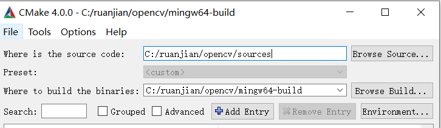
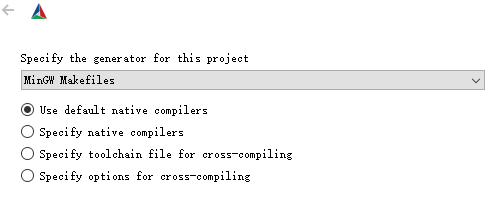
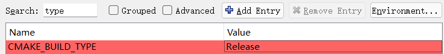
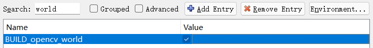
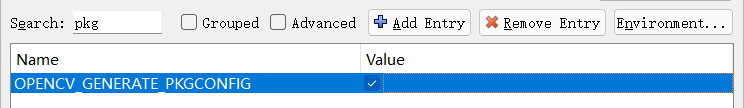

官网下载相应版本\
https://opencv.org/releases/
## MinGW编译
1. 打开 CMake-GUI，设置路径如下\


2. 点击 configure\
 \
如果报找不到编译器的错误,可以选择第二个单选框 Specify native compilers 手动选择编译器路径

3. 配置后再次点击 configure\
（1）填入Release会编译发行版本的opencv包，从而去除debug信息和符号表，这可以提高性能；填入Debug则会编译debug版本的opencv，适合需要修改opencv源码的情况\
 \
（2）会使得生成的链接库为一个包而不是多个\
 \
（3）会生成一个pkg-config的路径使得pkgconfig能够自动传递库路径给g++进行编译\
 

4. 点击 Generate
5. 到 build 路径下运行 ``make``，完成后运行 ``make install``
6. 将 ``C:\ruanjian\opencv\mingw64-build\install\x64\mingw\bin``添加到系统变量路径中
7. CMakeLists添加
```
set(OpenCV_DIR  C:/ruanjian/opencv/build/install)
find_package(OpenCV REQUIRED)
include_directories(${OpenCV_INCLUDE_DIRS})
target_link_libraries(${PROJECT_NAME} ${OpenCV_LIBS})
```
## MVSC编译
1. 将 ``C:\ruanjian\opencv\build\x64\vc16\bin``添加到系统变量路径中
2. CMakeLists添加
```
set(OpenCV_DIR  C:/ruanjian/opencv/build/x64/vc16/lib/)
find_package(OpenCV REQUIRED)
include_directories(${OpenCV_INCLUDE_DIRS})
target_link_libraries(${PROJECT_NAME} ${OpenCV_LIBS})
```