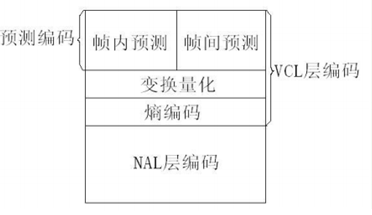
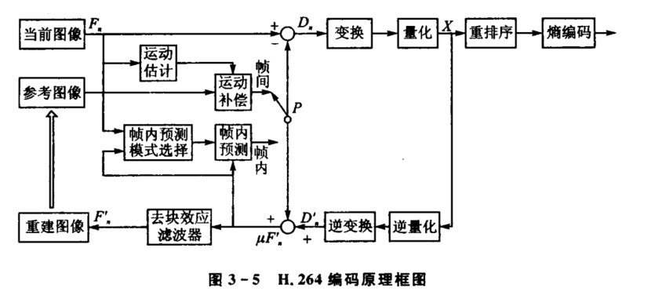
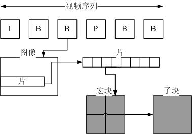

## 系统框架

### 视频编码层 VCL 
即被压缩编码后的视频数据序列，负责有效表示视频数据的内容，主要包括帧内预测，帧间预测、变换量化、熵编码等压缩单元。
### 网络抽象层 NAL
负责将 VCL 数据封装到 NAL 单元中，并提供头信息，以保证数据适合各种信道和存储介质上的传输。

## 画质级别
### 基本画质
支持I/P 帧，只支持无交错操作和CAVLC
### 进阶画质
支持I/P/B/SP/SI 帧，只支持无交错操作和CAVLC，用的少
### 主流画质
提供I/P/B 帧，支持无交错操作和交错，也支    持CAVLC 和CABAC 的支持
### 高级画质
在主流画质的基础上增加了 8x8 内部预测、自定义量化、无损视频编码和更多的YUV 格式
## 整数 DCT
主要使用4×4块进行DCT变换(相比MPEG的8×8块)
### 传统 DCT 问题
1. 涉及浮点运算，计算复杂度高
2. 不同平台实现可能有精度差异
3. 编码器和解码器可能产生不匹配
### 优点
1. 全整数运算，无浮点运算，计算简单，只需加法和移位
2. 精确可逆，编解码器完全匹配
3. 硬件友好，易于 VLSI 实现
### 正交变换
1. 正交变换
$$Y = C_f \cdot X \cdot C_f^T$$
X: 4×4 输入残差块；Y: 4×4 变换系数矩阵；$C_f$: 4×4 正变换核心矩阵
2. $C_f$
$$C_f = \begin{bmatrix}
1 & 1 & 1 & 1 \\
2 & 1 & -1 & -2 \\
1 & -1 & -1 & 1 \\
1 & -2 & 2 & -1
\end{bmatrix}$$
### 变换过程分解
1. 核心变换
$$Y' = C_f \cdot X \cdot C_f^T$$
2. 缩放，逐元素乘法
$$Y = E_f \odot Y'$$
3. 缩放矩阵
$$E_f = \frac{1}{4} \begin{bmatrix}
a^2 & ab & a^2 & ab \\
ab & b^2 & ab & b^2 \\
a^2 & ab & a^2 & ab \\
ab & b^2 & ab & b^2
\end{bmatrix}$$
$$a = \frac{1}{2}, \quad b = \sqrt{\frac{1}{2}} \cdot \frac{1}{2} = \frac{\sqrt{2}}{4}$$

## 编码流程

### 宏块划分/ 扫描
1. 视频以宏块为单元，宏块越大视频文件越小，视频的本质是宏块的运动
2. 句法元素共被组织成 序列、图像、片、宏块、子宏块五个层次

3. 默认使用 16X16 大小的区域作为一个宏块，也可以划分成 8X8 大小。
4. 为了更高的压缩率，还可以在 16X16 的宏块上更划分出更小的子块。
### 帧分组
1. 分组：把几帧关联密切的图像分为一个 GOP，为防止运动变化，帧数不宜取多
2. 将每组内各帧图像定义为三种类型，即 I 帧、B 帧和 P 帧
3. 编码器会按顺序，每次取出两幅相邻的帧进行宏块比较，计算两帧的相似度
4. 一般有差别的像素只有 10% 以内，亮度差值变化不超过 2%，色度差值变化不超过 1%，认为这样的图可以分到一组。
### 运动估计与补偿
1. 按顺序从缓冲区头部取出两帧视频数据，然后进行宏块扫描。当发现其中一幅图片中有物体时，就在另一幅图的邻近位置（搜索窗口中）进行搜索。
2. 如果在另一幅图中找到该物体，那么就可以计算出物体的运动矢量。
3. 运动矢量计算出来后，将相同部分减去，就得到了补偿数据。最终只需要将其进行压缩保存
### 帧内预测

### DCT 和量化
1. 将残差数据做整数离散余弦变换，去掉数据的相关性，进一步压缩数据。
### 熵编码（CABAC）
1. 无损压缩，其实现原理是使用新的编码来表示输入的数据，给高频的词一个短码，给低频词一个长码，从而达到压缩的效果。
2. 常用的熵编码有游程编码，哈夫曼编码和 CAVLC 编码等
3. H.264/MPEG-4 AVC 中使用的熵编码算法是 CABAC