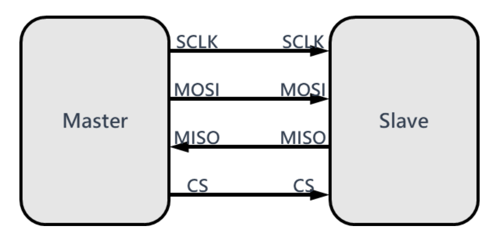
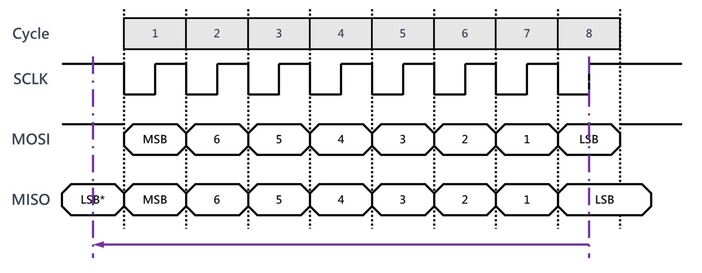
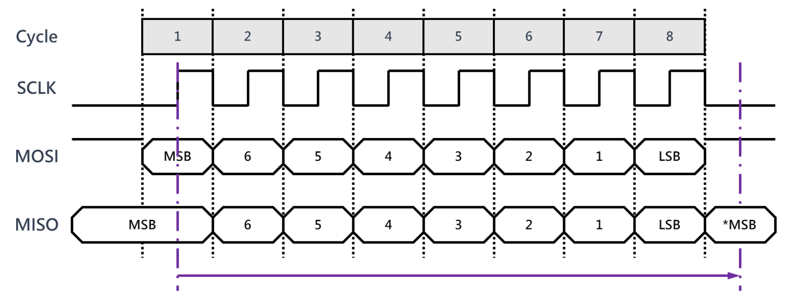
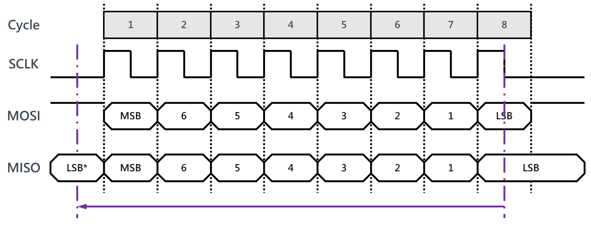
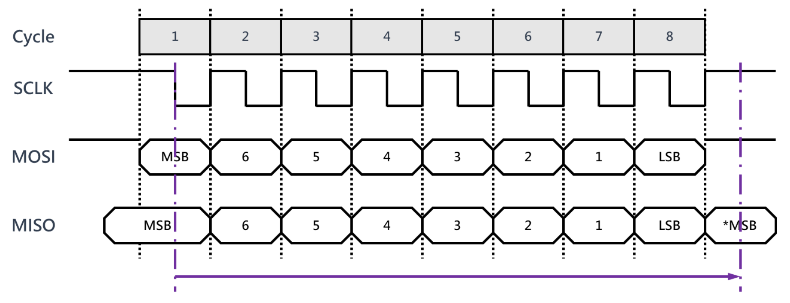
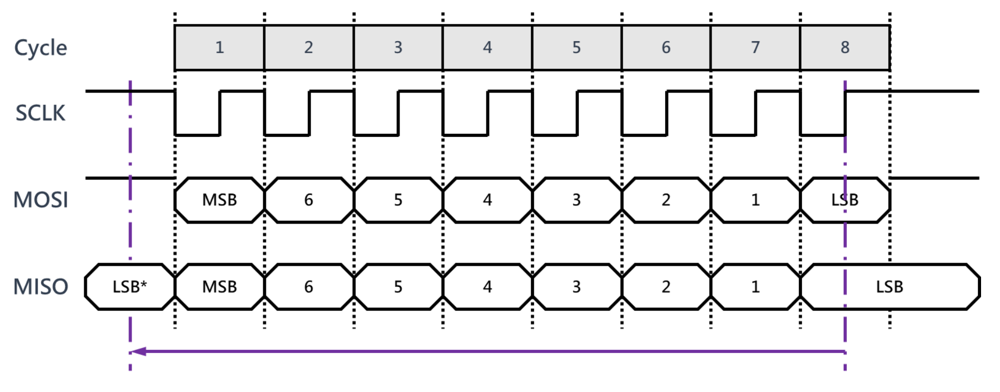

## 概述
1. SPI（Serial Peripheral Interface）是串行外设接口的缩写。
2. 一种高速的、全双工、同步的串行通信总线
3. 主要用于短距离内的芯片间通信，广泛应用于传感器、存储器、显示屏、ADC/DAC 等外设与微控制器的连接
## 特点
1. 单主多从架构：通常由一个主设备（如 MCU）控制多个从设备（如传感器），从设备不能主动发起通信
2. 无地址机制：通过片选信号（CS/NSS）选择目标从设备，而非通过地址识别
3. 灵活的数据长度：数据传输位数可自定义（常见 8 位，也支持 16 位、32 位等）
4. 高速传输：速率通常可达几 Mbps 到几十 Mbps，具体取决于器件支持的最大时钟频率
## 信号线
1. 一般需要 4 根线（也有 3 根线的，为单工）
2. MISO（主设备输入，从设备输出）、MOSI（主设备输出，从设备输入）、SCLK（时钟）、CS（片选）\

## 寻址方式
1. 当主设备要和某个从设备进行通信时，需要先向对应从设备的片选线上发送使能信号表示选中该从设备
2. 高电平或者低电平，根据从机而定
## 通信过程
1. SPI 总线在进行数据传送时，先传送高位，后传送低位。一个字节传送完成后，无需应答即可开始下一个字节的传送
2. 采用同步方式工作，时钟线在上升沿或下降沿时发送器向数据线上发送数据，在紧接着的下降沿或者上升沿时接收器从数据线上读取数据，八个时钟周期即可完成一个字节数据的传送\

## 极性和相位
有四种不同的工作模式，取决于时钟的极性（CPOL，Clock Polarity）和相位（CPHA，Clock Phase）
### CPOL
表示 SCLK 空闲时的状态
1. CPOL = 0，空闲时SCLK为低电平
2. CPOL = 1，空闲时SCLK为高电平
### CPHA
表示采样时刻
1. CPHA = 0，每个周期的第一个时钟沿采样
2. CPHA = 1，每个周期的第二个时钟沿采样
### CPOL = 0, CPHA = 0
空闲时 SCLK 为低电平，每个周期的第一个时钟沿采样，也就是上升沿。*MSB 表示前一帧的 MSB\

### CPOL = 0, CPHA = 1
空闲时 SCLK 为低电平，每个周期的第二个时钟沿采样。LSB* 表示下一帧的 LSB\

### CPOL = 1, CPHA = 0
空闲时 SCLK 为高电平，每个周期的第一个时钟沿采样。\

### CPOL = 1, CPHA = 1
空闲时 SCLK 为高电平，每个周期的第二个时钟沿采样。\

## 配置
1. 对于一个特定的从设备，一般在出厂时就会将其设计为某种特定的工作模式
2. 在使用该设备时必须保证主设备的工作模式和该从设备一致，否则无法进行通信