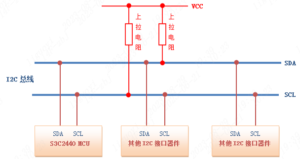
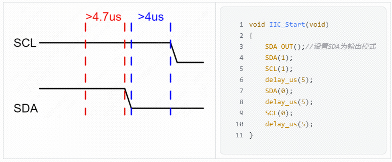
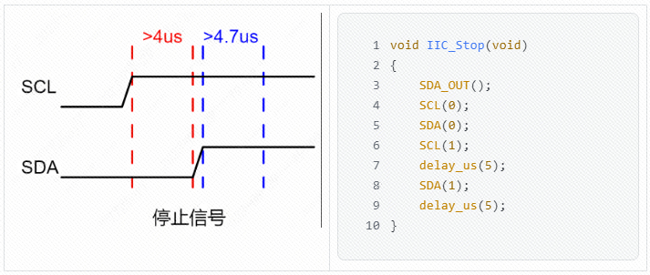
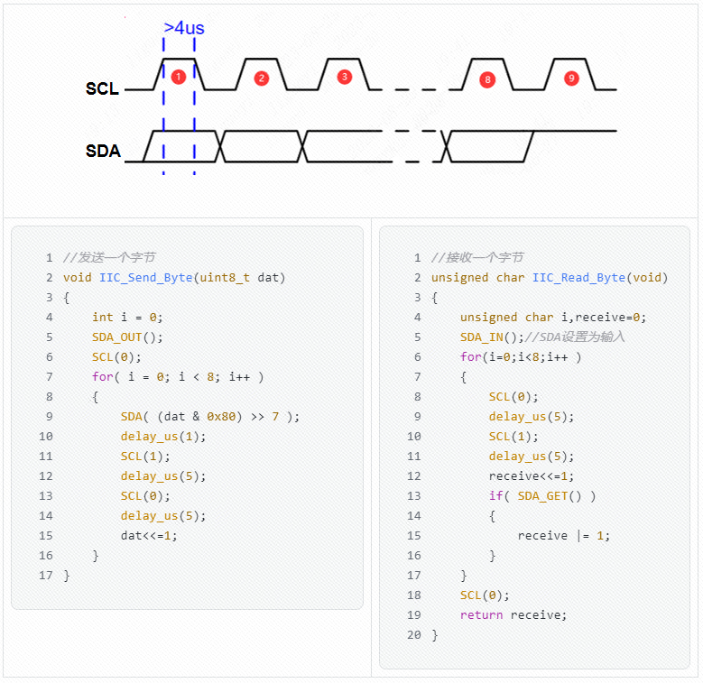
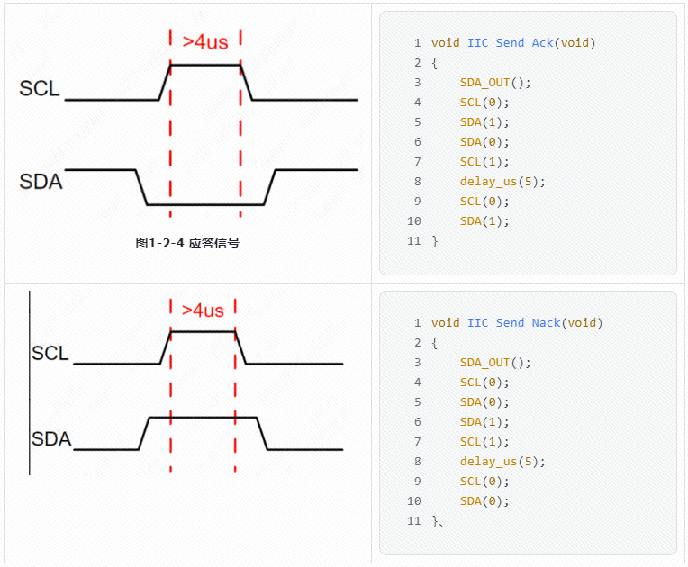
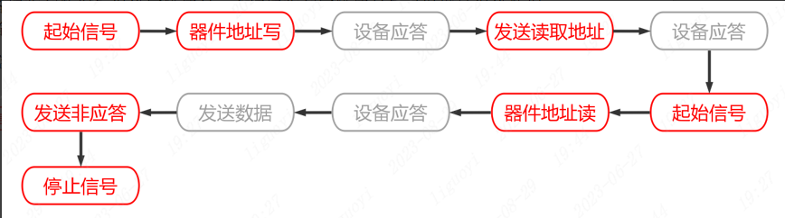

## 概述
1. 一种串行通信协议，通常用于连接低速外设。
2. 适用基于芯片的通信，例如连接传感器、存储器或数字信号处理器等。
## 组成
1. 总线只需要两条数据线，分别是串行数据线（SDA）和串行时钟线（SCL）。
2. 总线上有一个主设备和多个从设备。主设备掌控着总线上的通信过程，负责发起、控制、停止通信。从设备则需要等待主设备的请求，接收或发送数据。
3. 主设备和从设备之间的数据交换采用帧格式，每个帧通常包含地址、数据和控制信息。
## 硬件
### 电平
1. 通常使用两种电压电平，即高电平（VH）和低电平（VL）。高电平为 2.5V 至 5.5V，低电平为 0V 至 0.3V。
2. 为避免信号冲突，MCU 必须只能驱动 SDA 和 SCL 在低电平，即开漏输出。\
（1）防止干扰：多个器件共享 SDA 和 SCL，如果采用推挽输出模式，多个器件的输出将会叠加在数据线上，造成信号干扰。\
（2）防止短路：由于器件的输出只有拉低数据线的部分，如果两个或多个器件同时输出，也不会造成短路。
3. 开漏模式需要连接一个外部的上拉电阻将信号提拉至高电平。SDA 和 SCL 通常都连接了上拉电阻，以确保逻辑高电平的稳定性。
4. 上拉电阻的阻值通常在 2.2kΩ 至 10kΩ 之间，具体取决于总线的电容负载和通信距离。

### 传输
1. 有不同的传输速率可选，包括标准模式（100 kbps）、快速模式（400 kbps）以及高速模式。
2. 在标准模式下，最大线缆长度在 1 米左右，而在快速模式下，最大线缆长度约为 0.3 米。
3. 线缆上的总线容量也会对传输速率产生影响。

## 时序
### 起始信号
SCL 在高电平的状态下，SDA 的电平由高转低，表示开始一次通信。

### 结束信号
1. SCL 在高电平的状态下，SDA 的电平由低转高，表示结束这次通信。
2. 主设备在发送停止信号后不能再向从设备发送任何数据，除非再次发送起始信号。

### 传输
主设备和从设备进行数据的传输，可以是一个或多个字节的数据，发送和接收都是基于地址选择的。

### 应答/非应答确认机制
1. 如果一个设备接收到数据，它将通过在SDA线上拉低电平来发送一个应答信号以通知发送方数据已被接收。
2. 如果数据被损坏或未接收，接收设备将发送非应答信号（在SDA上保持高电平）。

## 通信流程
1. 主控向总线发送开始信号。
2. 主控将要通信的设备地址和读写位（R/W）发送到总线上。
3. 设备接收到地址后发送应答信号，主控接收到应答信号后发送数据或继续发送地址。
4. 设备接收到数据后发送应答信号，主控接收到应答信号后可以继续发送数据或者停止通信。
5. 主控向总线发送停止信号。
### 发送数据流程

### 接收数据流程

## 基本参数
### 速率
有标准模式（100 kbit/s）和快速模式（400 kbit/s）两种传输模式，还有更快的扩展模式和高速模式可供选择。
### 器件地址
每个设备都有唯一的7位或10位地址
### 总线状态
有五种状态，分别是空闲状态、起始信号、结束信号、响应信号、数据传输。
### 数据格式
有两种数据格式，标准格式和快速格式。标准格式是8位数据字节加上1位ack/nack（应答/非应答）位，快速格式允许两个字节同时传输。