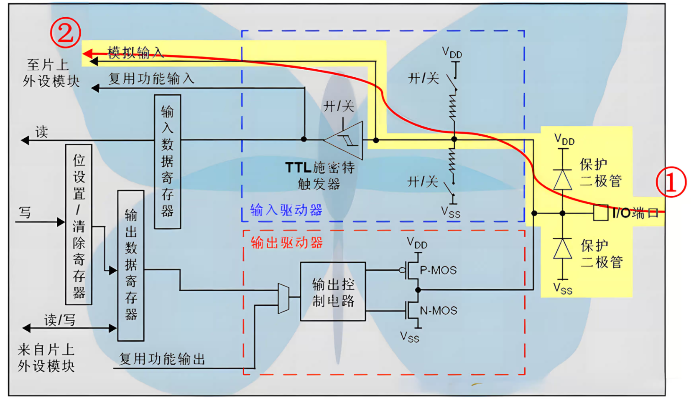
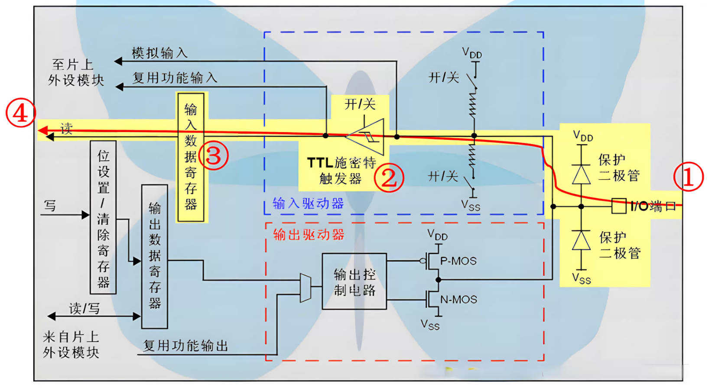
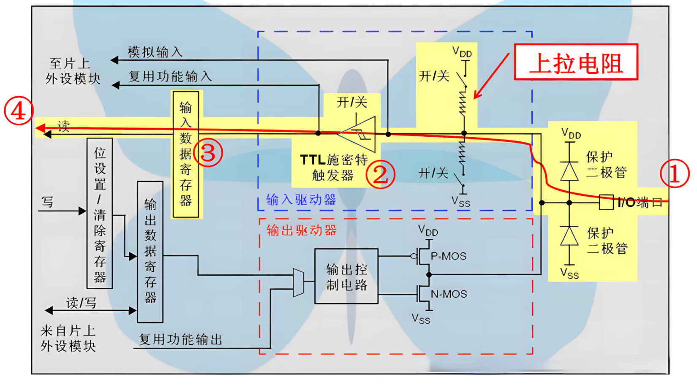
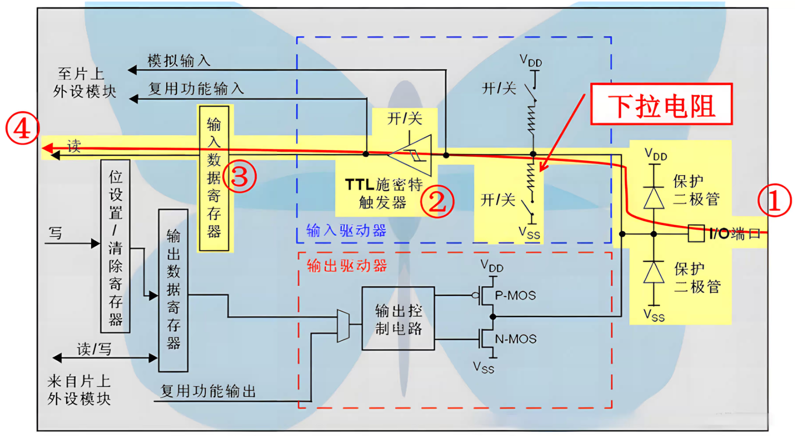
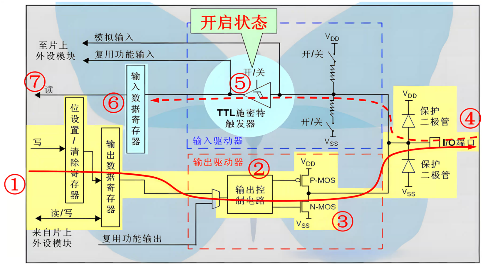
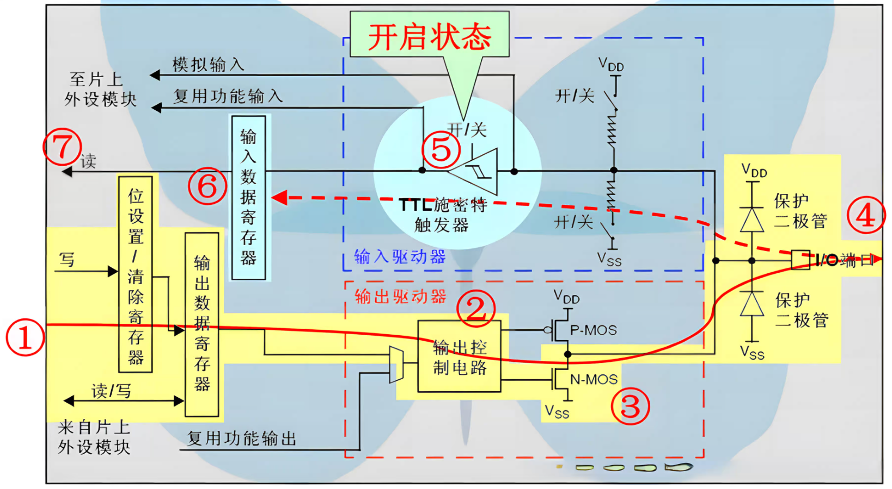
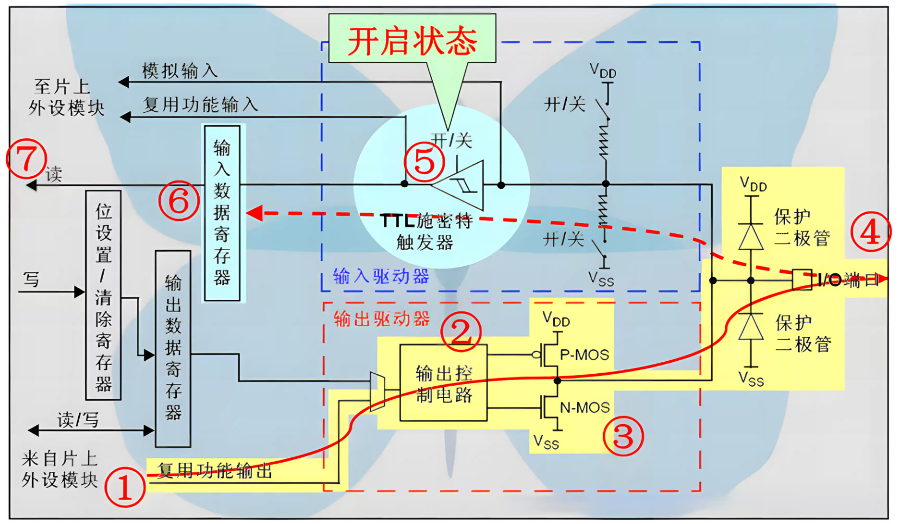
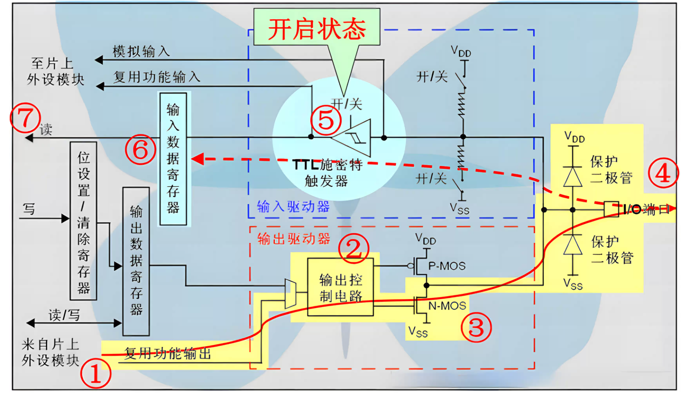

# 输入
## GPIO_Mode_AIN（模拟输入）

### 内部结构
1. 输入缓冲器 (包括施密特触发器) 禁用，上拉和下拉电阻禁用。
2. 引脚信号直接连接到片上模拟外设（如 ADC、DAC、比较器等）的输入端
### 电气特性
1. 引脚处于非常高的阻抗状态，几乎不消耗电流。引脚上的电压直接反映外部模拟信号的电压。
2. 此时，读取该引脚的数字输入寄存器 (IDR) 会得到不确定的值（通常是0）
### 应用场景
1. ADC 信号采集: 连接传感器（温度、光敏、压力等）输出的模拟电压信号。
2. DAC 输出: 用作 DAC 的输出引脚（配置为模拟模式以获得纯净的模拟输出）。
3. 模拟比较器输入: 连接需要进行电压比较的模拟信号。
4. 低功耗需求: 将未使用的引脚配置为模拟输入可以降低漏电流，是推荐的未使用引脚处理方式之一。
## GPIO_Mode_IN_FLOATING（浮空输入）

### 内部结构
输入缓冲器使能，上拉和下拉电阻均禁用，引脚状态完全由外部信号决定
### 电气特性
引脚处于高阻态，如果外部没有连接或者外部电路也是高阻态，引脚电平是不确定的，极易受到干扰
### 应用场景
1. 读取外部有确定电平信号的场景: 例如，连接另一个芯片的推挽输出引脚。
2. 外部有上下拉电阻的按键/信号: 如果外部电路已经设计了上拉或下拉电阻，MCU 内部就不需要再配置。
3. 连接需要高阻抗输入的模拟外设的数字控制引脚(需要时)，更常见的是使用模拟输入模式。
4. 不推荐将未使用的引脚配置为此模式并悬空，容易引入噪声。
## GPIO_Mode_IPU（上拉输入）

### 内部结构
输入缓冲器使能，内部上拉电阻 (连接到 VDD) 使能
### 电气特性
1. 引脚处于高阻态，但内部有一个弱上拉到 VDD。
2. 当引脚悬空或连接高阻态外部电路时，引脚会被内部上拉电阻拉高至 VDD 电平，读取为 '1'。
3. 只有当外部有足够强的低电平信号（如接地）时，引脚才会被拉低，读取为 '0'。
### 应用场景
1. 常用按键检测: 按键一端接 GPIO，另一端接地。未按下时，引脚被内部上拉为高电平；按下时，引脚被拉低到地，读取为低电平。
2. I2C 总线 (SDA, SCL): 虽然 I2C 通常配置为复用开漏输出 + 外部上拉，但在某些仅需监听总线或特定情况下，可配置为上拉输入模式（复用开漏是标准做法）。
3. 低电平有效的中断/信号输入: 检测外部设备是否将信号拉低。
## GPIO_Mode_IPD（下拉输入）

### 内部结构
输入缓冲器使能，内部下拉电阻 (连接到 VSS) 使能
### 电气特性
1. 引脚处于高阻态，但内部有一个弱下拉到 VSS。
2. 当引脚悬空或连接高阻态外部电路时，引脚会被内部下拉电阻拉低至 VSS 电平，读取为 '0'。
3. 只有当外部有足够强的高电平信号（如接 VDD）时，引脚才会被拉高，读取为 '1'。
### 应用场景
1. 按键检测: 按键一端接 GPIO，另一端接 VDD。未按下时，引脚被内部下拉为低电平；按下时，引脚被拉高到 VDD，读取为高电平。相对上拉输入按键接法较少见。
2. 高电平有效的中断/信号输入: 检测外部设备是否将信号拉高
# 输出
## GPIO_Mode_Out_PP（推挽输出）

### 内部结构
1. 输出缓冲器使能，由一个 P-MOS 管和一个 N-MOS 管组成（推挽结构）。
2. P-MOS 连接到 VDD，N-MOS 连接到 VSS
### 电气特性
1. 输出高电平 ('1') 时：P-MOS 导通，N-MOS 截止，引脚被强驱动到 VDD 电平。
2. 输出低电平 ('0') 时：P-MOS 截止，N-MOS 导通，引脚被强驱动到 VSS 电平。
3. 具有较强的驱动能力（可以输出或吸收较大电流），输出阻抗较低。
### 应用场景
1. 驱动 LED: （通常需要串联限流电阻）
2. 控制数字逻辑器件: 如驱动其他芯片的输入引脚
3. 产生方波信号: 如软件模拟 PWM 或其他时序信号
4. 通用数字输出: 大部分数字输出场景的首选
## GPIO_Mode_Out_OD（开漏输出）

### 内部结构
输出缓冲器使能，但只有 N-MOS 管（连接到 VSS）工作。P-MOS 管始终处于截止状态或不存在
### 电气特性
1. 输出低电平 ('0') 时：N-MOS 导通，引脚被强驱动到 VSS 电平。
2. 输出高电平 ('1') 时：N-MOS 截止，引脚处于高阻态 (浮空)。此时引脚的实际电平需要外部上拉电阻拉到高电平。
3. 允许多个开漏输出引脚连接到同一条线上，形成“线与”逻辑：只有所有引脚都输出高电平，线才会被外部上拉电阻拉高。
### 应用场景
1. I2C 总线 (SDA, SCL): 标准的 I2C 通信需要开漏输出配合外部上拉电阻，实现多主机/从机仲裁和电平兼容。
2. 电平转换: 连接不同工作电压的器件，外部上拉电阻可以连接到目标器件的 VDD。
3. 需要"线与"逻辑的共享信号线: 例如，多个设备共享一个中断请求线，任何一个设备需要中断时将线拉低。
4. 控制需要下拉激活的设备: 例如某些设备的复位引脚。
## GPIO_Mode_AF_PP（复用推挽输出）

### 内部结构
1. 与推挽输出类似 (P-MOS + N-MOS)，但引脚的控制权交给片上外设 (如 USART, SPI, TIM, I2C 等)，而不是由 ODR 直接控制。
2. 需要通过 GPIO 的复用功能寄存器 (AFR) 选择具体连接到哪个外设。
### 电气特性
同推挽输出，由外设控制输出高低电平，具有强驱动能力
### 应用场景
1. USART TX: 发送数据。
2. SPI MOSI, SCK, NSS (Master): 主设备输出信号。
3. TIM PWM 输出: 输出脉宽调制信号。
4. MCO (Microcontroller Clock Output): 输出内部时钟信号。
5. 绝大多数外设的数字输出功能。
## GPIO_Mode_AF_OD（复用开漏输出）

### 内部结构
1. 与开漏输出类似 (仅 N-MOS 工作)，但引脚控制权交给片上外设。
2. 同样需要通过 AFR 选择具体外设。通常也需要外部上拉电阻。
### 电气特性
同开漏输出，由外设控制输出低电平或高阻态，允许多设备共享总线。
### 应用场景
1. I2C 总线 (SDA, SCL): 当使用 STM32 的硬件 I2C 外设时，对应的引脚需要配置为此模式。
2. 某些特殊外设接口或总线协议: 需要共享总线并由外设自动控制的场景。