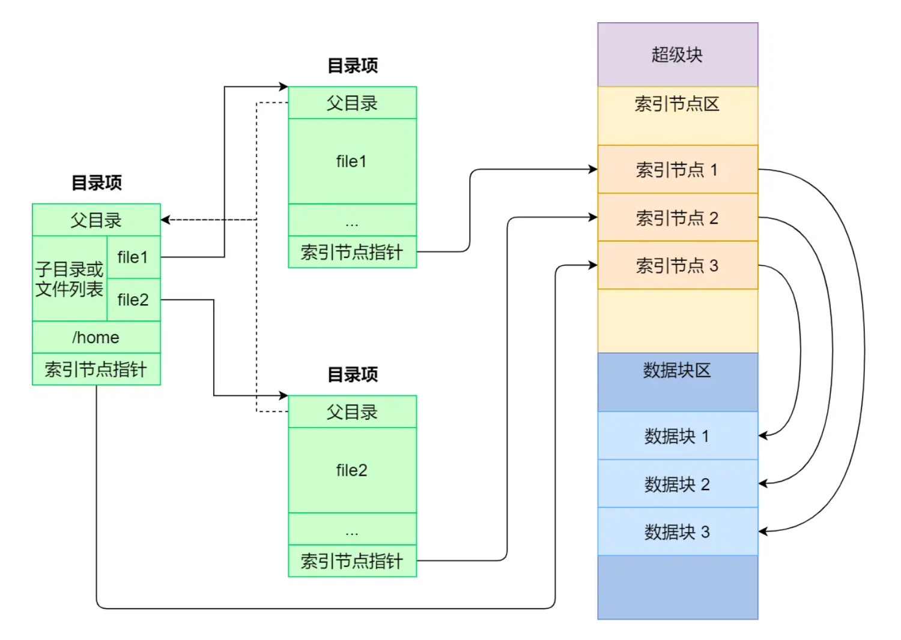

## 概述
1. 文件系统是操作系统中负责管理持久数据的子系统，基本数据单位是文件。
2. Linux 中一切皆文件，不仅普通的文件和目录，就连块设备、管道、socket 等，也都是统一交给文件系统管理的。

## 数据结构
为每个文件分配两个数据结构，索引节点（index node）和目录项（directory entry）
### 索引节点（inode）
1. 记录文件的元信息，比如 inode 编号、文件大小、访问权限、创建时间、修改时间、数据在磁盘的位置等等。
2. 是文件的唯一标识，也同样都会被存储在硬盘中。
### 目录项（dentry）
1. 用来记录文件的名字、索引节点指针以及与其他目录项的层级关联关系。
2. 多个目录项关联起来，就会形成目录结构。
3. 是由内核维护的一个数据结构，不存放于磁盘，而是缓存在内存。
4. 由于索引节点唯一标识一个文件，而目录项记录着文件的名字，所以目录项和索引节点的关系是多对一，也就是说，一个文件可以有多个别名。
### 与目录区分
1. 目录也是文件，也是用索引节点唯一标识，普通文件在磁盘里面保存的是文件数据，而目录文件在磁盘里面保存子目录或文件。
2. 查询目录频繁从磁盘读，效率会很低，所以内核会把已经读过的目录用目录项这个数据结构缓存在内存。

## 存储
### 扇区
磁盘读写的最小单位是扇区，只有 512B 大小
### 逻辑块
1. 每次都以扇区为单位读写，效率会很低，于是把多个扇区组成了一个逻辑块
2. 每次读写的最小单位就是逻辑块（数据块），大小为 4KB
### 初始化区域
磁盘进行格式化的时候，会被分成三个存储区域，分别是超级块、索引节点区和数据块区。
1. 超级块：用来存储文件系统的详细信息，比如块个数、块大小、空闲块等等。
2. 索引节点区：用来存储索引节点
3. 数据块区：用来存储文件或目录数据\

### 加载
不可能把超级块和索引节点区全部加载到内存，它们加载进内存的时机是不同的
1. 超级块：当文件系统挂载时进入内存
2. 索引节点区：当文件被访问时进入内存