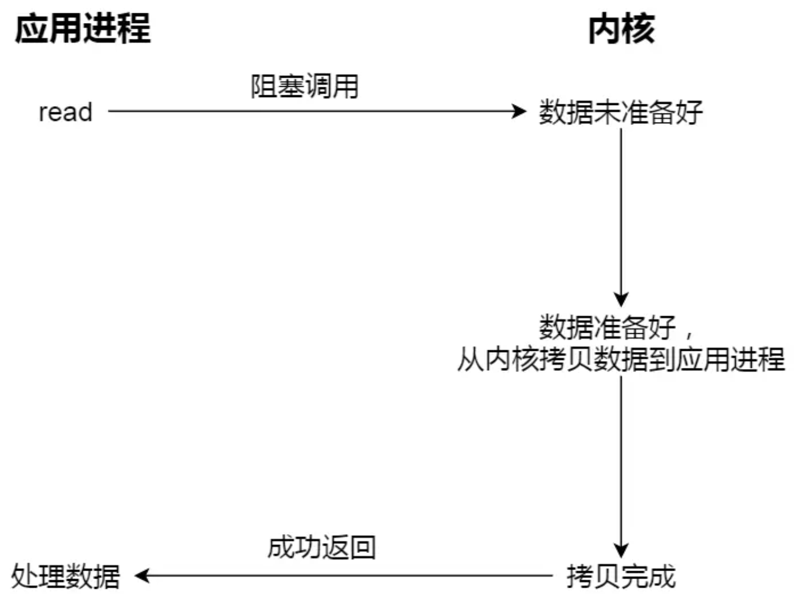
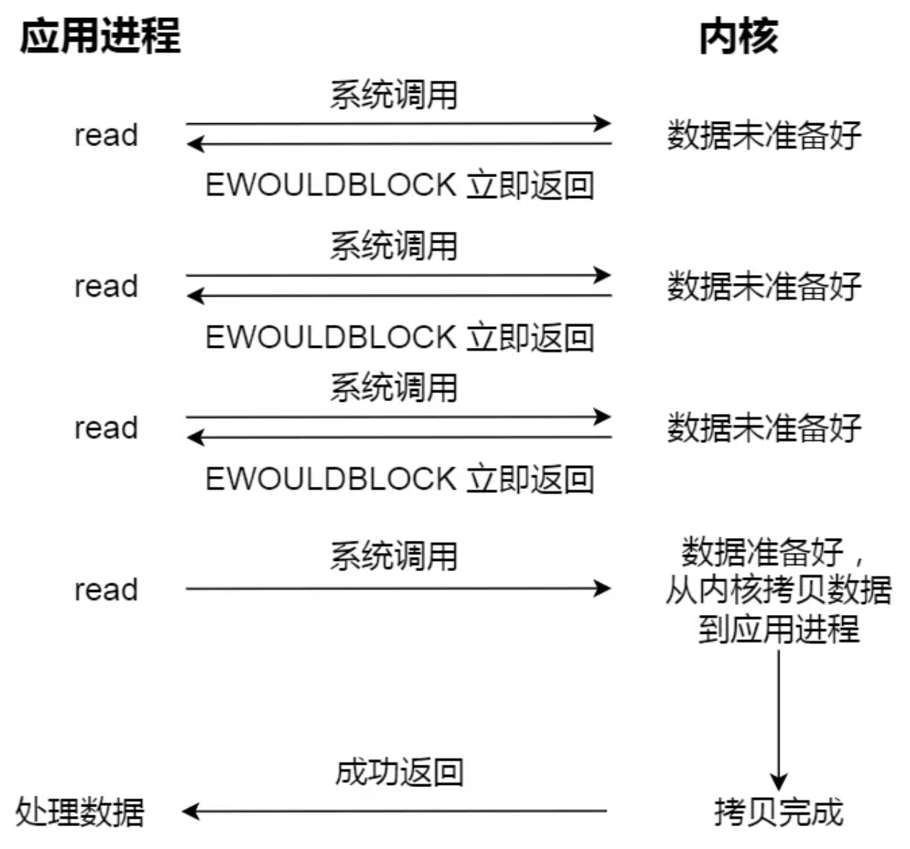

## 缓冲与非缓冲
特指标准库内部实现的缓冲
### 缓冲
利用标准库的缓存实现文件的加速访问，而标准库再通过系统调用访问文件
### 非缓冲
直接通过系统调用访问文件，不经过标准库缓存
## 直接与非直接
### 直接
1. 不会发生内核缓存和用户程序之间数据复制，而是直接经过文件系统访问磁盘。
2. 文件操作类的系统调用函数时，指定了 O_DIRECT 标志，则表示使用直接 I/O，默认是非直接
### 非直接
不会发生内核缓存和用户程序之间数据复制，而是直接经过文件系统访问磁盘。
### 写入磁盘场景
1. 调用 write 的最后，发现内核缓存的数据太多的时候
2. 用户主动调用 sync
3. 内存十分紧张，无法再分配页面时
4. 内核缓存的数据的缓存时间超过某个时间时
## 阻塞与非阻塞
### 阻塞
1. 用户程序执行 read ，线程会被阻塞，直到内核数据准备好，并把数据从内核缓冲区拷贝到应用程序的缓冲区中，当拷贝过程完成，read 才会返回
2. 阻塞等待的是「内核数据准备好」和「数据从内核态拷贝到用户态」这两个过程\

### 非阻塞
1. 在数据未准备好的情况下立即返回，可以继续往下执行，此时应用程序不断轮询内核
2. 直到数据准备好，内核将数据拷贝到应用程序缓冲区，read 调用才可以获取到结果
3. 访问管道或 socket 时，如果设置了 O_NONBLOCK 标志，表示使用的是非阻塞 I/O，默认是阻塞\

# I/O 多路复用
应用程序每次轮询内核的 I/O 是否准备好，是资源浪费，于是引出 I/O 多路复用