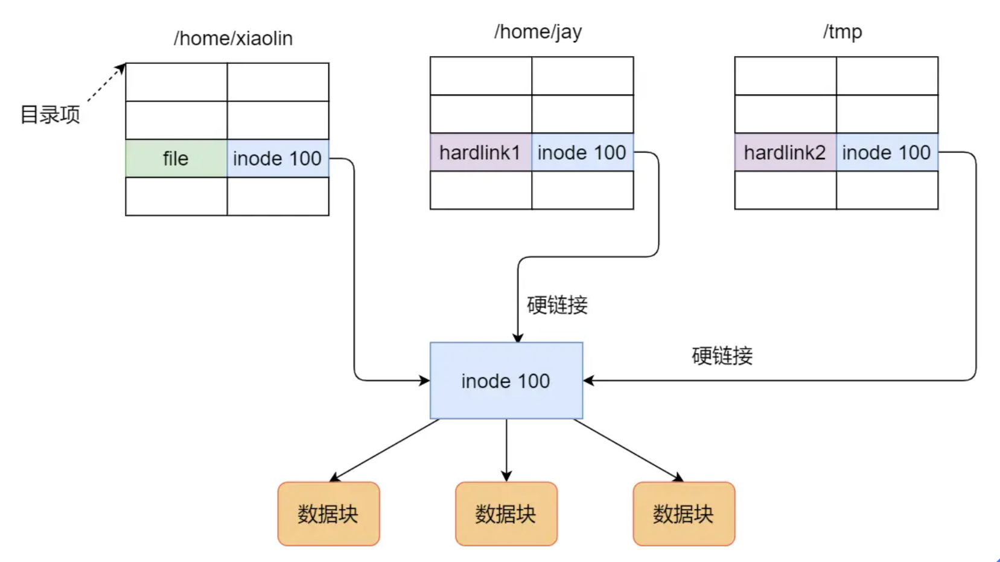
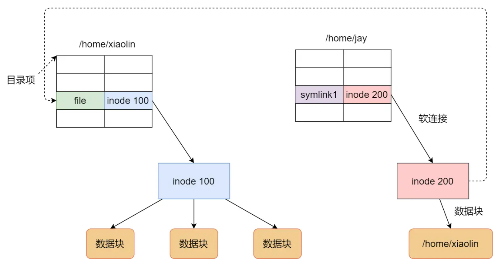

## 概述
给某个文件取别名，可以通过硬链接或软链接的方式实现，它们都是比较特殊的文件。
## 硬链接
1. 多个目录项中的 索引节点 指向一个文件，也就是指向同一个 inode
2. 每个文件系统都有各自的 inode 数据结构和列表，所以硬链接是不可能跨越文件系统的
3. 只有删除文件的所有硬链接以及源文件时，系统才会彻底删除该文件\

### 软链接
1. 重新创建一个文件，这个文件有独立的 inode，但是这个文件的内容是另外一个文件的路径
2. 访问软链接的时候，实际上相当于访问到了另外一个文件，所以软链接是可以跨文件系统的
3. 目标文件被删除了链接文件还在，只不过指向的文件找不到了而已。\
