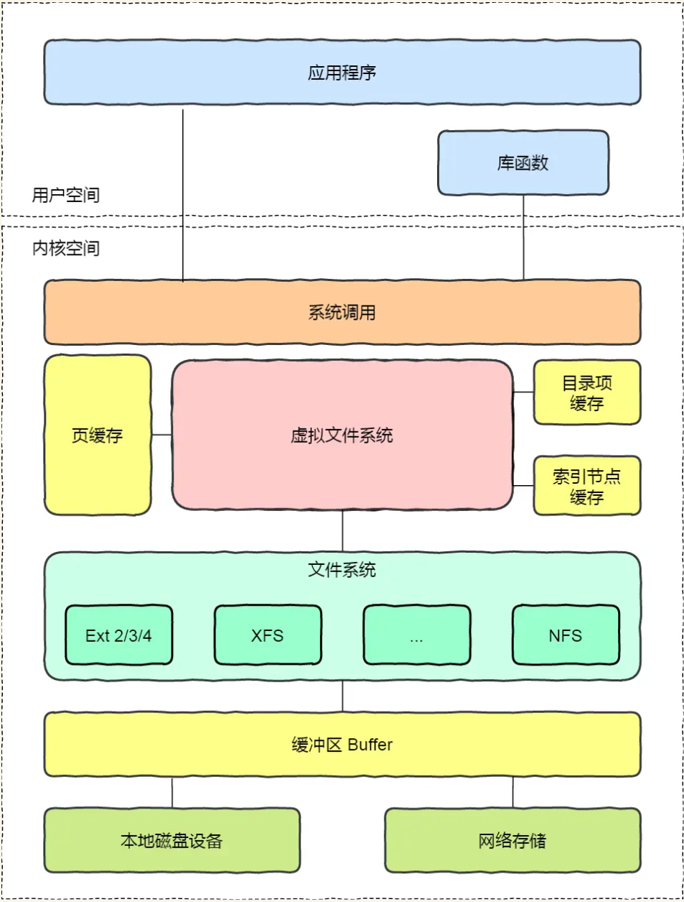

## 概述
1. 操作系统希望对用户提供一个统一的接口，于是在用户层与文件系统层引入了中间层，就称为虚拟文件系统（Virtual File System，VFS）
2. 为用户空间程序提供了一套统一的文件操作接口（如 open, read, write, close 等系统调用）
3. 为各种具体的文件系统（如 ext4, XFS, Btrfs, NFS, procfs 等）定义了一套清晰的“插件”接口，使其能够无缝地接入内核。
4. 用户空间、系统调用、虚拟文件系统、缓存、文件系统以及存储之间的关系如下图\

## 核心对象
VFS 通用文件模型由四个主要的对象构成，这些对象是存在于内存中的数据结构，用于表示物理或虚拟的文件系统实体。
### 超级块 (Superblock, struct super_block)
1. 代表一个已挂载的文件系统实例。
2. 在内存中持有该文件系统的高级元数据，例如文件系统类型、总大小、块大小、魔数（magic number）以及指向根目录项的指针。
3. 对于基于磁盘的文件系统，当执行 mount 操作时，内核会从磁盘的特定位置读取超级块信息，并在内存中创建对应的 struct super_block 实例。
4. 其生命周期始于文件系统特定的 fill_super() 函数分配并填充该结构，终于在卸载时调用 kill_sb()。   
### 索引节点 (Inode, struct inode)
1. 代表一个具体的文件系统客体，如普通文件、目录、符号链接或设备文件。
2. 包含了除文件名之外的所有元数据，包括所有权（用户 ID、组 ID）、访问权限、各种时间戳（创建、修改、访问）、文件大小，以及至关重要的、指向存储文件内容的数据块的指针或索引。
3. 当一个文件首次被访问时，其对应的 inode 会从磁盘的 inode 表中加载到内存，并被缓存在内核的 inode 缓存中以提高后续访问性能。
4. 多个目录项（即硬链接）可以指向同一个 inode。
5. 其生命周期由引用计数管理，当引用计数降至零时，内核会调用 put_inode 操作，最终可能将其从缓存中移除。   
### 目录项 (Dentry, struct dentry)
1. 代表一个目录条目，连接可读的文件名与 inode 编号。
2. 目录项在内存中构成了文件系统的目录树结构。它们在路径名遍历过程中被创建，并被密集地缓存在目录项缓存中，以加速未来的路径查找。
3. dcache 是 Linux 文件系统性能的关键组件，它将频繁的、原本需要磁盘 I/O 的目录读取操作，转变为高速的内存查找操作。   
### 文件 (File, struct file)
1. 代表一个由进程打开的文件。由 open() 系统调用创建，并且只存在于内存中，在磁盘上没有物理对应物。
2. 它追踪了一个打开文件的状态，例如当前的读写偏移量（f_pos）、访问模式（只读、读写等）。
3. 每个 struct file 对象都包含一个指向其对应 dentry 的指针，以及一个指向文件操作函数表（file_operations）的指针，用于处理读、写等 I/O 请求。
## 操作
### struct super_operations
针对整个文件系统实例的方法，如 read_inode()（读取一个 inode）、write_inode()（写回一个 inode）和 statfs()（获取文件系统统计信息）。   
### struct inode_operations
作用于特定 inode 的方法，如 create()（创建新文件）、lookup()（在目录中查找）、link()（创建硬链接）和 unlink()（删除文件）。   
### struct file_operations
作用于已打开文件的方法，如 read()、write()、llseek()（改变文件偏移）和 fsync()（将数据刷写到磁盘）。   
### struct dentry_operations
作用于目录项的方法，如 d_compare()（比较文件名）和 d_delete()（删除目录项）。
### 调用示例
1. 用户空间的应用程序调用 read() 时，内核的执行路径大致如下：sys_read() 系统调用入口 -> VFS通用层 -> file->f_op->read()
2. 最终的函数调用会精准地执行到与该文件所在文件系统类型相对应的、由驱动程序实现的 read 函数

## 文件系统
### 磁盘的文件系统
直接把数据存储在磁盘中，比如 Ext 2/3/4、XFS
### 内存的文件系统
数据占用内存空间，比如 /proc 和 /sys
### 网络的文件系统
用来访问其他计算机主机数据的文件系统，比如 NFS、SMB 等等
### 挂载
文件系统首先要先挂载到某个目录才可以正常使用，比如 Linux 系统在启动时，会把文件系统挂载到根目录。