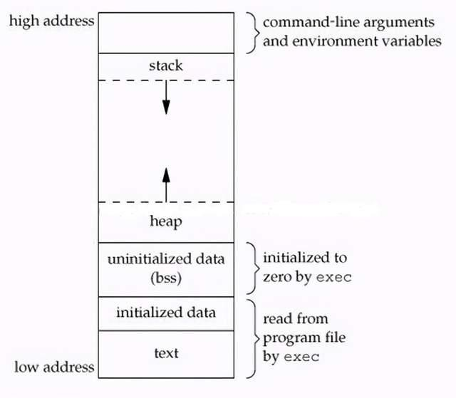

## 概述
为每个进程提供了一个独立的、私有的、连续的地址空间，从而实现了进程隔离、内存保护，并为按需分页、写时复制等高级内存管理技术提供了可能。
## 进程地址空间
1. 每个进程都拥有自己独立的虚拟地址空间。对于 32 位系统，是一个 4GB 的线性地址范围。
2. 通常被划分为两部分：较低的 3GB 供用户空间使用，最高的 1GB 保留给内核空间。
3. 进程用户空间布局如下\

## 分页
1. 虚拟内存和物理内存都被划分为固定大小的块，分别称为“页”和“页帧”，其大小通常为 4KB。
2. 通过分页机制将虚拟地址映射到物理地址，为了在 64 位地址空间中高效地管理这种映射关系，避免使用巨大稀疏的页表，现代 CPU 采用了多级页表结构。
### 页表结构
在 x86-64 架构上，一个 48 位的虚拟地址到物理地址的转换过程（即页表遍历）由 MMU 硬件自动完成，通常涉及四级页表：
1. CPU 的 CR3 寄存器存放着当前进程顶级页表的物理基地址。
2. 页全局目录 (PGD)：虚拟地址的最高位（bits 47-39）作为索引，在 PGD 中查找到一个指向 PUD 的条目。
3. 页上级目录 (PUD)：使用虚拟地址的次高位（bits 38-30）作为索引，在 PUD 中查找到一个指向 PMD 的条目。
4. 页中间目录 (PMD)：使用虚拟地址的中间位（bits 29-21）作为索引，在 PMD 中查找到一个指向 PTE 的条目。
5. 页表 (PTE)：使用虚拟地址的低位（bits 20-12）作为索引，在 PTE 表中查找到最终的页表条目（Page Table Entry）。这个条目包含了目标物理页帧的基地址以及访问权限等标志位。
6. 形成物理地址：将 PTE 中获得的物理页帧基地址与虚拟地址的最低12位（页内偏移）拼接起来，就得到了最终的物理地址。
### TLB
1. 由于每次内存访问都可能需要进行多次内存读取来遍历页表，这个过程本身是相当缓慢的。
2. 为了加速地址转换，CPU 内部集成了一个小而快的缓存，称为“转译后备缓冲区”（Translation Lookaside Buffer, TLB）。
3. 缓存了最近使用过的虚拟地址到物理地址的映射关系。当进行地址转换时，MMU 首先查询 TLB。
4. 如果未命中，硬件才会执行完整的页表遍历，并将新获得的映射关系存入TLB以备后用。
### 五级页表
1. 随着物理内存容量的持续增长，4级页表逐渐成为瓶颈。
2. Linux 内核和现代 CPU 已支持 5 级页表，在 PGD 和 PUD 之间插入了一个新的“P4D”层，将虚拟地址空间扩展到 128 PiB，物理地址空间扩展到 4 PiB。

## 页错误
### 按需分页
1. 一种 惰性加载 机制，当一个进程启动或通过 mmap 请求内存时，内核仅仅为其在页表中建立虚拟地址的映射记录，但并不会立即分配实际的物理内存页帧。
2. 物理内存只有在该进程首次尝试访问某个虚拟页时才会被分配。
### 页错误
1. 当进程访问一个在页表中存在、但尚未映射到任何物理页帧的虚拟地址时，MMU 无法完成地址转换，便会触发页错误异常。
2. CPU将控制权转交给内核的页错误处理程序
### 分类
1. 次要页错误 (Minor Fault)：当发生错误时，所请求的数据实际上已经位于物理内存中，只是当前进程的页表中还没有建立映射。\
（1）这种情况常见于多进程共享内存（如共享库），其中一个进程已经将页面加载到内存。\  
（2）处理程序只需为当前进程创建一个新的 PTE，指向那个已存在的物理页帧即可。这个过程非常快，不涉及磁盘I/O。   
2. 主要页错误 (Major Fault)：这是真正意义上的“缺页”。所请求的数据不在物理内存中，必须从后备存储（如磁盘上的可执行文件或交换空间）中加载。\
（1）找到一个空闲的物理页帧（如果找不到，则需要执行页面回收算法）\
（2）发起磁盘 I/O 操作，将数据读入该页帧\
（3）更新页表，将虚拟页映射到这个新的物理页帧\
（4）重新执行导致错误的指令。由于涉及磁盘访问，处理速度非常慢。   
3. 无效页错误 (Invalid Fault)：进程试图访问一个不属于其合法虚拟地址空间范围的地址（例如，访问空指针 NULL 指向的地址）。\
（1）内核的页错误处理程序会判定这是一次非法访问，并向该进程发送一个 SIGSEGV 信号，通常导致进程因“段错误”而终止。   

## 写时复制（CoW）
1. fork() 系统调用的一个关键优化技术。
2. 当一个父进程调用 fork() 创建子进程时，内核并不立即为子进程复制父进程的整个内存空间。
3. 因为这既耗时又浪费内存，特别是当子进程创建后立即调用 exec() 执行新程序时，这些复制的内存会被立刻丢弃。
### 机制
1. 共享页面：fork() 之后，内核让子进程与父进程共享所有的物理内存页。为了实现这一点，内核会将父子进程页表中对应这些共享页的 PTE 都标记为只读。
2. 触发 CoW 错误：如果父进程或子进程中的任何一个尝试对共享页面进行写操作，MMU 会因为违反了只读权限而触发一个页错误。
3. 处理 CoW 错误：页错误处理程序识别出这是一个 CoW 场景，执行以下操作\
（1）分配一个新的物理页帧\
（2）将原始共享页的内容完整地复制到这个新页帧中\
（3）修改触发写操作的那个进程的页表，使其对应的 PTE 指向这个新的、私有的页帧，并将其权限设置为可写。\
（4）返回并重新执行写指令，此时写操作将在私有副本上成功完成。
### 优点
1. 另一个进程则完全不受影响，继续使用原始的页面（如果还有其他子进程共享，该页面仍然是只读的）。
2. 内存的复制被推迟到真正需要写入时才发生，极大地提升了fork()的效率。

## 交换空间
在磁盘（或其他块设备）上划分出来的一块专用区域（可以是分区或文件），用于临时存放物理内存中那些不常被访问的内存页
### 目的
1. 扩展可用内存总量：如果系统只有 8GB RAM，但需要运行一个 10GB 内存的程序。系统会将不活跃的 2GB+ 数据放到磁盘上，让程序得以运行。
2. 提高物理内存的使用效率，将宝贵的高速 RAM 资源留给最活跃的数据和磁盘缓存。
3. 支持休眠：将整个 RAM 的内容快照写入交换空间，然后彻底断电。唤醒时，再从交换空间将数据读回 RAM。