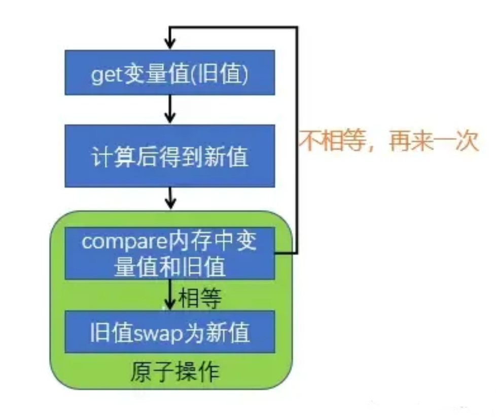

## 定义
1. CPU 一次只能执行一条指令。
2. 假定两个操作 A 和 B，如果从执行 A 的线程来看，当另一个线程执行 B 时，要么将 B 全部执行完，要么完全不执行 B，那么 A 和 B 对彼此来说是原子的。
## 引出
1. "i++"的操作，经过编译翻译成汇编语言后成了三句汇编代码
```
__asm__{
    mov eax [i]	//将变量i的值取出到cpu寄存器eax中
    inc eax		//eax自增1
    mov [i] eax	//将寄存器eax的值写入内存变量i的地址中
}
```
2. 在多线程环境下，这三条汇编指令可能未执行完，就因为 cpu 时间片结束了导致线程切换，被其他的线程获取值后修改了。
3. 除了加锁外，还有那就是原子操作可以解决此问题，其需要硬件的支持，不过大部分的电脑都支持。

# 实现
## 汇编指令 lock
通过 lock 指令锁住 cpu 总线，使这多句汇编代码变成一句不可分割的指令
```
int inc(int* value， int add) {
	int old;
    __asm__ volatile (
         "lock; xaddl %2， %1;"   // 指令1：lock; 指令2: xaddl， 操作数占位符：%1， %2
         : "=a" (old)            // 输出：结果放入通用寄存器eax
         : "m" (*value)， "a" (add)   // 输入：操作数1（内存），操作数2（寄存器eax）
         : "cc"， "memory"            // 编译方式，内存
     );
    return old;
}
```
## CAS（Compare and Swap）


1. 一种无锁算法，是硬件层面提供的操作。
2. CAS 有 3 个操作数，传入旧值跟新值去比较内存中已经存在的旧值
3. 如果传入进来的旧值跟内存中的旧值一致，那就把传入进来的新增修改。
4. 如果不相等则采用自旋的方式拿到内存中的旧值在再次进行比较，自旋可以可以理解为自旋锁机制含义。
### ABA 问题
1. CAS 需要在操作值的时候，检查值有没有发生变化，如果没有发生变化则更新。
2. 如果一个值原来是 A，变成了 B，又变成了 A，那么使用 CAS 进行检查时会发现它的值没有发生变化，但是实际上却变化了。
3. 解决方案: 可以采用 AtomicMarkableReference，AtomicStampedReference 进控制。
### 其他问题
1. 由于存在并发情况同时修改值，如果值被改过了，就会重新获取内存中的值进行比较，在此期间如果一直修改不成功，会导致死循环，性能损耗。
2. 每次更新操作只能更新一个值，如果有两个 CAS 指令那就不能保证原子操作，可把多个共享变量合并成一个共享变量来解决。

## C++
在语言层面提供了cas操作,在头文件 `#include<atomic>` 中
