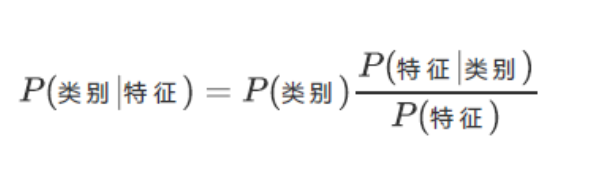

## 最大后验概率（MAP）
1. 分类任务目标通常不是计算出后验概率的精确值，而是确定哪个类别的后验概率最大。这个原则称为最大后验概率。
2. 对于一个新的样本 x，预测其类别 $\hat{y}$ 为所有可能类别中后验概率最大的那个，根据贝叶斯定理可得
$$\hat{y} = \arg\max_{k} P(C_k|\mathbf{x})= \arg\max_{k} \frac{P(\mathbf{x}|C_k)P(C_k)}{P(\mathbf{x})}$$
3. 可以理解为\

4. 证据概率 P(x) 是一个与类别 k 无关的常数，比 
5. 较不同类别的后验概率时，这个共同的分母项不影响比较结果，可以将其忽略。
$$\hat{y} = \arg\max_{k} P(C_k|\mathbf{x})= \arg\max_{k} {P(\mathbf{x}|C_k)P(C_k)}$$
6. 至此，分类问题被转化为优化问题：寻找一个类别 k，使得似然与先验的乘积最大化。
## 朴素假设
### 特征条件独立性假设
1. 给定类别 $C_k$ 的条件下，所有特征 $x_1,…,x_n$ 是相互独立的，即对于任意 $i\neq j$，有
$$P(x_i|C_k, x_j) = P(x_i|C_k)$$
2. 在条件独立性假设下，这个复杂的联合概率可以被分解为各个特征的边缘条件概率的乘积
$$P(\mathbf{x}|C_k) = P(x_1, \dots, x_n|C_k) = \prod_{i=1}^{n} P(x_i|C_k)$$
3. 最终，转化为
$$\hat{y} = \arg\max_k P(C_k) \prod_{i=1}^{n} P(x_i|C_k)$$
### 假设悖论
1. 条件独立性假设在现实世界中几乎从不成立，尤其是在文本分类等应用中，词语之间存在着强烈的相关性。
2. 基于如此错误假设的算法却在实践中表现出色，原因是基于 MAP 规则的分类任务并不要求后验概率的估计值完全准确。它仅仅要求正确类别的后验概率得分高于其他任何错误类别。
3. 更深层次地看，“朴素”假设是一种强大且故意的“模型正则化”手段。通过引入一种极强的偏见，即特征相互独立，来换取模型方差的巨大降低，即需要估计的参数数量大幅减少。
## 高斯朴素贝叶斯
### 原理
假设对于每一个类别，其连续型特征的取值服从正态分布
### 似然公式
$$P(x_i|C_k) = \frac{1}{\sqrt{2\pi\sigma^2_{k,i}}} \exp\left(-\frac{(x_i - \mu_{k,i})^2}{2\sigma^2_{k,i}}\right)$$
### 参数估计
公式中的均值和方差是需要从训练数据中学习的参数，对于每个特征 i 和每个类别 k，这些参数通过极大似然估计法（MLE）进行计算
### 应用
适用于特征为连续数值的分类任务
## 多项式朴素贝叶斯
### 原理
专为处理离散数据而设计，特别是那些表示频次或计数的特征向量。
### 似然公式
该模型的分布由每个类别 k 的参数向量 $\theta_k = (\theta_{k1}, \dots, \theta_{kn})$ 参数化，其中 n 是特征的总数（在文本分类中通常是词汇表的大小），$\theta_{ki} = P(x_i|C_k)$ 表示特征 i 在属于类别 k 的样本中出现的概率
### 参数估计
参数 $\theta_{ki}$ 通过平滑后的极大似然估计（即相对频率计数）来计算。
### 应用
文本分类任务（如垃圾邮件过滤、新闻主题分类）的经典选择。在这类任务中，特征通常是单词的出现次数（词频）或TF-IDF值。
## 伯努利朴素贝叶斯
### 原理
适用于多元伯努利分布，即特征是独立的二元变量，只关心特征是否出现，而不关心其出现的次数。
### 似然公式
$$P(x_i|C_k) = p_{ki}^{x_i} (1 - p_{ki})^{(1-x_i)}$$
其中 $p_{ki}$ 是特征 i 在类别 k 中出现的概率
### 区别
1. 与多项式模型不同，伯努利模型会明确地惩罚一个指示性特征的“未出现”。
2. 例如，在垃圾邮件分类中，如果“免费”一词是垃圾邮件的强指示词，那么多项式模型在处理不含“免费”的邮件时会忽略这个信息，而伯努利模型则会因“免费”的缺失而降低其为垃圾邮件的概率 。
### 应用
常用于文本分类，尤其适用于短文本，因为在短文本中，一个词是否出现（二元信息）可能比它出现了多少次（计数信息）更有判别力。
## 类别朴素贝叶斯（Categorical Naive Bayes）
为处理分类型特征（即具有两个以上离散类别的特征）设计的模型。它为每个特征在每个类别下的各个取值估计一个概率。
## 补充朴素贝叶斯（Complement Naive Bayes, CNB）
多项式模型的一个重要变体，特别适用于类别不平衡的数据集