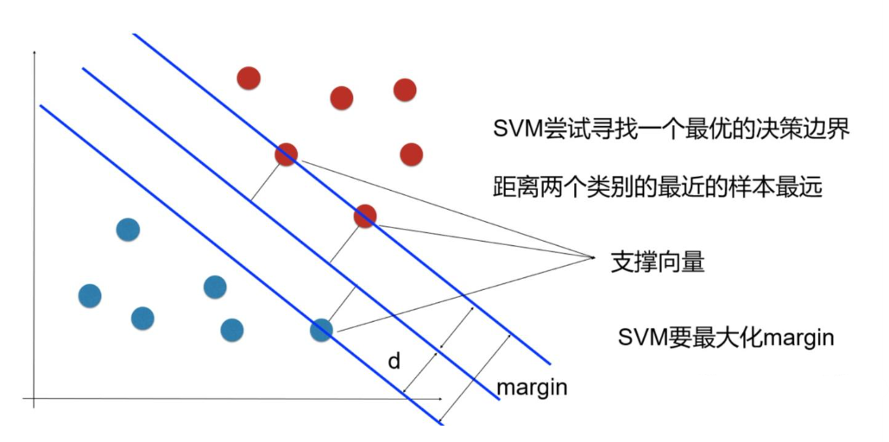

## 引出（pending）
1. 面对二元分类问题，感知机模型存在根本问题：一旦找到一个能够分离训练数据的超平面，算法就会停止，而这个超平面不一定是最佳的或稳健的。
2. 引出了支持向量机的核心问题：在所有可能的分离超平面中，哪一个才是最好的？
## 概念
### 间隔
SVM 认为“最佳超平面”是距离两边类别最近的数据点最远的超平面，这个距离称为间隔。
### 支持向量

1. 距离超平面最近的一些点叫支持向量，是训练集中最关键的数据点。
2. 最大间隔超平面的位置完全由这些支持向量决定，其他数据点对最终模型没有影响，这使得 SVM 在内存使用上非常高效。
3. 稳健分类的基本假设，一个为不同类别提供最大“缓冲空间”的决策边界，最不可能错误分类与训练数据相似的未见新数据点。
## 数学基础
### 构建优化问题
1. 一个点 x 到超平面 $w^T x + b=0$ 的距离是
$$\frac{|w^T x + b|}{||w||}$$
其中 $||w|| = \sqrt{w_1^2 + \dots + w_n^2}$

2. 支持向量到超平面的距离为 d，有
$$\begin{cases}
\frac{w^T x + b}{||w||d} \ge 1 & y=1 \\
\\
\frac{w^T x + b}{||w||d} \le -1 & y=-1
\end{cases}$$
3. 令 $||w||d$ 为 1（为了方便推导和优化，且这样做对目标函数的优化没有影响），公式变为
$$y_i(w^T x + b)\ge1$$
其中 $y_i∈{−1,1}$

4. 最大化 2d
$$max\ 2*\frac{|w^T x + b|}{||w||}=2*\frac{y_i(w^T x + b)}{||w||}=\frac 2 {||w||}$$
再进行转化，同时为了方便计算（去除 $||w||$ 的根号），可得
$$min \frac {||w||^2}2\quad s.t.\quad y_i(w^T x + b)\ge1 \tag{1}$$
5. 这是一个凸二次规划（Convex Quadratic Programming, QP）问题，意味着它存在唯一的全局最优解，并且可以通过有效的算法求解。
### 拉格朗日对偶
1. 对上式使用拉格朗日乘子法
$$L(w, b, \alpha) = \frac{1}{2} ||w||^2 + \sum_{i=1}^{m} \alpha_i (1 - y_i (w^T x_i + b)) \quad \tag{2}$$
令 $L(w,b,α)$ 对 w 和 b 的偏导为零，可得
$$w = \sum_{i=1}^{m} \alpha_i y_i x_i \quad 0 = \sum_{i=1}^{m} \alpha_i y_i \quad \tag{3}$$
2. 将式（3）代入式（2）可得其“对偶问题”
$$\max_{\alpha} \sum_{i=1}^{m} \alpha_i - \frac{1}{2} \sum_{i=1}^{m} \sum_{j=1}^{m} \alpha_i \alpha_j y_i y_j x_i^T x_j \quad \tag{4}$$

$$s.t. \quad \sum_{i=1}^{m} \alpha_i y_i = 0, \quad \alpha_i \ge 0, \quad i = 1, 2, \dots, m$$
3. 解出 α 后，求出 w 与 b 即可得到模型
$$f(x) = w^T x + b = \sum_{i=1}^{m} \alpha_i y_i x_i^T x + b \quad\tag{5}$$
4. $α_i$ 恰对应训练样本 $(x_i,y_i)$。注意约束条件，上述过程需满足KKT（Karush-Kuhn-Tucker）条件，即
$$
\begin{cases}
\alpha_i \ge 0 \\
y_i f(x_i) - 1 \ge 0 \\
\alpha_i(y_i f(x_i) - 1) = 0
\end{cases}\tag{6}
$$
5. 于是，对任意训练样本 $(x_i,y_i)$，总有 $α_i=0$ 或 $y_i f(x_i)=1$。\
（1）若 $α_i=0$，则该样本将不会在式（5）的求和中出现，也就不会对 $f(x)$ 有影响。\
（2）若 $α_i\neq 0$，则对应的样本点是支持向量。\
（3）这显示出支持向量机的一个重要性质：训练完成后，大部分的训练样本都不需要保留，最终模型仅与支持向量有关。
## SMO 算法

## 软间隔
