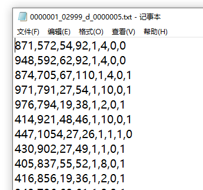

## 地址
https://github.com/VisDrone/VisDrone-Dataset
## 概述
1. 由 288 个视频片段（包含 261,908 帧）和 10,209 张静态图像组成，这些数据由各种无人机载摄像头拍摄。
2. 涵盖了广泛的方面，包括地点（中国 14 个不同的城市）、环境（城市和乡村）、物体（行人、车辆、自行车等）和密度（稀疏和拥挤的场景）。
3. 在不同的场景以及天气和光照条件下，使用各种无人机平台收集。
4. 通过手动方式进行了标注，包含超过 260 万个目标的边界框，例如行人、汽车、自行车和三轮车。
5. 此外，还提供了场景可见性、物体类别和遮挡等属性，以更好地利用数据。
## 数据集结构
1. 任务 1：图像中的物体检测
2. 任务 2：视频中的物体检测
3. 任务 3：单目标跟踪
4. 任务 4: 多目标跟踪
5. 任务 5：人群计数
## 应用
1. 被广泛用于训练和评估基于无人机的计算机视觉任务（如物体检测、物体跟踪和人群计数）中的深度学习模型。
2. 该数据集包含各种传感器数据、物体注释和属性，使其成为无人机计算机视觉领域研究人员和从业人员的宝贵资源。
## 标签格式


```
**标签含义：**
1. 边界框左上角的x坐标
2. 边界框左上角的y坐标
3. 边界框的宽度
4. 边界框的高度
5. GROUNDTRUTH 文件中的分数设置为 1 或 0。1 表示在计算中考虑边界框，而 0 表示将忽略边界框。
6.  类别：忽略区域（0）、行人（1）、人（2）、自行车（3）、汽车（4）、面包车（5）、卡车（6）、三轮车（7）、雨篷三轮车（8）、公共汽车（9）、摩托车（10），其他（11）。
7. GROUNDTRUTH 文件中的得分表示对象部分出现在帧外的程度（即，无截断= 0（截断比率0%），部分截断= 1（截断比率1%°´50%））。
8. GROUNDTRUTH 文件中的分数表示被遮挡的对象的分数（即，无遮挡=0（遮挡比率0%），部分遮挡=1（遮挡比率1%°´50%），重度遮挡=2（遮挡率50%~100%））。
```