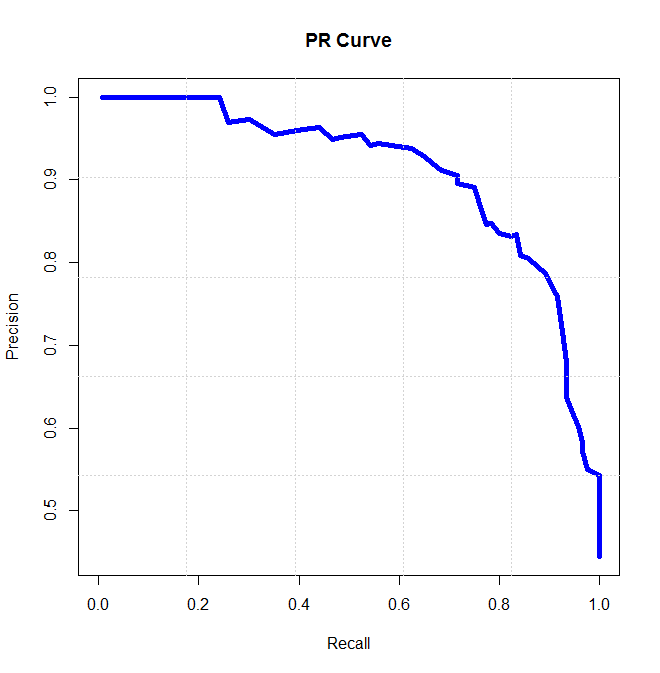

## 回归任务
### 均方根误差（RMSE）
$$ \text{RMSE} = \sqrt{\frac{1}{n}\sum_{i=1}^{n}(y_i - \hat{y}_i)^2} $$
最常用的回归指标之一
### 平均绝对误差（MAE）
$$ \text{MAE} = \frac{1}{n}\sum_{i=1}^{n}|y_i - \hat{y}_i| $$
### 决定系数（R-squared, $R ^2$ ）
$$ R^2 = 1 - \frac{\sum_{i=1}^{n}(y_i - \hat{y}_i)^2}{\sum_{i=1}^{n}(y_i - \bar{y})^2} =1-\frac {SSE}{SST}$$
1. 衡量模型对数据变异的解释程度。其值介于0到1之间，越接近1表示模型解释的变异越多，拟合效果越好。
2. 结果标准化，方便比较不同模型
3. SST (Total Sum of Squares, 总平方和): 表示数据总的变异程度，即因变量 Y 的总方差。
4. SSE (Sum of Squared Errors, 残差平方和): 也称为 RSS (Residual Sum of Squares)，表示模型未能解释的变异部分，即预测值与实际值之间的误差平方和。
## 分类任务

### 准确率（Accuracy）
$$ \text{Accuracy} = \frac{\text{TP} + \text{TN}}{\text{TP} + \text{TN} + \text{FP} + \text{FN}} $$
### 精确率（Precision）
$$ \text{Precision} = \frac{\text{TP}}{\text{TP} + \text{FP}} $$
应用于希望减少误报时。例如，垃圾邮件识别，误将正常邮件识别为垃圾邮件会造成困扰。
### 召回率（Recall）
$$ \text{Recall} = \frac{\text{TP}}{\text{TP} + \text{FN}} $$
应用于希望减少漏报时。例如，疾病诊断，漏诊癌症比误诊更严重。
### F1 值（F1-Score）
$$ F1 = 2 \cdot \frac{\text{Precision} \cdot \text{Recall}}{\text{Precision} + \text{Recall}} $$
更接近于精确率和召回率中较小的那个，常用于精确率和召回率都很重要时，比如推荐系统
### ROC & AUC
是常用的一个分类器评价指标，反映模型在所有可能分类阈值下的性能，并且对类别不平衡不敏感，能稳定反映模型在不同阈值下的表现，同时曲线越平滑越好。
$$ \text{TPR} = \frac{\text{TP}}{\text{TP} + \text{FN}} $$
$$ \text{FPR} = \frac{\text{FP}}{\text{FP} + \text{TN}} $$
理想情况\

完全随机猜测情况\

一般情况\

AUC 是一种综合性的评估指标，它不依赖于任何特定的分类阈值，一个好的模型通常具有高 AUC 值（接近 1），同时曲线越平滑越好。
### PR
P-R 曲线是精确率（Precision）和召回率（Recall）之间的关系曲线。它以召回率作为 X 轴，精确率作为 Y 轴

对类别不平衡非常敏感，适合评估类别不平衡的数据集，模型曲线越接近右上角，说明在高召回率（找到更多正样本）的同时，也能保持高精确率（预测结果更可信），性能越好。同时曲线越平滑越好。