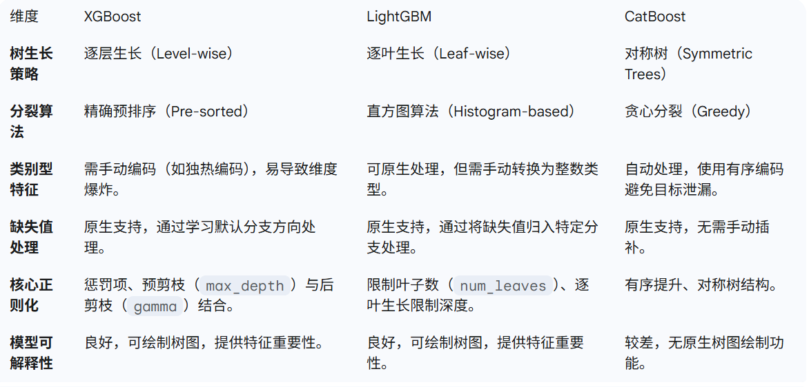
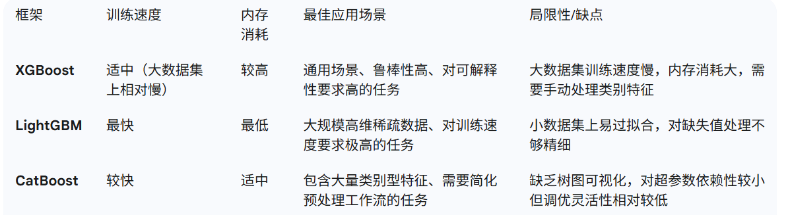

# XGBoost
## 带正则化的目标函数（根本创新）
### 公式
$$\text{Obj}^{(t)} = \sum_{i=1}^{n} L[y_i, \hat{y}_i^{(t-1)} + f_t(x_i)] + \Omega(f_t)$$
$\Omega(f_t)$ 是对新学习的树模型 $f_t$ 的复杂度惩罚项，其定义为
$$\Omega(f_t) = \gamma T + \frac{1}{2}\lambda \sum_{j=1}^{T} w_j^2$$
T 代表叶子节点数量，$w _j$ 代表叶子节点权重，参数 $λ$ 则对叶子节点的权重施加 L2 正则化
### 说明
1. 这是 XGBoost 与传统梯度提升机最根本的区别。并非简单地在训练完成后进行剪枝，而是将复杂度控制直接融入到树的构建过程中。
2. 通过设置超参数 $\gamma$，可以指定进行进一步分区所需的最小损失减少，增益小于该阈值的分支将被移除。
## 列块并行化
1. 预先将数据按特征（列）存储在压缩的内存块中，这些块按稀疏列格式（CSC）存储，并且每个列块中的特征值都已排序。
2. 寻找最佳分裂点时，算法可以对每个特征的列块并行处理，显著提高了训练效率。
3. XGBoost的并行计算并非指树的学习过程，而是在特征层面的并行处理。
## 缓存感知访问（Cache-aware Access）
1. 由于数据被分块存储，且数据访问模式被优化以适应系统的缓存结构，减少了缓存与主内存之间的数据传输延迟，进一步提升了模型的整体性能。
2. 对于无法一次性装入内存的大型数据集，XGBoost 也提供了“核外计算”的能力，将数据集分成压缩块保存在硬盘上，并在需要时解压缩到主内存，有效支持了大规模数据处理。
## 缺失值处理：稀疏感知算法
1. 对于某个具有缺失特征值的样本，算法会分别计算将其划分到左子节点和右子节点时的增益，并选择增益最大的方向作为该特征缺失值样本的默认分支。
2. 如果在训练集中没有缺失值而预测时出现缺失，则会自动将缺失值的划分方向放到右子结点。
3. 传统缺失值处理如均值或中位数插补，会用一个单一的数值替换缺失信息，这可能引入偏差或噪声，并丢失“缺失”本身所包含的潜在预测信号。
4. XGBoost 的原生处理机制将缺失值视为一种独特的类别，允许模型学习“缺失”本身的重要性，这通常比简单的插补方法更能保留潜在信息。
## 树的生长：逐层生长（Level-wise）
在同一层级的所有叶子节点上并行分裂，直到达到最大深度。
# LightGBM
将连续的浮点值离散化，可能错过某个“完美”的分裂点，但考虑到真实数据中普遍存在的噪声和冗余，这种近似处理并不会显著影响模型性能，反而能带来巨大的效率提升。
## 直方图算法（根本创新）
1. 将连续的浮点值离散化为固定数量的整数值，即“桶”（bins）。然后，为每个特征构建一个直方图，累积训练数据中落入该范围的样本统计量。
2. 离散化起到正则化作用，通过 max_bin 参数控制分桶的数量。max_bin 越小，离散化粒度越粗，模型对细节特征的感知能力减弱，正则化程度越高。
3. 根据样本频率进行划分，确保每个桶中包含大致相同数量的样本，这种等频分桶策略能更好地适应非均匀分布的数据。
4. 传统的预排序算法需要额外存储排序后的特征值和索引，直方图算法通过将连续浮点值映射到离散整数，可以采用如 uint8_t 等小数据类型来存储训练数据。
$O(\text{data} \times text{feature})$ 降至 $O(\text{bin} \times \text{feature})$
### 直方图做差加速
1. 在一个二叉决策树中，一个父节点的直方图可以由其两个子节点的直方图相加得到。
2. 算法构建完子节点的直方图后（通常选择数据量较小的那个），其兄弟节点的直方图可以通过父节点直方图减去已构建的子节点直方图来获得，无需再次遍历数据。
## 单边梯度采样（GOSS）
1. 核心思想是，梯度大的样本（预测误差大）对模型的提升作用更大，而梯度小的样本（已学习得足够好）则提供了冗余信息。
2. 对所有样本的梯度进行排序，保留所有梯度较大的样本，对梯度较小的样本进行随机采样。
3. 为了补偿对数据分布的影响，GOSS 在计算信息增益时，会引入一个常数乘数来放大那些梯度较小但被采样的样本。
4. 能够在不显著影响模型精度的前提下，减少训练数据量，从而大幅提高训练效率。
## 互斥特征捆绑（EFB）
1. 许多高维稀疏数据集中，特别是使用了独热编码的数据，很多特征是互斥的，即它们很少同时取非零值。
2. 将这些互斥特征捆绑成一个新特征，从而有效减少了特征数量。该算法将寻找最优捆绑问题转化为图着色问题，并使用贪心算法求解。
3. 这种双重优化策略使得 LightGBM 能够优雅地处理大规模、高维度的稀疏数据集，实现惊人的线性加速。
## 树的生长：逐叶生长（Leaf-wise）
1. 每次都选择能带来最大损失减少的叶子节点进行分裂。
2. 在损失减少上表现得更为“贪婪”，通常能比逐层生长更快地收敛并达到更高的精度。
3. 缺点是在训练数据量较小的情况下，它更容易生成过度复杂且深度很深的树，从而导致过拟合。所以不建议在小数据集上使用
# CatBoost
## 有序提升（根本创新）
### 预测偏移
1. CatBoost 旨在解决现有梯度提升算法中的一个核心统计问题，即“梯度偏差”（Gradient Bias）和由此导致的“预测偏移”（Prediction Shift）。
2. 使用所有样本的残差来更新模型，意味着模型在计算梯度时看到了其未来需要预测的答案，从而对训练数据本身产生了偏差，即“目标泄漏”（Target Leakage）。
3. 这种偏差在小数据集上尤为明显，导致模型在训练集上表现得过于乐观，而泛化能力下降。
### 原理
1. 核心思想是：在计算某个样本的梯度时，只使用那些在模型训练过程中没有“看到”过该样本的模型版本。
2. 策略一：为每个样本创建一个独立模型。
3. 策略二：有序排列与逐步训练，首先对训练样本进行随机排列。在每次迭代中，它会按照这个排列顺序逐步训练。
4. 具体步骤\
（1）随机打乱训练集\
（2）训练多个模型：假设训练集有 N 个样本。在每次迭代中，创建 N 个“临时”模型。\
（3）梯度计算： 对于第 t 次迭代，为了计算样本 i 的梯度，使用一个在不包含样本 i 的数据子集上训练的模型 $M _{i,t−1} ^′$ 。这个模型 是通过逐步在样本 1 到 i−1 上训练得到的。\
（4）构建新树： 基于所有样本的“无偏”梯度，构建第 t 棵树。\
（5）更新主模型： 将新构建的树添加到主模型（用于最终预测）中
## 自动处理类别型特征
1. 采用“有序编码”（Ordered Coding）机制，其根据训练数据的随机排列，动态地计算类别特征的目标统计量来将其转化为数值特征。
2. 为每个类别生成一个数值，这个数值代表了该类别与目标变量之间的关系。
3. 随机排列确保了在计算目标统计量时，每个样本都只使用它之前的样本的信息，从而避免了数据泄漏（data leakage）。
4. 高效处理高基数特征，无论有多少个特征值，这个过程都只会为每个样本生成一个或几个统计值，避免了维度爆炸。
## 对称树（Symmetric Trees）架构
1. 使用一种特殊的对称树（Oblivious Trees）作为其基学习器，在这种结构中，同一层级的所有节点都使用相同的分裂条件，且所有的叶子节点都位于同一深度。 
2. 因为所有叶子节点都位于同一深度，且计算模式高度一致，这使得在并行化计算中可以高效地利用GPU的硬件架构。
3. 因为限制了模型学习过于具体的模式，天然地具有一定的正则化效果。
4. 如果数据集的结构非常复杂且需要高度定制的决策路径，可能性能不佳。
# 性能比较
## 训练速度
1. 处理大规模数据集时，LightGBM 训练速度可以比 XGBoost 快 10-30% 甚至更高。
2. CatBoost的训练速度也通常比 XGBoost 快，但略慢于 LightGBM。
3. XGBoost因其精确预排序算法，训练时间相对较长，尤其是在处理大数据集时。 
## 精度
1. 在经过充分的超参数调优后，这三个框架通常能达到相似的顶尖精度水平。
2. 在某些特定场景下，CatBoost 因其无偏算法，在小数据集或多类别特征数据集上可能表现更优。
3. LightGBM的逐叶生长策略虽然收敛快，但在小数据集上更容易过拟合，需要更谨慎的调参。   
## 内存消耗
1. LightGBM凭借其直方图算法和互斥特征捆绑策略，内存占用最低。
2. XGBoost的预排序算法需要保存数据的特征值和排序结果，导致其内存消耗相对较高。 
## 特征处理  

# 应用
