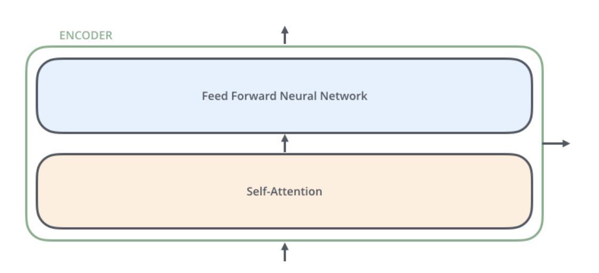
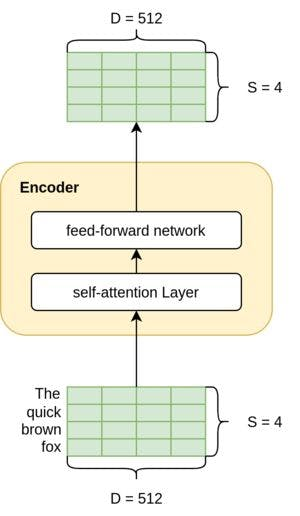

## 编码器层

1. 自注意力子层：帮助编码器关注句子中的其他词汇，以便更好地编码某个特定词汇。
2. 输入形状为 S x D，其中 S 是源句子长度（例如，英语句子），而 D 是嵌入的维度（也是模型维度，论文中为 512）。
3. 由于编码器层是相互叠加的，因此希望其输出与输入具有相同的维度，以便轻松地流入下一个编码器层。因此，输出也是 S x D 形状。\

## 解码器层

1. 多了一个注意力层，作用是让解码器能够注意到输入句子中与解码任务相关的部分。