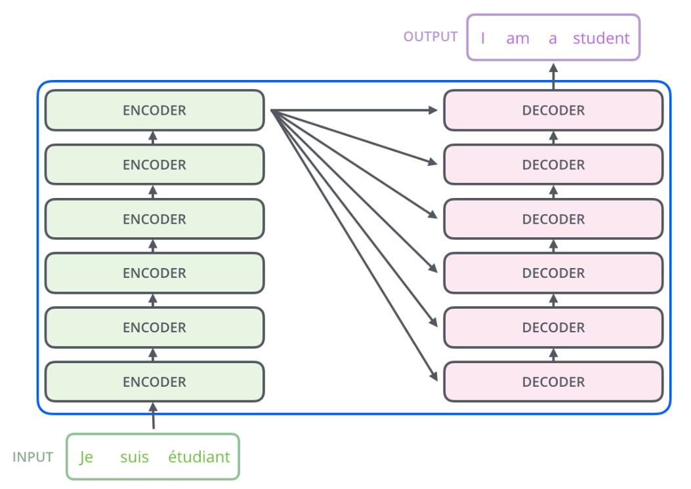

## 资源 
1. 论文：https://arxiv.org/abs/1706.03762
2. github：https://github.com/tensorflow/tensor2tensor
## 引出
1. RNN 存在梯度消失/爆炸的致命缺陷，LSTM引入了精密的门控机制来主动调节信息流，更好地保存和利用长期上下文信息，极大地缓解了梯度消失问题。
2. 尽管 LSTM/GRU 取得了巨大成功，但未能解决一个根本性的计算瓶颈：顺序计算依赖。
3. 在这些模型中，计算时间步 t 的状态必须等待时间步 t−1 的计算完成。使得在单个序列的时间维度上无法实现并行化，这成为了一个主要的性能瓶颈，尤其是在处理长序列时。
4. Transformer 核心思想是完全依赖注意力机制，彻底摒弃了循环和卷积结构，模型可以同时处理序列中的所有词元。
## 整体结构

Transformer 由 Encoder 和 Decoder 两个部分组成，各自包含 6 个 layer（论文中为6，实际是超参数）
## 输入
有两个嵌入向量层，用于将 token id 转换为 512 维的向量。
1. 调用 encode 前，将源字典中的 token id 转换为向量。
2. 调用 decode 前，将目标字典中的 token id 转换为向量。
### 词嵌入 (Embeddings)
将输入的文本序列（例如，"I am a student"）中的每个词转换成一个高维的向量表示。
### 位置编码 (Positional Encoding)
1. Transformer 抛弃了 RNN 的顺序结构，无法天然地感知到词语在句子中的位置。
2. 因此须引入位置编码，将每个词的位置信息注入到词嵌入向量中，让模型知道词语的先后顺序。
## 编码器
1. 由 N 个（论文中 N=6）完全相同的编码器层堆叠而成。
2. 负责处理和“理解”整个输入序列，为输入序列中的每个词生成一个富含上下文信息的向量表示。
3. 例如，在处理 "The bank of the river" 时，编码器能理解 "bank" 在此处的含义是“河岸”而不是“银行”。
## 解码器
1. 同样由 N 个（论文中 N=6）完全相同的解码器层堆叠而成。
2. 负责接收编码器的输出和已经生成的部分目标序列，然后预测下一个词。
3. 这个过程是自回归的（auto-regressive），即逐词生成。
## 输出
### 线性层
1. 解码器生成的向量映射到 logits 向量中。
2. 假设模型词汇表是 10000 个英语单词，它们是从训练数据集中学习的。 logits 向量维数也是 10000，每一维对应一个单词的分数。
### softmax层
将线性层的输出转换成一个概率分布，每个词都有一个概率值，概率最高的词就是模型当前的预测结果。